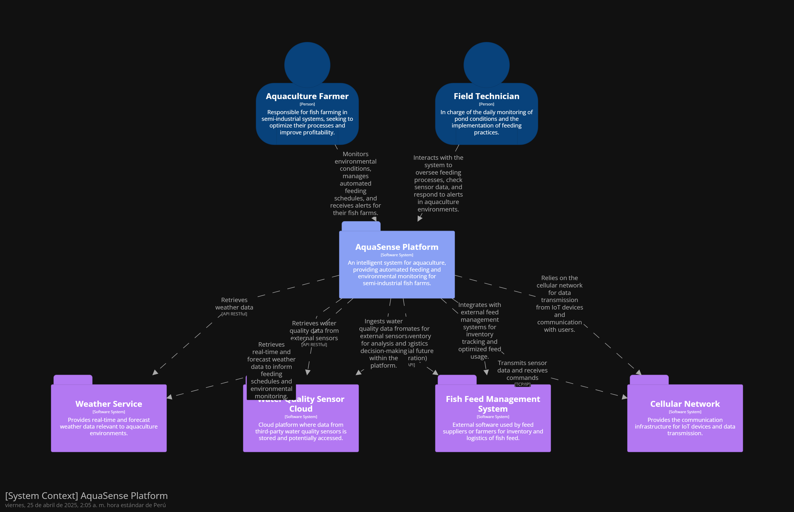
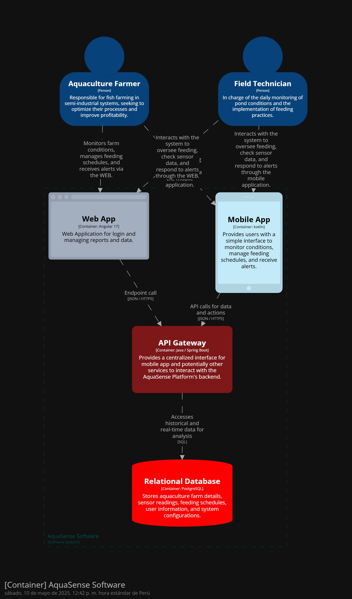
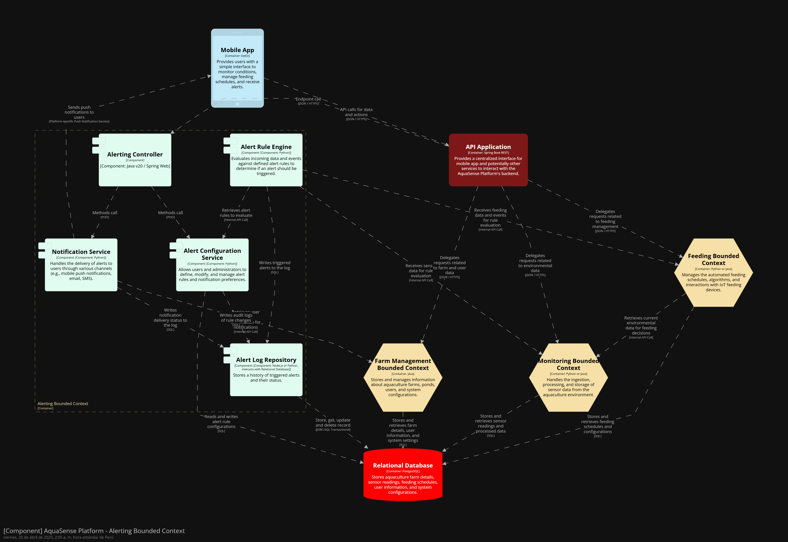
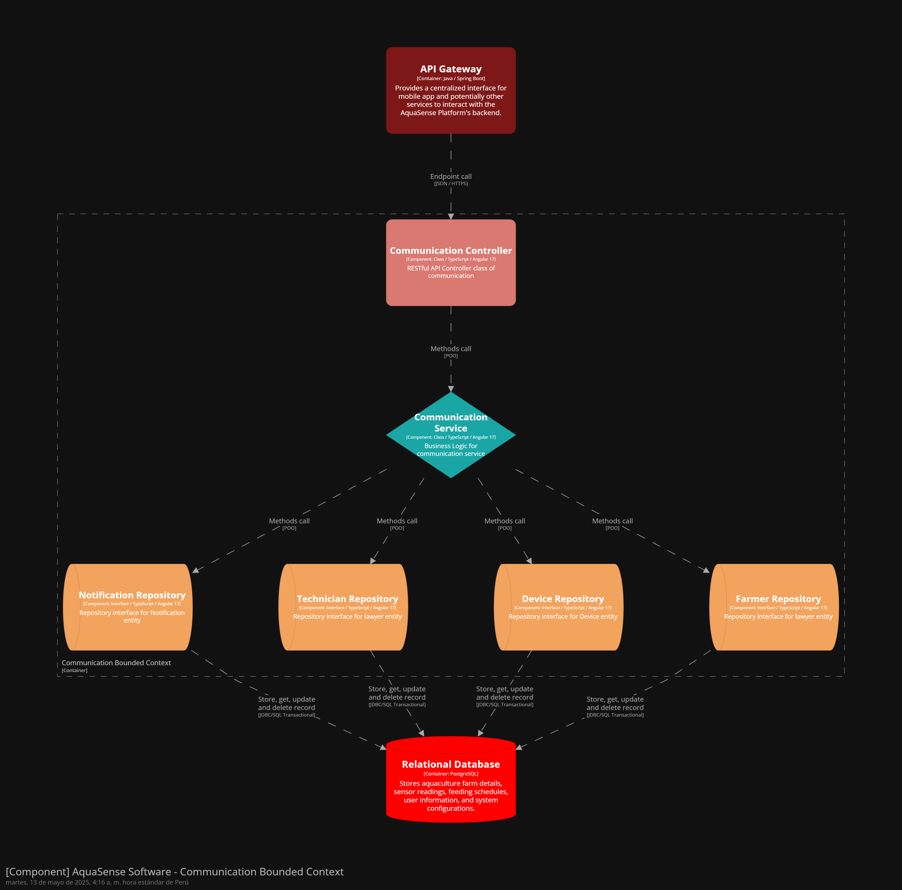
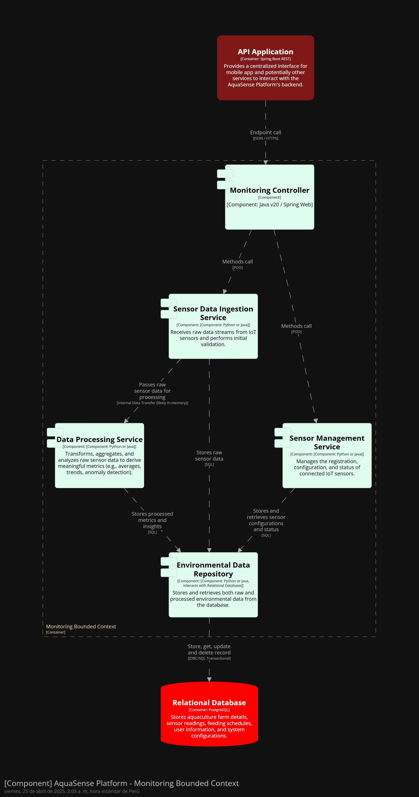
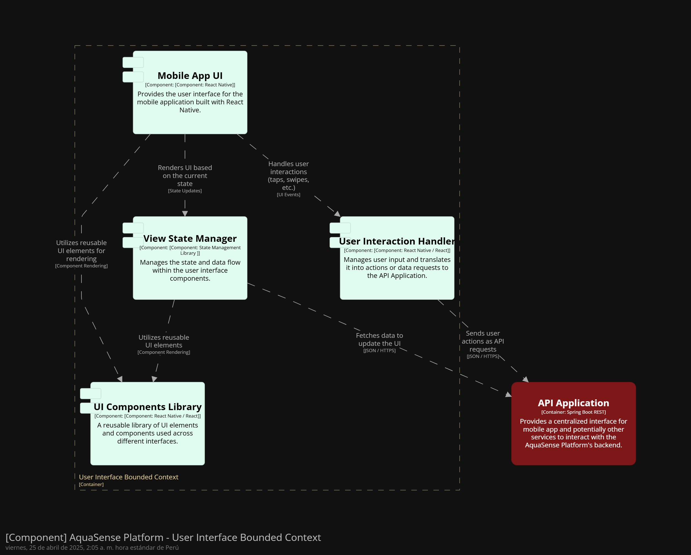
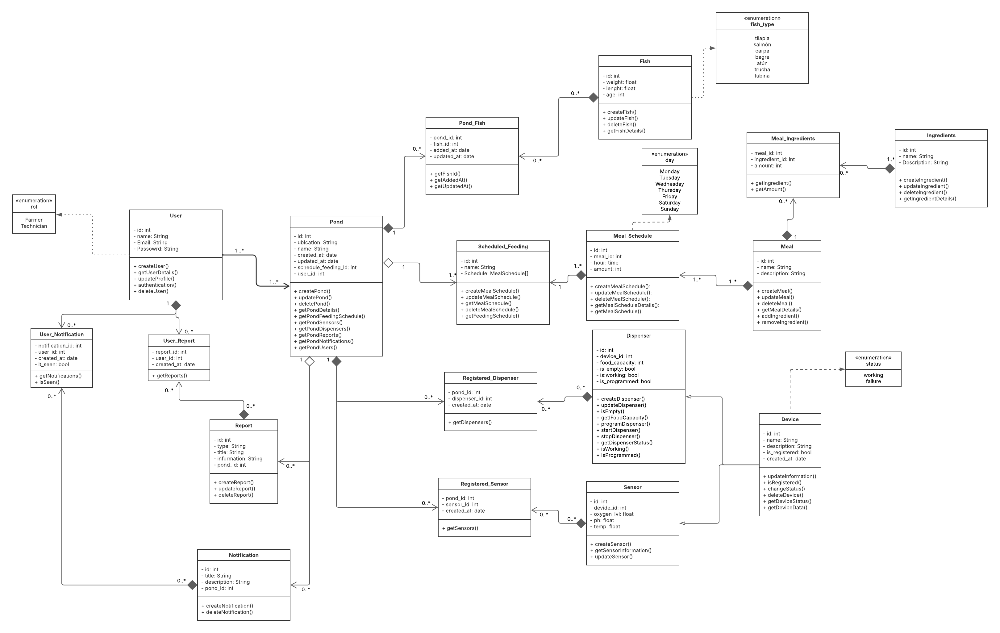
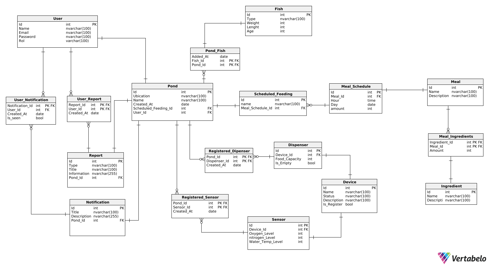

# Reporte de Proyecto

<div align="center">

# **UNIVERSIDAD PERUANA DE CIENCIAS APLICADAS**


### **Facultad de Ingeniería - Carrera de Ingeniería de Software**

### **2025-10**

#### **Curso:**

### 1ASI0572 - Desarrollo de Soluciones IoT

#### **NRC:**

#### 2947

#### **Profesor:**

#### Angel Augusto Velasquez Nuñez

### **Informe de Trabajo Final**

#### Startup: **AquaSense Technologies**

#### Producto: **FeedGuard**

### **Integrantes del equipo**

</div>

<table align="center">
  <thead>
    <tr>
      <th>Código de Estudiante</th>
      <th>Apellidos y Nombres</th>
    </tr>
  </thead>
  <tbody>
    <tr>
      <td align="center">U20231B547</td>
      <td align="center">Eduardo Espinoza, Vittorio Marcelo</td>
    </tr>
    <tr>
      <td align="center">U20221B394</td>
      <td align="center">Flores Avalos, Diego</td>
    </tr>
    <tr>
      <td align="center">U202121584</td>
      <td align="center">Martel Zevallos, Gabriel</td>
    </tr>
    <tr>
      <td align="center">U202018627</td>
      <td align="center">Garcia Rodriguez, Gabriel</td>
    </tr>
    <tr>
      <td align="center">201923994</td>
      <td align="center">Avellaneda Ramos, Carlos</td>
    </tr>
    <tr>
      <td align="center">20191E831</td>
      <td align="center">Rivas Sarango, David Alejandro</td>
    </tr>
  </tbody>
</table>

<br>

<div align="center">

### **Abril 2025**

</div>

---

## Registro de Versiones del Informe

<table border="1" cellspacing="0" cellpadding="5">
  <tr>
    <th>Versión</th>
    <th>Fecha</th>
    <th>Autor</th>
    <th>Descripción de modificación</th>
  </tr>
  <tr>
    <td>1.0.0</td>
    <td>15/04/2025</td>
    <td>Eduardo Espinoza, Vittorio Marcelo; Flores Avalos, Diego; Martel Zevallos, Gabriel; Garcia Rodriguez, Gabriel; Avellaneda Ramos, Carlos; Rivas Sarango, David Alejandro</td>
    <td>- Primera verison<br>- Creación del informe<br>- Creación de los branch<br>- Creación del esquema de cada Capitulo</td>
  </tr>
  <tr>
    <td>2.0.0</td>
    <td>20/04/2025</td>
    <td>Eduardo Espinoza, Vittorio Marcelo; Flores Avalos, Diego; Martel Zevallos, Gabriel; Garcia Rodriguez, Gabriel; Avellaneda Ramos, Carlos; Rivas Sarango, David Alejandro</td>
    <td>- Actualizar el Capitulo 1 con todos los puntos hechos del mismo
<br>- Actualizar el Capitulo 2 con todos los puntos hechos del mismo
<br>- Agregar la caratula con toda la informacion solicitada</td>
  </tr>
  <tr>
    <td>3.0.0</td>
    <td>25/04/2025</td>
    <td>Eduardo Espinoza, Vittorio Marcelo; Flores Avalos, Diego; Martel Zevallos, Gabriel; Garcia Rodriguez, Gabriel; Avellaneda Ramos, Carlos; Rivas Sarango, David Alejandro</td>
    <td>- Actualizar los puntos necesario segun criterio discutido en la reunion
<br>- Actualizar el Capitulo 4 con todos los puntos hechos del mismo
  </tr>
  <tr>
    <td>4.0.0</td>
    <td>02/05/2025</td>
    <td>Eduardo Espinoza, Vittorio Marcelo; Flores Avalos, Diego; Martel Zevallos, Gabriel; Garcia Rodriguez, Gabriel; Avellaneda Ramos, Carlos; Rivas Sarango, David Alejandro</td>
    <td>- Actualizar los puntos necesario segun criterio discutido en la reunion
    <br>- Corregir algunas aspectos mencionados por el profesor
    <br>- Actulizar los puntos pendientes a falta de historial de commits</tr>
  <tr>
    <td>5.0.0</td>
    <td>13/05/2025</td>
    <td>Eduardo Espinoza, Vittorio Marcelo; Flores Avalos, Diego; Martel Zevallos, Gabriel; Garcia Rodriguez, Gabriel; Avellaneda Ramos, Carlos; Rivas Sarango, David Alejandro</td>
    <td>- Realizar la primera versión del Frontend
    <br>- Realizar la primera versión del Landing Page
    <br>- Actualizar el Capitulo 5 con todos los puntos hechos del mismo
    <br>- Actualizar el Capitulo 6 con todos los puntos hechos del mismo</tr>
</table>

## Project Report Collaboration Insights

## Contenido

### Tabla de contenidos

  - [Registro de Versiones del Informe](#registro-de-versiones-del-informe)
  - [Project Report Collaboration Insights](#project-report-collaboration-insights)
  - [Contenido](#contenido)
    - [Tabla de contenidos](#tabla-de-contenidos)
  - [Student Outcome](#student-outcome)
  - [Capítulo I: Introducción](#capítulo-i-introducción)
    - [1.1. Startup Profile](#11-startup-profile)
      - [1.1.1. Descripción de la Startup](#111-descripción-de-la-startup)
      - [1.1.2. Perfiles de integrantes del equipo](#112-perfiles-de-integrantes-del-equipo)
    - [1.2. Solution Profile](#12-solution-profile)
      - [1.2.1. Antecedentes y problemática](#121-antecedentes-y-problemática)
      - [The 5 W’s and 2 H’s](#the-5-ws-and-2-hs)
    - [Descripción de la problemática](#descripción-de-la-problemática)
      - [1.2.2. Lean UX Process](#122-lean-ux-process)
        - [1.2.2.1. Lean UX Problem Statements](#1221-lean-ux-problem-statements)
        - [1.2.2.2. Lean UX Assumptions](#1222-lean-ux-assumptions)
        - [1.2.2.3. Lean UX Hypothesis Statements](#1223-lean-ux-hypothesis-statements)
        - [1.2.2.4. Lean UX Canvas](#1224-lean-ux-canvas)
    - [1.3. Segmentos objetivo](#13-segmentos-objetivo)
  - [Capítulo II: Requirements Elicitation \& Analysis](#capítulo-ii-requirements-elicitation--analysis)
    - [2.1. Competidores](#21-competidores)
      - [2.1.1. Análisis competitivo](#211-análisis-competitivo)
      - [2.1.2. Estrategias y tácticas frente a competidores](#212-estrategias-y-tácticas-frente-a-competidores)
    - [2.2. Entrevistas](#22-entrevistas)
      - [2.2.1. Diseño de entrevistas](#221-diseño-de-entrevistas)
    - [🎯 Objetivo de la entrevista](#-objetivo-de-la-entrevista)
    - [📋 Guía de preguntas](#-guía-de-preguntas)
      - [1. Datos personales y productivos](#1-datos-personales-y-productivos)
      - [2. Proceso de alimentación actual](#2-proceso-de-alimentación-actual)
      - [3. Monitoreo ambiental y toma de decisiones](#3-monitoreo-ambiental-y-toma-de-decisiones)
      - [4. Tecnología, percepción y adopción](#4-tecnología-percepción-y-adopción)
    - [📝 Datos complementarios a recolectar](#-datos-complementarios-a-recolectar)
      - [2.2.2. Registro de entrevistas](#222-registro-de-entrevistas)
      - [2.2.3. Análisis de entrevistas](#223-análisis-de-entrevistas)
    - [2.3. Needfinding](#23-needfinding)
      - [2.3.1. User Personas](#231-user-personas)
      - [2.3.2. User Task Matrix](#232-user-task-matrix)
      - [2.3.3. User Journey Mapping](#233-user-journey-mapping)
      - [2.3.4. Empathy Mapping](#234-empathy-mapping)
      - [2.3.5. As-is Scenario Mapping](#235-as-is-scenario-mapping)
    - [2.4. Ubiquitous Language](#24-ubiquitous-language)
  - [Capítulo III: Requirements Specification](#capítulo-iii-requirements-specification)
    - [3.1. To-Be Scenario Mapping](#31-to-be-scenario-mapping)
    - [To-Be Scenario Mapping – Juan Pérez](#to-be-scenario-mapping--juan-pérez)
    - [To-Be Scenario Mapping – Bryan Díaz](#to-be-scenario-mapping--bryan-díaz)
    - [3.2. User Stories](#32-user-stories)
    - [3.3. Impact Mapping](#33-impact-mapping)
      - [Impact Mapping – Juan Pérez (Piscicultor rural, tradicional)](#impact-mapping--juan-pérez-piscicultor-rural-tradicional)
      - [Impact Mapping – Bryan Díaz (Piscicultor técnico, innovador)](#impact-mapping--bryan-díaz-piscicultor-técnico-innovador)
    - [3.4. Product Backlog](#34-product-backlog)
  - [Capítulo IV: Solution Software Design](#capítulo-iv-solution-software-design)
    - [4.1. Strategic-Level Domain-Driven Design](#41-strategic-level-domain-driven-design)
      - [4.1.1. EventStorming](#411-eventstorming)
        - [4.1.1.1. Candidate Context Discovery](#4111-candidate-context-discovery)
      - [Unstructured Exploration](#unstructured-exploration)
      - [Timelines](#timelines)
      - [BC-IAM](#bc-iam)
      - [BC-Schedule Planning](#bc-schedule-planning)
      - [BC-Feeding](#bc-feeding)
      - [BC-Device Managment](#bc-device-managment)
      - [BC-Communication](#bc-communication)
        - [4.1.1.2. Domain Message Flows Modeling](#4112-domain-message-flows-modeling)
        - [4.1.1.3. Bounded Context Canvases](#4113-bounded-context-canvases)
      - [BC Canvas-IAM](#bc-canvas-iam)
      - [BC Canvas-Schedule Planning](#bc-canvas-schedule-planning)
      - [BC Canvas-Feeding](#bc-canvas-feeding)
      - [BC Canvas-Device Managment](#bc-canvas-device-managment)
      - [BC Canvas-Communication](#bc-canvas-communication)
      - [4.1.2. Context Mapping](#412-context-mapping)
      - [4.1.3. Software Architecture](#413-software-architecture)
        - [4.1.3.1. System Landscape Diagram](#4131-system-landscape-diagram)
        - [4.1.3.2. Context Level Diagrams](#4132-context-level-diagrams)
        - [4.1.3.3. Container Level Diagrams](#4133-container-level-diagrams)
        - [4.1.3.4. Deployment Diagrams](#4134-deployment-diagrams)
  - [Identify and access Bounded Context](#identify-and-access-bounded-context)
  - [Communication Bounded Context](#communication-bounded-context)
  - [Device Management Bounded Context](#device-management-bounded-context)
  - [Feeding Bounded Context](#feeding-bounded-context)
  - [Schedule Management Bounded Context](#schedule-management-bounded-context)
    - [link de structurizr](#link-de-structurizr)
    - [4.2. Tactical-Level Domain-Driven Design](#42-tactical-level-domain-driven-design)
      - [4.2.1. Bounded Context: \<Access and Identify\>](#421-bounded-context-access-and-identify)
        - [4.2.1.1. Domain Layer](#4211-domain-layer)
        - [4.2.1.2. Interface Layer](#4212-interface-layer)
        - [4.2.1.3. Application Layer](#4213-application-layer)
        - [4.2.1.4. Infrastructure Layer](#4214-infrastructure-layer)
        - [4.2.1.5. Component Level Diagrams](#4215-component-level-diagrams)
        - [4.2.1.6. Code Level Diagrams](#4216-code-level-diagrams)
      - [4.2.2. Bounded Context: \<Communication\>](#422-bounded-context-communication)
        - [4.2.2.1. Domain Layer](#4221-domain-layer)
        - [4.2.2.2. Interface Layer](#4222-interface-layer)
        - [4.2.2.3. Application Layer](#4223-application-layer)
        - [4.2.2.4. Infrastructure Layer](#4224-infrastructure-layer)
        - [4.2.2.5. Component Level Diagrams](#4225-component-level-diagrams)
        - [4.2.2.6. Code Level Diagrams](#4226-code-level-diagrams)
      - [4.2.3. Bounded Context: \<Device Management\>](#423-bounded-context-device-management)
        - [4.2.3.1. Domain Layer](#4231-domain-layer)
        - [4.2.3.2. Interface Layer](#4232-interface-layer)
        - [4.2.3.3. Application Layer](#4233-application-layer)
        - [4.2.3.4. Infrastructure Layer](#4234-infrastructure-layer)
        - [4.2.3.5. Component Level Diagrams](#4235-component-level-diagrams)
        - [4.2.3.6. Code Level Diagrams](#4236-code-level-diagrams)
      - [4.2.4. Bounded Context: \<Feeding Management\>](#424-bounded-context-feeding-management)
        - [4.2.4.1. Domain Layer](#4241-domain-layer)
        - [4.2.4.2. Interface Layer](#4242-interface-layer)
        - [4.2.4.3. Application Layer](#4243-application-layer)
        - [4.2.4.4. Infrastructure Layer](#4244-infrastructure-layer)
        - [4.2.4.5. Component Level Diagrams](#4245-component-level-diagrams)
        - [4.2.4.6. Code Level Diagrams](#4246-code-level-diagrams)
      - [4.2.5. Bounded Context: \<Schedule Management\>](#425-bounded-context-schedule-management)
        - [4.2.5.1. Domain Layer](#4251-domain-layer)
        - [4.2.3.2. Interface Layer](#4232-interface-layer-1)
        - [4.2.3.3. Application Layer](#4233-application-layer-1)
        - [4.2.3.4. Infrastructure Layer](#4234-infrastructure-layer-1)
        - [4.2.3.5. Component Level Diagrams](#4235-component-level-diagrams-1)
        - [4.2.3.6. Code Level Diagrams](#4236-code-level-diagrams-1)
          - [4.3.1 Domain Layer Class Diagrams](#431-domain-layer-class-diagrams)
          - [4.3.2 Database Design Diagram](#432-database-design-diagram)
  - [Capítulo V: Solution UI/UX Design](#capítulo-v-solution-uiux-design)
    - [5.1. Style Guidelines.](#51-style-guidelines)
      - [5.1.1. General Style Guidelines.](#511-general-style-guidelines)
      - [5.1.2. Web, Mobile and IoT Style Guidelines.](#512-web-mobile-and-iot-style-guidelines)
    - [5.2. Information Architecture.](#52-information-architecture)
      - [5.2.1. Organization Systems.](#521-organization-systems)
      - [5.2.2. Labeling Systems.](#522-labeling-systems)
      - [5.2.3. SEO Tags and Meta Tags](#523-seo-tags-and-meta-tags)
      - [5.2.4. Searching Systems.](#524-searching-systems)
      - [5.2.5. Navigation Systems.](#525-navigation-systems)
    - [5.3. Landing Page UI Design.](#53-landing-page-ui-design)
      - [5.3.1. Landing Page Wireframe.](#531-landing-page-wireframe)
      - [5.3.2. Landing Page Mock-up.](#532-landing-page-mock-up)
    - [5.4. Applications UX/UI Design.](#54-applications-uxui-design)
      - [5.4.1. Applications Wireframes.](#541-applications-wireframes)
      - [5.4.2. Applications Wireflow Diagrams.](#542-applications-wireflow-diagrams)
      - [5.4.3. Applications Mock-ups.](#543-applications-mock-ups)
      - [5.4.4. Applications User Flow Diagrams.](#544-applications-user-flow-diagrams)
    - [5.5. Applications Prototyping.](#55-applications-prototyping)
      - [🧭 Criterios para las decisiones de interacción](#-criterios-para-las-decisiones-de-interacción)
      - [🗂️ Sistema de navegación](#️-sistema-de-navegación)
      - [🔁 Tipos de interacciones seleccionadas](#-tipos-de-interacciones-seleccionadas)
      - [🎯 Prototipos presentados](#-prototipos-presentados)
      - [🎥 Enlaces a videos en Microsoft Stream](#-enlaces-a-videos-en-microsoft-stream)
  - [Capítulo VI: Product Implementation, Validation \& Deployment](#capítulo-vi-product-implementation-validation--deployment)
    - [6.1. Software Configuration Management.](#61-software-configuration-management)
      - [6.1.1. Software Development Environment Configuration](#611-software-development-environment-configuration)
      - [6.1.2. Source Code Management.](#612-source-code-management)
    - [Semantic Versioning 2.0.0](#semantic-versioning-200)
    - [Conventional Commits](#conventional-commits)
      - [6.1.3. Source Code Style Guide \& Conventions.](#613-source-code-style-guide--conventions)
    - [HTML](#html)
    - [CSS](#css)
    - [TypeScript con Angular](#typescript-con-angular)
    - [Java con Spring Boot](#java-con-spring-boot)
    - [Flutter con Dart](#flutter-con-dart)
      - [6.1.4. Software Deployment Configuration.](#614-software-deployment-configuration)
    - [6.2. Landing Page, Services \& Applications Implementation.](#62-landing-page-services--applications-implementation)
      - [6.2.1. Sprint 1](#621-sprint-1)
        - [6.2.1.1. Sprint Planning 1.](#6211-sprint-planning-1)
        - [6.2.1.2. Aspect Leaders and Collaborators.](#6212-aspect-leaders-and-collaborators)
        - [6.2.1.3. Sprint Backlog 1.](#6213-sprint-backlog-1)
        - [6.2.1.4. Development Evidence for Sprint Review.](#6214-development-evidence-for-sprint-review)
        - [6.2.1.5. Testing Suite Evidence for Sprint Review.](#6215-testing-suite-evidence-for-sprint-review)
        - [6.2.1.6. Execution Evidence for Sprint Review.](#6216-execution-evidence-for-sprint-review)
        - [6.2.1.7. Services Documentation Evidence for Sprint Review.](#6217-services-documentation-evidence-for-sprint-review)
        - [6.2.1.8. Software Deployment Evidence for Sprint Review.](#6218-software-deployment-evidence-for-sprint-review)
        - [6.2.1.9. Team Collaboration Insights during Sprint.](#6219-team-collaboration-insights-during-sprint)
  - [Conclusiones](#conclusiones)
      - [Conclusiones y recomendaciones.](#conclusiones-y-recomendaciones)
    - [Bibliografía](#bibliografía)
  - [Anexos](#anexos)

---

## Student Outcome

<table border="1" cellspacing="0" cellpadding="5" style="border-collapse: collapse; width: 100%;">
  <tr>
    <th>Criterio especifico</th>
    <th>Acciones realizadas</th>
    <th>Conclusiones</th>
  </tr>
  <tr>
    <td><strong>Trabaja en equipo para proporcionar liderazgo en forma conjunta</strong></td>
    <td>
    Avellaneda Ramos, Carlos Edward<br>
    <i>
    TB1:
    Trabajamos como equipo, liderando la dirección y aportando la ejecución técnica para modelar AquaSense.
    </i><br><br>
    Eduardo Espinoza, Vittorio Marcelo<br>
    <i>TB1: se realizo el Lean UX Problem Statements, Assumptions, Hypothesis Statements, Canvas y Segmentos objetivo</i><br>
    <i>TP1: se realizo Style Guidelines, Web Applications Wireframes y Web Applications Mock-ups</i><br><br>
    Flores Avalos, Diego<br>
    <i>TB1: Se realizó user stories, Context Mapping, System Landscape Diagram, Context Diagram.</i><br>
    <i>TP: Se realizó el event storming, domain message flow modelling, feeding context, user stories.</i><br><br>
    Garcia Rodriguez, Gabriel Stefano<br>
    <i>TB1: se realizo el ubiquitous Languaje, To-Be Scenario Mapping, User Stories, Impact Mapping, Product Backlog, user stories</i><br>
    <i>TP1: se realizo user stories, event storming, Candidate Context Discovery, Bounded Context Canvases, Context Mapping, Landing Page UI Design, Landing Page Wireframe, Landing Page Mock-up, Software Configuration Management, feeding context, Sprint 1</i><br><br>
    Martel Zevallos, Gabriel<br>
    <i>TB1: Colaboré con la elaboración de las preguntas que se le cuestionarian a los segmentos objetivo, también he aportado en el liderazgo para el EventStorming.</i><br>
    <i>TP: Coolabore con el desarrollo de los user stories, y ampliamente en el desarrollo del prototipo.</i><br><br>
    Rivas Sarango, David Alejandro<br>
    <i>TB1:<i>Se realizó el capítulo 2, junto con la elaboración de las entrevistas.  Nos comunicamos eficientemte al comunicar nuestras ideas para el diseño de las entrevistas y así identificarlas falencias actuales que poseen los piscicultores.</i><br></i><br>
    <i>TP:<i>Se dialogó la elaboración y decisión de mockups y wireframes de la aplicación.</i><br></i><br>
    </td>
    <td>TB1: La construcción de la solución se benefició con el intercambio constante de ideas entre los miembros del equipo. Cada miembro asumió responsabilidades específicas y contribuyó activamente en la toma de decisiones, fortaleciendo así el liderazgo distribuido dentro del grupo.</td>
  </tr>
  <tr>
    <td><strong>Crea un entorno colaborativo e inclusivo, establece metas, planifica tareas y cumple objetivos.</strong></td>
    <td>
    Avellaneda Ramos, Carlos Edward<br>
    <i>TB1: Creamos un entorno colaborativo y alcanzamos el objetivo de construir el modelo C4 mediante tareas planificadas y comunicación abierta.
    </i><br><br>
    Eduardo Espinoza, Vittorio Marcelo<br>
    <i>TB1: se realizo el Lean UX Problem Statements, Assumptions, Hypothesis Statements, Canvas y Segmentos objetivo</i><br>
    <i>TP1: se realizo Style Guidelines, Web Applications Wireframes y Web Applications Mock-ups</i><br><br>
    Flores Avalos, Diego<br>
    <i>TB1: Se realizó user stories, Context Mapping, System Landscape Diagram, Context Diagram.</i><br>
    <i>TP: Se realizó el event storming, domain message flow modelling, feeding context, user stories.</i><br><br>
    Garcia Rodriguez, Gabriel Stefano<br>
    <i>TB1: se realizo el ubiquitous Languaje, To-Be Scenario Mapping, User Stories, Impact Mapping, Product Backlog</i><br>
    <i>TP1: se realizo user stories, event storming, Candidate Context Discovery, Bounded Context Canvases, Context Mapping, Landing Page UI Design, Landing Page Wireframe, Landing Page Mock-up, Software Configuration Management, feeding context, Sprint 1</i><br><br>
    Martel Zevallos, Gabriel<br>
    <i>TB1: Colaboré con la elaboración de las preguntas que se le cuestionarian a los segmentos objetivo, también he aportado en el liderazgo para el EventStorming.</i><br>
    <i>TP: Coolabore con el desarrollo de los user stories, y ampliamente en el desarrollo del prototipo.</i><br><br>
    <i>TB1</i><br>
    Rivas Sarango, David Alejandro<br>
    <i>TB1:<i> Para esta entrega realice el análisis de competidores y las entrevistas. Lo que me ayudó a comprender mejor la situación actual del usuario y así mejorar el Needfinding.</i><br>
    <i>TP:<i> En esta entrega se realizaron los user stories, style guidelines, message flows y mockups de la aplicación.</i><br></i><br>
    </td>
    <td> TB1: Concluimos que la incorporación de soluciones IoT es fundamental para el sector acuícola. Si se les ayuda a automatizar y que no requieran un sobre esfuerzo. Se centrarían más en la gestión y administración adecuada de su negocio.</td>
  </tr>
</table>

## Capítulo I: Introducción

En el contexto de los sistemas productivos modernos, la incorporación de tecnologías emergentes como el Internet de las Cosas (IoT, por sus siglas en inglés) representa una oportunidad clave para mejorar procesos tradicionales a través de la automatización, el monitoreo en tiempo real y la toma de decisiones basada en datos. Esta transformación digital, conocida como Industria 4.0, ha impactado positivamente múltiples sectores, incluyendo la agricultura, la manufactura, la logística y, más recientemente, la acuicultura.

La acuicultura, entendida como la cría controlada de organismos acuáticos en entornos artificiales o semi-naturales, se ha consolidado como una de las principales fuentes de proteína animal a nivel mundial. Sin embargo, a pesar de su crecimiento, enfrenta desafíos estructurales relacionados con la eficiencia de los recursos, la sostenibilidad ambiental y la precisión en los procesos operativos, especialmente en el manejo de la alimentación y la calidad del agua.

Este reporte documenta el ciclo de vida completo del desarrollo de una solución basada en IoT orientada a resolver una problemática concreta dentro del entorno acuícola. A través de la aplicación de metodologías ágiles, principios de diseño centrado en el usuario, y prácticas modernas de desarrollo de software, se busca diseñar e implementar una solución que no solo resuelva una necesidad real del sector, sino que también aproveche los beneficios de la conectividad y la automatización.

El contenido del informe abordará desde la identificación de la problemática, el análisis de los usuarios, la especificación de requerimientos y diseño de la arquitectura de software, hasta la implementación, validación y despliegue de la solución propuesta. Todo ello con el objetivo de mostrar cómo una propuesta tecnológica puede impactar positivamente la productividad y sostenibilidad de una actividad económica vital como lo es la acuicultura.

### 1.1. Startup Profile

#### 1.1.1. Descripción de la Startup

AquaSense Technologies es una startup tecnológica orientada al desarrollo de soluciones inteligentes para el sector acuícola. Su enfoque principal es mejorar la eficiencia y sostenibilidad de los procesos productivos en pisciculturas mediante el uso de tecnologías IoT, automatización y monitoreo ambiental en tiempo real. La empresa trabaja con un enfoque centrado en el usuario, combinando ingeniería, datos y experiencia en campo para resolver problemáticas clave en sistemas semiindustriales de crianza de peces.

- 🧭 **Visión**

  Convertirnos en referentes en la transformación digital de la acuicultura en Latinoamérica, mediante soluciones tecnológicas accesibles, eficientes y sostenibles que contribuyan al desarrollo de sistemas de producción más rentables y responsables con el medio ambiente.

- 🎯 **Misión**

  Diseñar e implementar soluciones inteligentes que integren IoT, automatización y análisis de datos en tiempo real para optimizar procesos clave en sistemas acuícolas, mejorando la productividad, la sostenibilidad y la calidad del producto final.

- 💡 **Propuesta de valor**

  - Soluciones tecnológicas adaptadas a las necesidades reales de productores acuícolas semiindustriales.
  - Automatización de procesos críticos como la alimentación y el monitoreo ambiental.
  - Mejora de la eficiencia operativa, reducción de desperdicios y optimización del uso de recursos.
  - Diseño centrado en el usuario y validación continua con datos reales del entorno.

- ⚙️ **Enfoque tecnológico**

  AquaSense Technologies desarrolla productos utilizando:

  - **Tecnologías IoT** para la sensorización y automatización.
  - **Sistemas embebidos** conectados con plataformas en la nube.
  - **Arquitecturas distribuidas** con Edge Computing y servicios RESTful.
  - **Software open-source** para garantizar adaptabilidad y sostenibilidad.

- 🤝 **Compromiso**

  Promovemos la integración entre tecnología y sostenibilidad en el sector acuícola. Nuestro compromiso es con la innovación responsable, la mejora continua y la colaboración interdisciplinaria, integrando conocimientos de ingeniería, biología acuática y experiencia del usuario.

- 🚀 **Primer producto**

  **FeedGuard**  
  Sistema inteligente de alimentación y monitoreo para acuicultura semiindustrial.<br>
  Automatiza la dosificación de alimento y toma decisiones en función de parámetros como el oxígeno disuelto y los compuestos nitrogenados del agua, mejorando la eficiencia productiva y el bienestar de los peces.

#### 1.1.2. Perfiles de integrantes del equipo

<table border="1" cellspacing="0" cellpadding="5" style="border-collapse: collapse; width: 100%;">
  <tr>
    <th>Foto</th>
    <th>Descripcion</th>
  </tr>
  <tr>
    <td></td>
    <td>
     Mi nombre es Carlos Avellaneda Ramos, estudiante de la carrera de ingeniería de software, en la UPC. Actualmente, manejo con soltura Java y TypeScript. Además, me divierto creando mods para juegos en Lua y también tengo experiencia con Python y C++.
    </td>
  </tr>
  <tr>
    <td></td>
    <td>
    Mi nombre es Vittorio Marcelo Eduardo Espinoza y soy alumno de la carrera de ingeniería de software en la UPC. Soy una persona persistente y honesta que trata realizar su trabajo de manera correcta, así como tengo conocimientos en programación como C++ y Java Spring.
    </td>
  </tr>
  <tr>
    <td></td>
    <td>
    Mi nombre es Diego Flores, tengo conocimientos de lenguajes de programación C++, Python, HTML y CSS. Frontend: Vue. Backend: Flask. Me interesa el área de desarrollo web y soy proactivo y me gusta trabajar en equipo.
    </td>
  </tr>
  <tr>
    <td></td>
    <td>
    Mi nombre es Garcia Rodriguez Gabriel Stefano, tengo conocimientos de lenguajes de programación c++, c#, python, html y css, Frontend: Html, CSS, Angular y Vue. Backend: C# .NET y Java Spring Boot.  Habilidades de liderazgo y contribución en equipo.
    </td>
  </tr>
  <tr>
    <td> </td>
    <td>
      Mi nombre es Gabriel Martel, tengo conocimientos de lenguajes de programación JavaScript, TypeScript, Python, HTML y CSS. Frontend: React. Me interesa el área de Data Science y cuento con habilidades de liderazgo y trabajo en equipo.
    </td>
  </tr>
  <tr>
    <td></td>
    <td>
    Mi nombre es David Alejandro Rivas Sarango, actualmente estoy cursando la carrera de Ingeniería de Software en la UPC. Soy una persona honesta y responsable. Me interesa el área de Data Science, por esto estoy siguiendo cursos de capacitacion en SQL y Python.
    </td>
  </tr>
</table>

### 1.2. Solution Profile

#### 1.2.1. Antecedentes y problemática

#### The 5 W’s and 2 H’s

- **Who (¿Quiénes están involucrados?)**  
  Productores acuícolas, específicamente aquellos que operan sistemas semiindustriales de crianza de peces en estanques, piscinas o jaulas flotantes.  
  Técnicos encargados del monitoreo y mantenimiento de las condiciones del agua y de los procesos de alimentación.  
  Proveedores de alimento balanceado y servicios de mantenimiento de equipos.  
  Instituciones regulatorias o de supervisión ambiental.

- **What (¿Qué está ocurriendo?)**  
  Se presentan ineficiencias significativas en los procesos de alimentación y control de calidad del agua. Estas fallas operativas generan impactos negativos en el crecimiento de los peces, el uso de insumos y la rentabilidad general del sistema.

- **Where (¿Dónde ocurre?)**  
  En entornos de acuicultura semiindustrial, comúnmente en zonas rurales o periurbanas donde se instalan estanques o piscinas de crianza de peces como parte de sistemas de producción local o regional.

- **When (¿Cuándo ocurre?)**  
  De forma continua durante las fases activas del ciclo productivo de los peces, con especial incidencia durante los horarios de alimentación y monitoreo diario.

- **Why (¿Por qué ocurre?)**  
  La problemática surge por la ausencia de mecanismos automatizados y precisos que permitan controlar tanto la cantidad de alimento suministrado como el estado ambiental del agua. Las decisiones suelen basarse en la experiencia empírica del personal y no en datos en tiempo real.

- **How (¿Cómo ocurre?)**  
  A través de procesos manuales o semi-manuales que no siempre garantizan la regularidad ni la exactitud necesarias, lo que puede llevar a situaciones de sobrealimentación, subalimentación, o alimentación en condiciones desfavorables del agua.

- **How much (¿Cuánto impacta?)**  
  El impacto puede reflejarse en pérdidas económicas por mal aprovechamiento del alimento (hasta un 30% del alimento puede desperdiciarse), aumento del estrés en los peces, crecimiento lento, aparición de enfermedades, y deterioro de la calidad del agua que obliga a realizar tratamientos costosos o incluso pérdidas totales en algunos ciclos productivos.

---

### Descripción de la problemática

En los sistemas acuícolas semiindustriales, uno de los procesos más críticos y determinantes para el éxito del ciclo de producción es la alimentación. La alimentación adecuada no solo garantiza el crecimiento óptimo de los peces, sino que también influye directamente en la calidad del agua y en la salud general del cultivo. Sin embargo, a pesar de su importancia, la alimentación suele llevarse a cabo de manera manual o con mecanismos rudimentarios, lo que conlleva una serie de desafíos recurrentes.

En primer lugar, la alimentación manual depende de la experiencia del operario, lo que introduce una variabilidad significativa en términos de cantidad, frecuencia y oportunidad. Esto puede resultar en prácticas ineficientes como la sobrealimentación, que genera acumulación de residuos en el agua, o la subalimentación, que afecta el crecimiento de los peces. Ambas situaciones pueden tener consecuencias económicas severas para los productores.

Adicionalmente, la falta de integración entre el proceso de alimentación y las condiciones ambientales del agua representa otro factor de riesgo. Parámetros como el oxígeno disuelto o los niveles de compuestos nitrogenados (amonio, nitritos, nitratos) tienen un impacto directo en la fisiología de los peces. Alimentar en condiciones subóptimas no solo reduce la eficiencia de conversión alimenticia, sino que también incrementa el estrés y la vulnerabilidad a enfermedades.

A esto se suma la necesidad de optimizar el uso del tiempo y los recursos humanos en un contexto donde el acceso a personal capacitado es limitado y los márgenes de ganancia son estrechos. Las actividades repetitivas y rutinarias como la alimentación podrían ser automatizadas para liberar tiempo y reducir errores humanos.

Frente a esta problemática, se evidencia una clara oportunidad de mejora mediante el uso de tecnologías emergentes que permitan tomar decisiones más informadas, automatizar procesos clave y mejorar la sostenibilidad del sistema productivo.

#### 1.2.2. Lean UX Process

En esta parte, explicamos el proceso de Lean UX que utilizamos para desarrollar la solución FeedGuard. Se detallan los problemas, asunciones, hipótesis y el enfoque general que guía nuestra propuesta tecnológica centrada en el usuario dentro del sector acuícola.

##### 1.2.2.1. Lean UX Problem Statements

**Problem Statement 1:**
En los sistemas acuícolas semiindustriales del Perú, el proceso de alimentación sigue siendo mayormente manual, dependiente de la experiencia del operario y desconectado de los parámetros ambientales del agua. Esto genera ineficiencias como la sobrealimentación o subalimentación, afectando negativamente la salud de los peces y reduciendo la rentabilidad. Los sistemas actuales no ofrecen una solución automatizada, asequible y adaptada a las condiciones reales de los pequeños piscicultores. FeedGuard abordará esta brecha mediante una solución IoT que automatiza la alimentación basándose en datos en tiempo real. Sabremos que hemos tenido éxito cuando los productores reporten una reducción significativa en el desperdicio de alimento y una mejora en la tasa de conversión alimenticia.

**Problem Statement 2:**
Actualmente, los pequeños productores acuícolas carecen de herramientas tecnológicas que integren monitoreo ambiental con decisiones operativas automatizadas. Esta desconexión impide detectar condiciones adversas como niveles bajos de oxígeno o altos niveles de amonio a tiempo, comprometiendo la salud del cultivo. Lo que los productos actuales no logran resolver es la combinación entre accesibilidad, automatización inteligente y diseño centrado en el usuario. Nuestra solución integrará sensorización ambiental y automatización para garantizar condiciones óptimas antes, durante y después de la alimentación. Sabremos que hemos tenido éxito cuando observemos una mejora en la supervivencia y crecimiento de los peces, y un aumento en la satisfacción de los usuarios por la facilidad de uso y resultados alcanzados.

##### 1.2.2.2. Lean UX Assumptions

**Business Outcomes:**

- Creemos que los productores acuícolas necesitan una solución tecnológica que automatice y optimice la alimentación de los peces basada en datos ambientales.

- Estas necesidades pueden resolverse mediante una plataforma IoT integrada con sensores, actuadores y una interfaz intuitiva para el control remoto o automático.

- Nuestros clientes iniciales son piscicultores semiindustriales en zonas rurales o periurbanas que buscan mejorar sus resultados productivos sin aumentar significativamente sus costos operativos.

- El valor principal que ofrecen nuestras soluciones es el ahorro en alimento, la mejora en la salud de los peces y la facilidad de implementación.

- Beneficios adicionales incluyen: monitoreo remoto, reducción del trabajo manual, y soporte técnico.

- Llegaremos a nuestros clientes mediante demostraciones en campo, alianzas con asociaciones piscícolas y difusión en redes técnicas y ferias tecnológicas del sector agropecuario.

- Nuestra monetización se basará en ventas directas del dispositivo FeedGuard, modelos de suscripción para mantenimiento remoto y analítica avanzada.

- Nuestra competencia incluye alimentadores automáticos básicos, empresas de automatización industrial costosa y métodos tradicionales empíricos.

- Nos diferenciamos porque ofrecemos una solución adaptada al contexto rural, de bajo costo, modular y basada en datos reales.

- Los mayores riesgos son: resistencia al cambio tecnológico, desconfianza en nuevas tecnologías y fallas técnicas en ambientes rurales.

- Reduciremos estos riesgos mediante pruebas piloto, capacitación práctica y soporte técnico continuo.

- Sabremos que tenemos éxito cuando los piscicultores reporten una mejora en su productividad y recomienden nuestra solución a sus pares.

**User Outcomes:**

**¿Quiénes serán nuestros usuarios?**

- Piscicultores semiindustriales que trabajan en zonas rurales o periurbanas.

- Técnicos jóvenes e innovadores que buscan implementar nuevas tecnologías en sus unidades de cultivo.

**¿Dónde encaja nuestro producto en su vida o trabajo?**

FeedGuard se integra en la rutina diaria de alimentación y monitoreo, permitiendo una operación más eficiente y menos demandante en tiempo y esfuerzo.

**¿Qué problemas tiene nuestro producto y cómo se pueden resolver?**

**Problemas:**
Dificultad en adopción tecnológica inicial; entornos sin conectividad estable; desconocimiento técnico.

**Soluciones:**
Interfaz amigable, modo offline, materiales de capacitación visual, soporte técnico local y remoto.

**¿Cómo y cuándo es usado nuestro producto?**

Es utilizado durante las rutinas de alimentación y monitoreo diario, y en cualquier momento cuando el usuario desea revisar el estado del sistema o los parámetros del agua.

**¿Qué características son importantes?**

- Interfaz visual e intuitiva.

- Alertas automáticas ante condiciones críticas del agua.

- Historial de datos y reportes accesibles.

- Control manual o automático de la alimentación.

- ¿Cómo debe verse y comportarse nuestro producto?

- El diseño debe inspirar confianza, mostrar profesionalismo y ser percibido como fácil de usar.

- Debe comportarse de forma confiable, con respuestas rápidas y una integración fluida entre sensores, actuadores y plataforma de visualización.

**Features:**

Desde la cuenta del usuario técnico:

- Acceso en tiempo real a parámetros del agua y estado de alimentación.

- Configuración personalizada de horarios y condiciones de alimentación.

- Visualización de históricos y reportes de desempeño.

Desde la cuenta del productor básico:

- Encendido/apagado simple del sistema.

- Alertas visuales o auditivas sobre anomalías detectadas.

- Recomendaciones prácticas automatizadas en lenguaje accesible.

##### 1.2.2.3. Lean UX Hypothesis Statements

- Creemos que al ofrecer un sistema automatizado de alimentación que se adapte a condiciones reales del agua, los productores acuícolas reducirán el desperdicio de alimento y mejorarán la tasa de conversión alimenticia. Sabremos que esto es cierto si observamos una reducción de al menos 20% en el uso de alimento y un aumento del 15% en el peso promedio de los peces.

- Creemos que al facilitar una interfaz intuitiva y soporte técnico cercano, los productores semiindustriales superarán la barrera tecnológica y adoptarán FeedGuard como herramienta cotidiana. Sabremos que esto es cierto si más del 70% de los usuarios iniciales continúan usando el sistema después de tres meses y lo recomiendan a otros.

- Creemos que al integrar monitoreo ambiental en tiempo real con alertas automatizadas, los productores podrán evitar condiciones críticas que afecten a sus cultivos. Sabremos que esto es cierto si se reporta una reducción de eventos de mortalidad o enfermedades atribuibles a condiciones del agua en al menos un 30%.

##### 1.2.2.4. Lean UX Canvas


### 1.3. Segmentos objetivo

**Segmento 1: Productores acuícolas semiindustriales rurales**
Descripción:
Pequeños y medianos piscicultores que operan estanques de crianza de tilapia, trucha o gamitana en zonas rurales o periurbanas. Generalmente trabajan de forma independiente o en asociación, con entre 2 y 10 unidades de cultivo operativas.

Características demográficas y técnicas:

- Edad promedio de los productores: entre 35 y 55 años.
- Nivel educativo: secundaria completa o técnica agrícola.
- Acceso limitado a tecnologías digitales, pero creciente interés por innovaciones que mejoren la rentabilidad.
- Ubicación en zonas con conectividad móvil básica y limitado acceso a servicios técnicos continuos.
- Operación centrada en ciclos productivos de entre 5 y 8 meses.

**Segmento 2: Piscicultores técnicos innovadores**
Descripción:
Piscicultores jóvenes o de perfil técnico, con conocimientos básicos o intermedios en tecnologías digitales, automatización y sensores. Utilizan o experimentan con herramientas como Arduino, sensores ambientales y dispositivos móviles para monitoreo de sus estanques. Tienen altas expectativas en cuanto a eficiencia y tecnología.

Características demográficas y técnicas:

- Edad promedio: 25 a 40 años.
- Nivel educativo: técnico superior o universitario (áreas relacionadas a producción agropecuaria, ingeniería técnica o afines).
- Uso de dispositivos móviles y plataformas digitales.
- Interés activo en automatización, monitoreo en tiempo real y reducción de costos operativos.
- Buscan soluciones escalables y con soporte técnico constante.

## Capítulo II: Requirements Elicitation & Analysis

### 2.1. Competidores

#### 2.1.1. Análisis competitivo

<table border="1" cellspacing="0" cellpadding="5">
  <tr>
    <th colspan="7">Competitive Analysis Landscape</th>
  </tr>
  <tr>
    <td rowspan="2" colspan="2"><strong>¿Por qué llevar a cabo este análisis?</strong></td>
    <td colspan="5"><strong>Escriba en el recuadro la pregunta que busca responder o el objetivo de este análisis.</strong></td>
  </tr>
  <tr>
    <td colspan="5"></td>
  </tr>
  <tr>
    <td colspan="3"><strong>(En la cabecera colocar por cada competidor nombre y logo)</strong></td>
    <td style="width: 25%;">FeedGuard</td>
    <td style="width: 25%;">Aquarium Xiamoi</td>
    <td style="width: 25%;">FishFarmFeeder</td>
    <td style="width: 25%;">Aplians Fish</td>
  </tr>
  <tr>
    <td rowspan="2" colspan="1" style="writing-mode: vertical-rl; 
           transform: rotate(180deg); 
           text-align: center; 
           vertical-align: middle;"><strong>Perfil</strong></td>
    <td colspan="2"><strong>Overview</strong></td>
    <td><strong>Es una solución enfocada en la automatización del proceso de alimentación en las pesceras mediante sensores integrados.</strong></td>
    <td><strong>Acuario inteligente de Xiaomi dedicado a Smart Home, este dispositivo puede alimentar automáticamente a los peces, ofrece información sobre el estado del acuario</strong></td>
    <td><strong>Aplicación móvil que permite monitorizar en tiempo real los alimentadores instalados. Accesible tanto para IPhone como Android.</strong></td>
    <td><strong>Plataforma española que gestiona de manera continua el desempeño de la piscíola, disponible desde celular y pc.</strong></td>
  </tr>
  <tr>
    <td colspan="2"><strong>Ventaja competitiva ¿Qué valor ofrece a los clientes?</strong></td>
    <td>Automatización de alimentación y notificación de alerta basada en datos y con un diseño intuitivo</td>
    <td>Su principal ventaja radica en la integración tecnológica, siendo respaldado por la marca mundial Xiaomi. Ofrese una experiencia de usuario moderna para los poseedores de estanques hogareños.</td>
    <td>Su ventaja reside en la especialización y enfoque en la eficiencia y optimización de la alimentación en la industria acuícola.</td>
    <td>Centrado en la especialización de control de inventario y monitoreo de crecimiento, esta plataforma sigue todo el ciclo de vida desde la siembra hasta la cosecha y trazabilidad.</td>
  </tr>
  <tr>
    <td rowspan="2" colspan="1" style="writing-mode: vertical-rl; 
           transform: rotate(180deg); 
           text-align: center; 
           vertical-align: middle;"><strong>Perfil de Marketing</strong></td>
    <td colspan="2"><strong>Mercado objetivo</strong></td>
    <td><strong>Son los piscicultores con limitaciones tecnológicas que posean de 2 a 10 estanques que se ubican entre los 35 y 55 años de edad.</strong></td>
    <td><strong>Consumidores interesados en acuarios domésticos inteligentes.</strong></td>
    <td><strong>Productores agrícoles de pequeña a gran escala.</strong></td>
    <td><strong>Productores agrícoles que buscan digitalizar y optimizar la gestión de sus cultivos.</strong></td>
  </tr>
  <tr>
    <td colspan="2"><strong>Estrategias de marketing</strong></td>
    <td> Marketing educativo, alianzas estratégicas y flexibilidad en los costos.</td>
    <td>Poseen una línea de productos SmartHome que venden globalmente, no solo consolidándose como competidor en el mercado móvil.</td>
    <td>Marketing digital dirigido a la industria agrícola y en eventos del sector, incluyendo demostraciones del producto.</td>
    <td>Marketing online a través de su plataforma y redes sociales.</td>
  </tr>
  <tr>
    <td rowspan="3" colspan="1" style="writing-mode: vertical-rl; 
           transform: rotate(180deg); 
           text-align: center; 
           vertical-align: middle;"><strong>Perfil de Producto</strong></td>
    <td colspan="2"><strong>Productos & Servicios</strong></td>
    <td><strong>La funcionalidad principal viene de la mano con sensores IoT para monitorear oxígeno, temperatura y compuestos dañinos dentro de la pescera.</strong></td>
    <td><strong>Acuario inteligente con sistema de filtración integrado, iluminación LED, control de temperatura y oxígeno, conectividad WI-FI y aplicación móvil.</strong></td>
    <td><strong>Sistema de alimentación automática de peces en estanques y sistemas de acuicultura.</strong></td>
    <td><strong>Plataforma que maneja el desempeño agrícola incluso de manera local, incluye seguimiento del proceso productivo y reportes en línea.</strong></td>
  </tr>
  <tr>
    <td colspan="2"><strong>Precios & Costos</strong></td>
    <td>40 dólares por suscripción mensual.</td>
    <td>50 dólares por unidad</td>
    <td>55 dólares al mes</td>
    <td>80 dólares al mes por Centro piscícola / 25 dólares al mes por estanque</td>
  </tr>
  <tr>
    <td colspan="2"><strong>Canales de distribución (Web y/o Móvil)</strong></td>
    <td>Distribución tanto web como móvil.</td>
    <td>A través de su plataforma oficial o en tiendas online de terceros.</td>
    <td>Venta directa a través de su propia página web.</td>
    <td>Principalmente a través de su propia tienda online, luego se extiende a tiendasfísicas especializadas en acuarios.</td>
  </tr>
  <tr>
    <td rowspan="5" colspan="1" style="writing-mode: vertical-rl; 
           transform: rotate(180deg); 
           text-align: center; 
           vertical-align: middle;"><strong>Analisis SWOT</strong></td>
    <td colspan="6"><strong>Realice esto para su startup y sus competidores. Sus fortalezas deberían apoyar sus oportunidades y contribuir a lo que ustedes definen como su posible ventaja competitiva.</strong></td>
  </tr>
  <tr>
    <td colspan="2"><strong>Fortalezas</strong></td>
    <td><strong>No se posee necesidad de uso de red, implementación en granjas de estanques clave y colaboración estratégica con piscicultores de nicho.</strong></td>
    <td><strong>Integración de tecnología inteligente que se puede controlar por aplicación móvil, conectividad móvil, alimentación automática y monitoreo de ambiente.</strong></td>
    <td><strong>Solución especializada para la alimentación en acuicultura.</strong></td>
    <td><strong>Enfoque en la variedad y calidad de peces, conocimiento especilizado en el cuidado de peces.</strong></td>
  </tr>
  <tr>
    <td colspan="2"><strong>Debilidades</strong></td>
    <td>Dificultad inicial a adoptar una técnología con una curva de aprendizaje media para los piscicultores.</td>
    <td>Precio elevado</td>
    <td>Necesidad de capacitación, mercado objetivo limitado a la industria acuícola empresarial.</td>
    <td>Requiere una curva de aprendizaje elevada para el correcto manejo del producto.</td>
  </tr>
  <tr>
    <td colspan="2"><strong>Oportunidades</strong></td>
    <td>Crecimiento del sector acuícola en LATAM, enfoque en los que no poseen acceso a internet 24/7.</td>
    <td>Creciente interés en hogares inteligentes.</td>
    <td>Creciente demanda por productos del mar gestionables, posibilidad de incluir sensores.</td>
    <td>Creciente demanda por productos gestionables.</td>
  </tr>
  <tr>
    <td colspan="2"><strong>Amenazas</strong></td>
    <td>Competencia de soluciones genéricas IoT con monitoreo, variedad de características por parte de la competencia.</td>
    <td>Competencia con marcas de acuarios tradicionales y nuevos competidores de acuarios inteligentes.</td>
    <td>Costo elevado mensual respecto al mercado acuícola.</td>
    <td>Competencia de otras plataformas con mayor visibilidad.</td>
  </tr>
</table>

#### 2.1.2. Estrategias y tácticas frente a competidores

A partir del análisis competitivo realizado, se logró identificar las fortalezas, debilidades, oportunidades y amenzas destacadas en los competidores. A continuación, se brindará tanto estrategias como tácticas para alcanzar esta meta:

**Fortalezas de nuestros competidores:**

- Integración de tecnología inteligente con una marga global por detrás.
- Solución especializada y eficiente para la alimentación.
- Acompaña en el ciclo de vida, incluyendo el control de inventario y monitoreo de crecimiento.

**Estrategias y tácticas a nuestras fortalezas:**

**Estrategias:**

- Consolidación de características: Se puede desarrollar tecnología que abarque en conjunto lo que ofrecen los competidores.
- Construcción de una comunidad: Se fomentaría una unión mediante una comunidad, los usuarios podrían acceder a contenido educativo que otros publican.
- Ampliar segmento objetivo: No limitarnos a negocios de piscicultura, sino a usuarios que inician en este ámbito.

**Tácticas:**

- Crear foros de comunidad.
- Colaboración con tiendas online de cuidado de peces.
- Sistema de recompensas.

**Debilidades de nuestros competidores:**

- Algunos pueden ser percibidos como caros debido a su costo excesivo mensual, llegando hasta los 80 dólares.
- Curva de aprendizaje pronunciada debido a su logística compleja.

**Estrategias y tácticas a nuestras debilidades:**
**Estrategias:**

- Simplicidad: Ofrecer simplicidad y facilidad de uso para que la aplicación no posea una curva de aprendizaje pronunciada.
- Soporte: Ofrecer servicio al cliente
- Calidad-precio: Disminuir precio para acceder a la aplicación, distribuirlo entre las características que brinda.
- **Tácticas:**

- Crear tutoriales de uso y conceptos sobre la piscicultura
- Desarrollar alianzas con tiendas de mascotas locales
- Implementar sistema de suscripciones por características.

**Oportunidades de nuestros competidores:**

- Creciente interés en hogares inteligentes.
- Monitoreo avanzado y modificable que se le proporciona a los usuarios.

**Estrategias y tácticas a nuestras oportunidades:**
**Estrategias:**

- Compra/venta de productos: Se pueden ofrecer productos como pesceras a nivel de usuarios especializados.
- Anticipación de tendencias y conceptos: Se puede identificar las nuevas tendencias y promoverlas en la plataforma.

**Tácticas:**

- Integrar asistentes de voz e IA.
- Establecer el producto físico como el más completo.
- Implementar nuevos sensores de monitoreo para el ambiente, no solo la pescera.

**Amenazas de nuestros competidores:**

- Competencia entre marcas de acuarios innovando en la tecnología, crecimiento de la IA, variedad de costos en el mercado.
- Competencia tanto online como en el mercado retail.

**Estrategias y tácticas a nuestras amenazas:**
**Estrategias:**

- Adaptabilidad: Debemos ser capaces de ajustar la oferta, limitar lo esencial a la plataforma.
- Seguridad: Se debe incluir un sistema de seguridad eficiente.
- Disponibilidad: Debe utilizarse con normalidad sin resaltar defectos por parte del sistema.

**Tácticas:**

- Implementar un sistema de recompensa.
- Establecernos como la plataforma que monitorea todos los aspectos.

### 2.2. Entrevistas

#### 2.2.1. Diseño de entrevistas

Con el objetivo de comprender las necesidades, frustraciones, comportamientos y expectativas de los usuarios objetivo del sistema FeedGuard, se diseñó una guía de entrevistas semiestructurada dirigida a **productores acuícolas semiindustriales**. Estas entrevistas permitirán construir perfiles de usuario (User Personas) representativos y definir con mayor claridad las funcionalidades de la solución IoT.

Las entrevistas se dividen en 4 bloques temáticos: **Datos personales y productivos**, **Proceso de alimentación actual**, **Monitoreo ambiental**, y **Tecnología y disposición al cambio**.

### 🎯 Objetivo de la entrevista

Recolectar información cualitativa sobre la operación acuícola, métodos actuales de alimentación, monitoreo ambiental, percepción de la tecnología y disposición a adoptar una solución automatizada como FeedGuard.

### 📋 Guía de preguntas

#### 1. Datos personales y productivos

- ¿Cuál es su nombre y edad?
- ¿Dónde está ubicada su piscigranja?
- ¿Qué especie cultiva (tilapia, trucha, gamitana, etc.)?
- ¿Cuántos estanques opera actualmente?
- ¿Desde hace cuánto tiempo se dedica a la acuicultura?
- ¿Cuántas personas trabajan en la operación?
- ¿Qué tipo de formación o experiencia tiene en este rubro?

#### 2. Proceso de alimentación actual

- ¿Cómo se realiza actualmente la alimentación de los peces?
- ¿Cuántas veces al día alimenta y en qué horarios?
- ¿Cómo decide la cantidad de alimento que les da?
- ¿Qué sucede si un día no puede alimentar en el horario previsto?
- ¿Ha tenido problemas de sobrealimentación o desperdicio?
- ¿Qué indicadores usa para saber si los peces están comiendo bien?

#### 3. Monitoreo ambiental y toma de decisiones

- ¿Monitorea parámetros del agua como oxígeno o amonio? ¿Con qué frecuencia?
- ¿Tiene sensores o lo hace de forma manual?
- ¿Alguna vez ha tenido pérdidas por mala calidad del agua?
- ¿Qué tan fácil o difícil es mantener el agua en condiciones óptimas?

#### 4. Tecnología, percepción y adopción

- ¿Ha usado alguna tecnología automatizada para alimentar?
- ¿Qué herramientas digitales utiliza en su trabajo? (Apps, redes, sensores, etc.)
- ¿Le interesaría automatizar el proceso de alimentación si esto le ahorra alimento y trabajo?
- ¿Qué necesitaría una herramienta tecnológica para que usted la use sin complicaciones?
- ¿Qué desconfianza tendría respecto a un sistema automatizado?
- ¿Cuánto estaría dispuesto a invertir en una solución que mejore su eficiencia?

---

### 📝 Datos complementarios a recolectar

Además de las respuestas a las preguntas, durante cada entrevista se deben registrar los siguientes datos del participante:

- **Género**: Masculino, femenino u otro.
- **Edad**: Número de años cumplidos.
- **Nivel educativo**: Primaria, secundaria, formación técnica o educación superior.
- **Tecnología que utiliza habitualmente**: Por ejemplo, celular, laptop, o ninguna herramienta digital.
- **Canales digitales que usa con frecuencia**: Como WhatsApp, Facebook u otras plataformas de comunicación.
- **Tiempo promedio dedicado diariamente al monitoreo de los estanques**: Expresado en horas por día.

#### 2.2.2. Registro de entrevistas

**Entrevista a piscicultores**
|**Nombre del entrevistado**|**Sebastian Pacheco**|
|:-|:-|
|Edad|23 años|
|Profesión|Psicicultor|
|Departamento|Lima, Peru|
||Como primer entrevistado tenemos a Sebastian Pacheco, él es un piscicultor rural cuya granja se encuentra en Qulmana, Cañete. Cultiva tolapia roja y paco en menor escala. Nos menciona que posee un alimentador automático casero que armo con Arduino. Este alimenta a los peces 3 veces por día. Para el cálculo y registro de la alimentacion de los peces usa la herramienta Excel. Como indicadores paa saber si los peces estan comiendo bien califica la velocidad de consumoo, residuos en el fondo, reaccion cuando se aproxima a la granja de peces y la temperatura. Incluyendo el monitoreo de oxígeno y amonio constantemente. Actualmente posee una aplicación móvil que le avisa cuando baja el nivel de agua. Utiliza Whatsapp para ventas, Youtube para aprender y Drive para su registro. Él desearía que el sistema no falle o no avise sobre un evento. Estaría dispuesto a invertir entre 1500 y 2000 soles por una solución más completa.|
|Duración 00:0-8:43|URL: [https://upcedupe-my.sharepoint.com/:v:/g/personal/u20191e831_upc_edu_pe/EU50bQBP4zhIoBj3MkcMCwsBnqQq6FpDVFsV35YFJWXVJQ?nav=eyJyZWZlcnJhbEluZm8iOnsicmVmZXJyYWxBcHAiOiJTdHJlYW1XZWJBcHAiLCJyZWZlcnJhbFZpZXciOiJTaGFyZURpYWxvZy1MaW5rIiwicmVmZXJyYWxBcHBQbGF0Zm9ybSI6IldlYiIsInJlZmVycmFsTW9kZSI6InZpZXcifX0%3D&e=pKyMyB] |

**Entrevista a piscicultores**
|**Nombre del entrevistado**|**Andre Bernaola**|
|:-|:-|
|Edad|24 años|
|Profesión|Psicicultor|
|Departamento|Lima, Peru|
||Andre Bernaola es un pisciultor rural que cría anguílas en agua salada. Menciona que no posee un control de la cantidad especifica de alimento que le brinda a su cultivo. Se les alimenta 2 veces durante un día. El desea saber cómo se puede verificar el nivel tanto de oxígeno y calidad del agua para poder proceder a un cambio y así las anguílas puedan prosperar en un buen ambiente. Utiliza Whatsapp para el contacto con proveedores y ventas. Esta muy interesado en usar una aplicación que lo ayuden con el monitoreo. El desearía que la aplicación posea monitoreo de oxígeno, cantidad de anguílas y datos que lo ayuden a mejorar su piscigranja. Estaría dispuesto a invertir 40 soles mensuales en una solución completa.|
|Duración 8:43-13:45|URL: [https://upcedupe-my.sharepoint.com/:v:/g/personal/u20191e831_upc_edu_pe/EU50bQBP4zhIoBj3MkcMCwsBnqQq6FpDVFsV35YFJWXVJQ?nav=eyJyZWZlcnJhbEluZm8iOnsicmVmZXJyYWxBcHAiOiJTdHJlYW1XZWJBcHAiLCJyZWZlcnJhbFZpZXciOiJTaGFyZURpYWxvZy1MaW5rIiwicmVmZXJyYWxBcHBQbGF0Zm9ybSI6IldlYiIsInJlZmVycmFsTW9kZSI6InZpZXcifX0%3D&e=pKyMyB] |

**Entrevista a piscicultores**
|**Nombre del entrevistado**|**Alberto Martinez**|
|:-|:-|
|Edad|24 años|
|Profesión|Psicicultor|
|Departamento|Lima, Peru|
|| Alberto es un pisciultor experimentado que ya posee dispositivos de monitoreo para sus piscigranjas. Cría salmon en agua salada, carpas y tilapias. Con uno de sus dispositivos de Arduino, él ya puede saber la cantidad exacta de alimento que les va a proveer, con los demás registra el nivel de oxígeno, amonio y de residuos que perjudiquen a su cultivo; esto lo ayuda a decidir cuando hay un cambio de agua en sus piscigranjas. Utiliza Whatsapp e Instagram para el contacto con proveedores y para realizar sus ventas. Se encuentra interesado en usar una aplicación que reúna todas las características que sus dispositivos indican. El desearía que la aplicación posea una sección donde pueda colocar sus anotaciones. Estaría dispuesto a invertir 50 soles mensuales para una solución que reúna todas las características de sus ya existentes dispositivos Arduino. |
|Duración 13:45-17:55|URL: [https://upcedupe-my.sharepoint.com/:v:/g/personal/u20191e831_upc_edu_pe/EU50bQBP4zhIoBj3MkcMCwsBnqQq6FpDVFsV35YFJWXVJQ?nav=eyJyZWZlcnJhbEluZm8iOnsicmVmZXJyYWxBcHAiOiJTdHJlYW1XZWJBcHAiLCJyZWZlcnJhbFZpZXciOiJTaGFyZURpYWxvZy1MaW5rIiwicmVmZXJyYWxBcHBQbGF0Zm9ybSI6IldlYiIsInJlZmVycmFsTW9kZSI6InZpZXcifX0%3D&e=pKyMyB] |

**Entrevista a piscicultores**
|**Nombre del entrevistado**|**Rosa Nuñez**|
|:-|:-|
|Edad|24 años|
|Profesión|Psicicultor|
|Departamento|Lima, Peru|
|| Rosa es una piscicultora cuya piscigranja se encuentra en Junín. Para sus cultivos de salmón, ella trabaja con dos personas para la administración de 3 estanques. Ella no posee experiencia previa puesto a que es un negocio familiar, alimenta a los peces dependiendo del tamaño del pez y a veces, no lo hace. Posee un dispensador automático para la alimentación, también para la salud del agua de los estanques utiliza un medido portátil. Hubieron ocasiones donde sus peces morían debido a falta de oxígeno. Cuando hace calor o llueve se complica el mantener una excelente calidad del agua. Utiliza Whatsapp para el contacto externo como ventas. Ella quisiera que hubiera una sección de notificaciones en la aplicación que utilize.|
|Duración 17:55-23:40|URL: [https://upcedupe-my.sharepoint.com/:v:/g/personal/u20191e831_upc_edu_pe/EU50bQBP4zhIoBj3MkcMCwsBnqQq6FpDVFsV35YFJWXVJQ?nav=eyJyZWZlcnJhbEluZm8iOnsicmVmZXJyYWxBcHAiOiJTdHJlYW1XZWJBcHAiLCJyZWZlcnJhbFZpZXciOiJTaGFyZURpYWxvZy1MaW5rIiwicmVmZXJyYWxBcHBQbGF0Zm9ybSI6IldlYiIsInJlZmVycmFsTW9kZSI6InZpZXcifX0%3D&e=pKyMyB] |

**Entrevista a piscicultores**
|**Nombre del entrevistado**|**Sebastian Vargas**|
|:-|:-|
|Edad|26 años|
|Profesión|Psicicultor|
|Departamento|Lima, Peru|
|| Sebastian Vargas tiene 26 años, es un pisciultor experimentado que ya posee dispositivos de monitoreo para sus piscigranjas. Cría salmon en agua salada y carpas en 6 estanques. Se dedica al rubro hace 3 años, hay 3 personas que trabajan con él, su experiencia como tecnico apicultor le permitió entrar a la apicultura. Alimenta a sus peces 3 veces al día: 7am, 1 pm y 5:30pm. Para saber la cantidad de alimento utiliza una biomasa estimada, cuando no puede alimentar en el horaio previsto cuenta con un dispensador automático.A veces se le tapa la boquilla del dosificador, para saber el estado de los peces observa la velocidad de consumo y residuos en el estanque. Utiliza Whatsapp e Instagram para el contacto con proveedores y para realizar sus ventas. Se encuentra interesado en usar una aplicación que reúna todas las características que sus dispositivos indican. El desearía que la aplicación posea una sección donde pueda colocar sus anotaciones. Estaría dispuesto a invertir 50 soles mensuales para una solución que reúna todas las características de sus ya existentes dispositivos Arduino. |
|Duración 23:40- 29:22|URL: [https://upcedupe-my.sharepoint.com/:v:/g/personal/u20191e831_upc_edu_pe/EU50bQBP4zhIoBj3MkcMCwsBnqQq6FpDVFsV35YFJWXVJQ?nav=eyJyZWZlcnJhbEluZm8iOnsicmVmZXJyYWxBcHAiOiJTdHJlYW1XZWJBcHAiLCJyZWZlcnJhbFZpZXciOiJTaGFyZURpYWxvZy1MaW5rIiwicmVmZXJyYWxBcHBQbGF0Zm9ybSI6IldlYiIsInJlZmVycmFsTW9kZSI6InZpZXcifX0%3D&e=pKyMyB] |

**Entrevista a piscicultores**
|**Nombre del entrevistado**|**Bryan Palma**|
|:-|:-|
|Edad|25 años|
|Profesión|Psicicultor|
|Departamento|Lima, Peru|
|| Bryan Palma es un pisciultor de 25 años experimentado puesto que ya cuenta con dispositivos que lo ayudan en su pisigranja. Cría salmon en agua salada y tilapia roja en 3 estanques, cada uno con su dispensador y aireación. Con uno de sus dispositivos de Arduino, él ya puede saber la cantidad exacta de alimento que les va a proveer, con los demás registra el nivel de oxígeno, amonio y de residuos que perjudiquen a su cultivo; esto lo ayuda a decidir cuando hay un cambio de agua en sus piscigranjas. Utiliza Whatsapp para la relación con los proveedores, Facebook para ventas locales, Youtube para aprender y Drive para el registro de la producción. Se encuentra interesado en usar una aplicación que posea un dashboard con indicadores de alerta y conectividad estable. El desearía que la aplicación posea una sección donde pueda colocar sus anotaciones. Estaría dispuesto a invertir 65 soles mensuales para una solución que reúna todas las características de sus ya existentes dispositivos Arduino. |
|Duración 29:22-34:29|URL: [https://upcedupe-my.sharepoint.com/:v:/g/personal/u20191e831_upc_edu_pe/EU50bQBP4zhIoBj3MkcMCwsBnqQq6FpDVFsV35YFJWXVJQ?nav=eyJyZWZlcnJhbEluZm8iOnsicmVmZXJyYWxBcHAiOiJTdHJlYW1XZWJBcHAiLCJyZWZlcnJhbFZpZXciOiJTaGFyZURpYWxvZy1MaW5rIiwicmVmZXJyYWxBcHBQbGF0Zm9ybSI6IldlYiIsInJlZmVycmFsTW9kZSI6InZpZXcifX0%3D&e=pKyMyB] |

#### 2.2.3. Análisis de entrevistas

**Piscicultor técnico**

El 100% de los piscicultores rurales indicaron que le gista la acuicultura y como es su principal fuente de ingresos. El 100% reconoció que la tecnología será clave para la automatización de procesos. Se presentó interés en conseguir una aplicación, con tal de que abarque todas las funcionalidades dentro del sistema de monitoreo.

**Piscicultor rural**

Entre los piscicultres entrevistado, el 80% indica que los acuicultores rurales entrevistados mencionaron que le gusta relizar monitoreo. Solo 20% de los entrevistados ha utillizado sensores electrónicos para controlar parámetros físicos. A pesar de la carga, el 100% de los piscicultors expresó interés en la solución total. Que la herramienta incluya una función del registro y anotaciones para poder tener control de los parámetros. Finalmente el 100% estaria dispuesto a invertir como mínimo 40 soles mensuales.

### 2.3. Needfinding

A continuación, se detallan los principales artefactos elaborados en esta fase del proyecto.

#### 2.3.1. User Personas

Con base en el análisis de entrevistas realizadas a representantes de los segmentos objetivo, se han definido dos **User Personas** representativos del ecosistema productivo de la acuicultura semiindustrial.

- **Persona 1**, Juan
  

- **Persona 2**, Bryan
  

Estos arquetipos nos permiten modelar comportamientos, motivaciones y necesidades clave que serán consideradas a lo largo del diseño de la solución.

#### 2.3.2. User Task Matrix

| Task Matrix                                                           | Piscicultores rural Frecuencia | Piscicultores rural Importancia | Piscicultores técnico Frecuencia | Piscicultores técnico Importancia |
| --------------------------------------------------------------------- | :----------------------------: | :-----------------------------: | :------------------------------: | :-------------------------------: |
| 1. Aumentar la eficiencia de su operación                             |              Alta              |              Alta               |               Alta               |               Alta                |
| 2. Monitorear niveles de la piscigranja                               |              Alta              |              Alta               |               Alta               |               Media               |
| 3. Reducir el desperdicio de recursos                                 |              Alta              |              Alta               |               Alta               |               Alta                |
| 4. Anotar actividades y datos sobre su trabajo                        |             Media              |              Alta               |               Alta               |               Alta                |
| 5. Contar la cantidad de cultivos que posee                           |             Media              |              Alta               |              Media               |               Media               |
| 6. Monitorear el ciclo de vida del cultivo completo en la piscigranja |              Alta              |              Alta               |               Alta               |               Alta                |
| 7. Tomar decisiones en base a datos brindados                         |             Media              |              Alta               |               Alta               |               Alta                |
| 8. Estar alerta en caso de escasez o excedente de recursos            |              Alta              |              Alta               |              Media               |               Alta                |
| 9. Intentar automatizar el proceso                                    |              Baja              |              Media              |               Alta               |               Alta                |

- **Juan** prioriza tareas manuales como la dosificación y supervisión visual, con poco uso de registros o análisis digital.
- **Bryan**, en cambio, tiene una visión más analítica: mide constantemente, registra sus datos y busca optimizar con base en evidencia técnica.

También se observa que **Bryan valora mucho la automatización y el uso de sensores**, mientras que **Juan necesita confianza y simplicidad** para adoptar nuevas herramientas.

**Piscicultores rurales**
Los piscicultores rurales priorizan la eficiencia operativa, el monitoreo constante de las condiciones de la granja y la reducción de desperdicio de recursos. También se observa un alto valor otorgado a registrar actividades y datos. Aunque la automatización no esta entre su foco principal, muestra interés en la toma de decisiones a partir de datos.

**Piscicultores técnicos**

Los piscicultores técnicos, por otro lado, muestran un enfoque más avanzado y estratégico en la gestión de sus operaciones. Junto con la eficiencia, valoran altamente la automatización de procesos y el uso de datos para la toma de decisiones. Aunque el monitoreo constante sigue siendo frecuente, su importancia rapida más en los aspectos técnicos y analíticos. La anotación de datos son prácticas clave en este segmento.

#### 2.3.3. User Journey Mapping

Se construyeron los **User Journey Maps** (estado actual - _As-Is_) para cada User Persona. A continuación, se resumen las fases clave del proceso diario:

**Piscicultores rurales**


**Piscicultores técnicos**


#### 2.3.4. Empathy Mapping

**Piscicultores rurales**


**Piscicultores técnicos**


#### 2.3.5. As-is Scenario Mapping

En esta sección se presentan los _As-Is Scenario Mapping_ correspondientes a los dos User Personas definidos: **Juan Pérez** y **Bryan Díaz**. Estos mapas describen el escenario actual de los usuarios, sin la intervención de la solución FeedGuard, y permiten visualizar cómo experimentan su jornada operativa en relación a la alimentación y monitoreo en sistemas acuícolas semiindustriales.

**Piscicultores rurales**


**Piscicultores técnicos**


### 2.4. Ubiquitous Language

| Término (inglés)  | Término (español)        | Definición                                                                                                                |
| ----------------- | ------------------------ | ------------------------------------------------------------------------------------------------------------------------- |
| Fish Farmer       | Piscicultor              | Persona responsable por la gestión de la piscigranja.                                                                     |
| Fish Farm         | Piscigranja              | Instalación acuícola (natural o artificial) destinada a la crianza de organismos marinos.                                 |
| Pond              | Estanque                 | Donde se cultivan los organismos marinos.                                                                                 |
| Fish Stock        | Cultivo de peces         | Total de organismos marinos que estan siendo criados en un estanque.                                                      |
| Feeding time      | Tiempo de alimentación   | Momento determinado del día en el que se alimenta a los organismos marinos.                                               |
| Feed distribution | Distribución de alimento | Acción de repartir el alimento para organismos marinos sobre el estanque.                                                 |
| Water Quality     | Calidad del agua         | Medición de las condiciones del agua, considerando oxígeno, pH, temperatura y químicos que afectan la salud de los peces. |
| Contamined water  | Agua contaminada         | Agua que no es adecuada para los peces debido a los desechos o químicos.                                                  |
| Oxygen level      | Nivel de oxígeno         | Cantidad de oxígeno disuelto en el agua.                                                                                  |
| Ammonia level     | Nivel de amoniaco        | Sistancia producida por los desechos de los peces que puede resultar tóxica en altas concentraciones.                     |
| Daily routine     | Rutina diaria            | Actividades realizadas o por realizar en un día en la piscigranja.                                                        |

## Capítulo III: Requirements Specification

### 3.1. To-Be Scenario Mapping

En esta sección se presentan los **To-Be Scenario Mapping** elaborados para cada uno de los segmentos objetivo identificados: **Juan Pérez** (piscicultor rural, tradicional) y **Bryan Díaz** (piscicultor técnico, innovador).  
Cada mapa refleja cómo la solución FeedGuard transforma la experiencia diaria de los usuarios, detallando las fases principales de su jornada y describiendo, para cada una, lo que hacen (Doing), piensan (Thinking) y sienten (Feeling) con la incorporación de la tecnología.

El proceso de construcción de estos mapas incluyó sesiones de lluvia de ideas, revisión de los recorridos actuales (As-Is), identificación de fases clave y validación de los cambios esperados.  
A continuación, se presenta el To-Be Scenario Mapping para cada segmento objetivo, permitiendo comparar claramente la evolución respecto al escenario actual y evidenciar los beneficios de la solución propuesta.

### To-Be Scenario Mapping – Juan Pérez


### To-Be Scenario Mapping – Bryan Díaz


### 3.2. User Stories

Los User Stories sirven para describir de manera más detallada las diferentes funciones de la aplicación, adaptándolas a las necesidades y prioridades de los usuarios. Estas historias también capturan el propósito de uso de las personas, brindando una comprensión más completa de cómo se relacionan con la aplicación y qué esperan lograr con ella.

**Epic Stories**

<table>
  <thead>
    <tr>
      <th>Epic / Story ID</th>
      <th>Título</th>
      <th>Descripción</th>
    </tr>
  </thead>
  <tbody>
    <tr>
      <td>EP01</td>
      <td>Landing Page</td>
      <td>
  <strong>Descripción:</strong> Como piscicultor, deseo que la landing page comunique claramente los beneficios de FeedGuard y cómo puede ayudarme a optimizar la alimentación y el monitoreo en mi piscigranja.<br><br>
  Como usuario interesado, deseo entender rápidamente cómo FeedGuard automatiza procesos críticos, reduce desperdicios y mejora la eficiencia en la acuicultura.<br><br>
  Como cliente potencial, deseo poder acceder fácilmente a información sobre las funcionalidades principales, casos de éxito y cómo comenzar a usar el sistema.<br><br>
  <strong>Technical Stories:</strong><br>
  - Como desarrollador, deseo implementar una landing page responsiva y optimizada para SEO, para atraer y convertir visitantes.<br>
  - Como desarrollador, deseo mostrar testimonios y casos de éxito en la landing page, para aumentar la confianza de los usuarios.<br>
  - Como desarrollador, deseo asegurar que la landing page cargue rápidamente y sea accesible desde cualquier dispositivo.
</td>
    </tr>
    <tr>
      <td>EP02</td>
      <td>Onboarding de Usuario y Configuración de Granja</td>
      <td>
        <strong>Descripción:</strong> Como nuevo usuario, deseo poder registrarme fácilmente en la plataforma FeedGuard y configurar la información básica de mi piscigranja (nombre, ubicación, número de estanques, especies de peces) para comenzar a utilizar el sistema.<br><br>
        Como técnico de campo, deseo poder agregar y configurar los dispositivos IoT (sensores, alimentadores) asociados a cada estanque para que la plataforma pueda recopilar datos y enviar comandos.<br><br>
        Como administrador, deseo tener herramientas para gestionar las cuentas de usuario y la información general de las piscigranjas.<br><br>
        <strong>Technical Stories:</strong><br>
        - Como desarrollador, deseo implementar un flujo de registro y login seguro para nuevos usuarios.<br>
        - Como desarrollador, deseo crear interfaces para la configuración de la información de la granja y los estanques.<br>
        - Como desarrollador, deseo implementar la lógica para asociar dispositivos IoT específicos a estanques.<br>
        - Como desarrollador, deseo asegurar la validación de la información ingresada por el usuario.
      </td>
    </tr>
    <tr>
      <td>EP03</td>
      <td>Monitoreo Ambiental en Tiempo Real</td>
      <td>
        <strong>Descripción:</strong> Como piscicultor, deseo poder visualizar en tiempo real los datos de los sensores ambientales de mis estanques (oxígeno disuelto, temperatura, pH, etc.) para estar informado de las condiciones del agua.<br><br>
        Como técnico de campo, deseo poder acceder a gráficos históricos de los parámetros ambientales para identificar tendencias y posibles problemas.<br><br>
        Como usuario, deseo recibir alertas automáticas cuando los parámetros ambientales se salgan de los rangos óptimos definidos para mis especies.<br><br>
        <strong>Technical Stories:</strong><br>
        - Como desarrollador, deseo implementar la recepción y almacenamiento de datos de los sensores IoT en tiempo real.<br>
        - Como desarrollador, deseo crear interfaces visuales (tableros, gráficos) para mostrar los datos ambientales en tiempo real e históricos.<br>
        - Como desarrollador, deseo implementar la lógica para la definición de reglas de alerta basadas en rangos de parámetros.<br>
        - Como desarrollador, deseo implementar el sistema de notificaciones (push, email) para enviar alertas a los usuarios.
      </td>
    </tr>
    <tr>
      <td>EP04</td>
      <td>Analytics y Reportes</td>
      <td>
        <strong>Descripción:</strong> Como piscicultor y técnico de FeedGuard, deseo disponer de herramientas de análisis y generación de reportes para evaluar el desempeño de mis estanques y facilitar la toma de decisiones basadas en datos. Este epic abarca la creación de dashboards interactivos, programación de informes automáticos y exportación de datos para análisis externo.<br><br>
        <strong>Technical Stories:</strong><br>
        - Como desarrollador, quiero diseñar e implementar un servicio RESTful “/api/v1/analytics/dashboard” que agregue y devuelva KPIs, para alimentar el dashboard interactivo.<br>
        -  Como desarrollador, quiero exponer un endpoint “/api/v1/analytics/export” que permita la exportación de datos en formatos CSV y JSON.<br>
        - Como desarrollador, quiero crear un microservicio de programación de tareas que ejecute generación de reportes (PDF/CSV).<br>
      </td>
    </tr>
  </tbody>
</table>

<table border="1" cellspacing="0" cellpadding="5" style="border-collapse: collapse; width: 100%;">
  <tr>
    <th>Epic / Story ID</th>
    <th>Título</th>
    <th>Descripción</th>
    <th>Criterios de<br>Aceptación</th>
    <th>Relacionado<br>con (Epic ID)</th>
  </tr>
  <tr>
      <td>HU1</td>
      <td>Visualización de Servicios Destacados</td>
      <td>Como cliente, quiero ver los servicios legales más destacados en la landing page para entender rápidamente cómo la plataforma puede ayudarme a resolver mis problemas legales.</td>
      <td>
        <strong>Scenario 1:</strong> Visualización de Servicios Destacados<br>
        GIVEN un cliente potencial visitando la landing page<br>
        WHEN accede al sitio web<br>
        THEN se muestran los servicios legales más relevantes y populares en un formato atractivo, organizado por categorías para facilitar la navegación<br>
        AND puede hacer clic directamente en los servicios para obtener más información.<br><br>
        <strong>Scenario 2:</strong> No hay servicios destacados disponibles<br>
        GIVEN un cliente potencial accediendo a la landing page<br>
        WHEN no hay servicios destacados disponibles<br>
        THEN se muestra un mensaje indicando que los servicios se actualizarán pronto<br>
        AND se ofrece la opción de registrarse para recibir notificaciones sobre los nuevos servicios.
      </td>
      <td>EP01</td>
    </tr>
    <tr>
  <td>HU2</td>
  <td>Testimonios de Usuarios Satisfechos</td>
  <td>Como piscicultor, quiero leer testimonios de otros usuarios satisfechos en la landing page para sentirme más confiado al considerar la solución, lo que me ayudará a tomar una decisión informada.</td>
  <td>
    <strong>Scenario 1:</strong> Visualización de Testimonios<br>
    GIVEN un piscicultor potencial interesado en FeedGuard<br>
    WHEN navega por la landing page<br>
    THEN se muestra una sección con testimonios auténticos de usuarios satisfechos, ordenados por relevancia<br>
    AND puede filtrar los testimonios por tipo de piscigranja o beneficio obtenido.<br><br>
    <strong>Scenario 2:</strong> No hay testimonios disponibles<br>
    GIVEN un piscicultor potencial buscando opiniones en la landing page<br>
    WHEN no hay testimonios disponibles<br>
    THEN se muestra un mensaje indicando que pronto se publicarán nuevos testimonios<br>
    AND se invita al usuario a contactar con el equipo para más información.
  </td>
  <td>EP01</td>
</tr>
<tr>
  <td>HU3</td>
  <td>Acceso Rápido a Funcionalidades Clave</td>
  <td>Como piscicultor, quiero tener accesos rápidos a las funcionalidades principales desde la landing page para encontrar fácilmente lo que necesito, sin tener que hacer clics innecesarios.</td>
  <td>
    <strong>Scenario 1:</strong> Acceso Rápido desde la Landing Page<br>
    GIVEN un piscicultor potencial explorando el sitio web<br>
    WHEN llega a la landing page<br>
    THEN se muestran accesos directos claros a funcionalidades clave como registro, contacto y casos de éxito, con un diseño intuitivo y responsivo<br>
    AND puede realizar una acción en 3 clics o menos.<br><br>
    <strong>Scenario 2:</strong> No hay accesos rápidos disponibles<br>
    GIVEN un piscicultor potencial buscando funcionalidades clave<br>
    WHEN no se muestran accesos rápidos en la landing page<br>
    THEN el usuario puede navegar a través del menú principal para acceder a las funcionalidades deseadas<br>
    AND se le informa de los accesos disponibles en otras secciones.
  </td>
  <td>EP01</td>
</tr>
<tr>
  <td>HU4</td>
  <td>Información Clara y Concisa sobre FeedGuard</td>
  <td>Como piscicultor, quiero encontrar una descripción clara y concisa de FeedGuard en la landing page para entender de qué se trata la solución sin complicaciones.</td>
  <td>
    <strong>Scenario 1:</strong> Información sobre el Servicio<br>
    GIVEN un piscicultor potencial sin experiencia previa con FeedGuard<br>
    WHEN accede a la landing page<br>
    THEN se presenta una descripción clara y simple de los servicios y beneficios de FeedGuard<br>
    AND puede acceder a más información sin tener que navegar por varias páginas.<br><br>
    <strong>Scenario 2:</strong> No se muestra la información clara<br>
    GIVEN un piscicultor potencial buscando más información<br>
    WHEN la descripción no es clara o está incompleta<br>
    THEN el usuario puede contactar al equipo para obtener más detalles<br>
    AND se le ofrece una guía o página de preguntas frecuentes.
  </td>
  <td>EP01</td>
</tr>
<tr>
  <td>HU5</td>
  <td>Diseño Atractivo y Responsivo</td>
  <td>Como piscicultor, quiero que la landing page tenga un diseño atractivo y sea responsivo para una experiencia de usuario agradable desde cualquier dispositivo.</td>
  <td>
    <strong>Scenario 1:</strong> Diseño de la Landing Page<br>
    GIVEN un piscicultor potencial utilizando diferentes dispositivos<br>
    WHEN visita la landing page<br>
    THEN la página se adapta perfectamente al dispositivo, con un diseño atractivo que facilita la navegación<br>
    AND las principales funcionalidades son accesibles sin problemas desde móviles y tablets.<br><br>
    <strong>Scenario 2:</strong> Problemas de responsividad<br>
    GIVEN un piscicultor utilizando un dispositivo móvil<br>
    WHEN la página no se adapta correctamente a su pantalla<br>
    THEN el usuario puede informar del problema a través de un formulario de retroalimentación<br>
    AND se le ofrece una versión simplificada de la página para continuar su navegación.
  </td>
  <td>EP01</td>
</tr>
<tr>
  <td>HU06</td>
  <td>Registro Seguro de Usuario</td>
  <td>Como nuevo usuario, quiero registrarme en la plataforma con mi correo electrónico y contraseña de forma segura para poder acceder a las funcionalidades de FeedGuard.</td>
  <td>
    <strong>Scenario 1:</strong> Registro exitoso<br>
    GIVEN un nuevo usuario con un correo válido y una contraseña segura<br>
    WHEN completa el formulario de registro y lo envía<br>
    THEN su cuenta se crea correctamente y puede acceder a la plataforma.<br><br>
    <strong>Scenario 2:</strong> Registro fallido<br>
    GIVEN un usuario que ingresa datos inválidos (correo no válido o contraseña débil)<br>
    WHEN intenta registrarse<br>
    THEN el sistema muestra mensajes de error claros indicando cómo corregir los datos.
  </td>
  <td>EP02</td>
</tr>
<tr>
  <td>HU07</td>
  <td>Configuración Inicial de la Granja</td>
  <td>Como técnico de campo, quiero configurar los detalles de mi granja, incluyendo el nombre, ubicación y número de estanques para poder organizar mis dispositivos y datos.</td>
  <td>
    <strong>Scenario 1:</strong> Configuración completa<br>
    GIVEN un técnico que accede por primera vez a la plataforma<br>
    WHEN completa los datos de su granja y guarda la configuración<br>
    THEN los estanques quedan registrados y visibles en su tablero.<br><br>
    <strong>Scenario 2:</strong> Datos incompletos<br>
    GIVEN un técnico que omite campos obligatorios<br>
    WHEN intenta guardar<br>
    THEN el sistema le indica qué campos debe completar.
  </td>
  <td>EP02</td>
</tr>
<tr>
  <td>HU08</td>
  <td>Vinculación de Dispositivos IoT</td>
  <td>Como técnico, quiero vincular cada sensor y alimentador IoT específico a un estanque dentro de la plataforma para que los datos y las acciones se asocien correctamente.</td>
  <td>
    <strong>Scenario 1:</strong> Vinculación exitosa<br>
    GIVEN un técnico con dispositivos IoT previamente configurados<br>
    WHEN selecciona un estanque y asigna un dispositivo<br>
    THEN el dispositivo queda vinculado y comienza a transmitir datos.<br><br>
    <strong>Scenario 2:</strong> Error en vinculación<br>
    GIVEN un dispositivo que ya está vinculado a otro estanque<br>
    WHEN se intenta vincular de nuevo<br>
    THEN el sistema notifica que el dispositivo ya está en uso y no permite duplicación.
  </td>
  <td>EP02</td>
</tr>
<tr>
  <td>HU09</td>
  <td>Visualización de Parámetros en Tiempo Real</td>
  <td>Como piscicultor, quiero ver los valores actuales de oxígeno disuelto, temperatura y pH para cada uno de mis estanques en un panel principal para tener una visión general rápida de las condiciones.</td>
  <td>
    <strong>Scenario 1:</strong> Panel actualizado<br>
    GIVEN un piscicultor en su tablero principal<br>
    WHEN consulta el estado de sus estanques<br>
    THEN ve en tiempo real los valores actuales de los parámetros para cada estanque.<br><br>
    <strong>Scenario 2:</strong> Falta de datos<br>
    GIVEN una pérdida de conexión temporal con un sensor<br>
    WHEN intenta ver los valores<br>
    THEN el sistema indica que los datos están temporalmente no disponibles.
  </td>
  <td>EP03</td>
</tr>
<tr>
  <td>HU10</td>
  <td>Gráficos Históricos de Parámetros Ambientales</td>
  <td>Como técnico, quiero visualizar gráficos históricos de los parámetros ambientales durante las últimas 24 horas para identificar fluctuaciones o tendencias inusuales.</td>
  <td>
    <strong>Scenario 1:</strong> Análisis de datos<br>
    GIVEN un técnico en el módulo de monitoreo<br>
    WHEN selecciona un estanque<br>
    THEN puede ver gráficos con la evolución de temperatura, oxígeno y pH de las últimas 24 horas.<br><br>
    <strong>Scenario 2:</strong> Rangos anormales<br>
    GIVEN que existen variaciones inusuales en los datos<br>
    WHEN se visualizan los gráficos<br>
    THEN el sistema destaca automáticamente los valores fuera del rango normal.
  </td>
  <td>EP03</td>
</tr>
<tr>
  <td>HU11</td>
  <td>Alertas por Parámetros Fuera de Rango</td>
  <td>Como usuario, quiero definir rangos óptimos para cada parámetro ambiental por especie de pez y recibir una notificación si alguno de los valores se sale de ese rango para poder tomar medidas correctivas.</td>
  <td>
    <strong>Scenario 1:</strong> Configuración de alertas<br>
    GIVEN un usuario que ha ingresado los rangos óptimos por especie<br>
    WHEN un parámetro se desvía<br>
    THEN el sistema le envía una notificación instantánea.<br><br>
    <strong>Scenario 2:</strong> Personalización de rangos<br>
    GIVEN un usuario con múltiples especies<br>
    WHEN configura los rangos para cada estanque<br>
    THEN puede personalizar los umbrales según la especie presente.
  </td>
  <td>EP03</td>
</tr>
<tr>
  <td>HU12</td>
  <td>Recomendaciones de Alimentación Basadas en Tendencias Históricas</td>
  <td>Como piscicultor quiero recibir recomendaciones automáticas de dosificación de alimento basadas en el análisis de datos históricos de crecimiento y consumo Para optimizar la alimentación y maximizar la tasa de conversión alimenticia.</td>
  <td>
    <strong>Scenario 1:</strong>Mostrar recomendación diaria<br>
    GIVEN que tengo al menos 7 días de datos históricos en FeedGuard<br>
    WHEN entro en la sección de “Recomendaciones”<br>
    THEN el sistema muestra una sugerencia diaria de cantidad de alimento por estanque basada en patrones anteriores.<br><br>
    <strong>Scenario 2:</strong> Programar dosificación automática<br>
    GIVEN que acepto la recomendación<br>
    WHEN confirmo en el panel<br>
    THEN FeedGuard programa el dosificador para la siguiente alimentación automática.
  </td>
  <td>EP03</td>
</tr>
<tr>
  <td>HU13</td>
  <td>Mantenimiento Predictivo de Equipos IoT</td>
  <td>Como técnico de campo Quiero recibir alertas tempranas de posibles fallos o calibraciones necesarias en sensores y alimentadores Para programar mantenimiento antes de que ocurra una interrupción.</td>
  <td>
    <strong>Scenario 1:</strong>Alerta por deriva de sensor<br>
    GIVEN que un sensor muestra lecturas atípicas (deriva > 10% frente a su historial)<br>
    WHEN el sistema detecta la anomalía<br>
    THEN envía notificación al técnico con descripción del problema y sugerencia de calibración.<br><br>
    <strong>Scenario 2:</strong> Registro de mantenimiento completado<br>
    GIVEN que confirmo la intervención en el sistema<br>
    WHEN completo la reparación o calibración<br>
    THEN el estado del dispositivo vuelve a “Óptimo” y se registra la fecha de mantenimiento.
  </td>
  <td>EP02</td>
</tr>
<tr>
  <td>HU14</td>
  <td>Gestión Avanzada de Roles y Permisos</td>
  <td>Como administrador de FeedGuard Quiero asignar distintos roles (piscicultor, técnico, auditor) con permisos específicos sobre módulos de la plataforma Para controlar el acceso y asegurar la integridad de los datos.</td>
  <td>
    <strong>Scenario 1:</strong>Asignación granular de permisos<br>
    GIVEN que estoy en el módulo de “Usuarios”<br>
    WHEN creo o edito una cuenta<br>
    THEN puedo seleccionar uno de los roles predefinidos con permisos granulares en lectura de datos, configuración de alertas y generación de reporte.<br><br>
    <strong>Scenario 2:</strong> Acceso limitado para rol Auditor<br>
    GIVEN un usuario con rol “Auditor”<br>
    WHEN accede al tablero<br>
    THEN ve solamente reportes y métricas, sin acceso a configuración ni acciones de control.
  </td>
  <td>EP02</td>
</tr>
<tr>
  <td>HU15</td>
  <td>Exportación de Reportes para Análisis Externo</td>
  <td>Como piscicultor o técnico Quiero exportar mis datos de parámetros y alimentación en formatos CSV o PDF Para analizarlos con herramientas externas o compartirlos con consultores.</td>
  <td>
    <strong>Scenario 1:</strong>Exportación en CSV<br>
    GIVEN que estoy en la sección de “Reportes”<br>
    WHEN elijo un rango de fechas y el formato CSV<br>
    THEN el sistema genera y descarga el archivo con los datos correctamente delimitados y codificados en UTF-8.<br><br>
    <strong>Scenario 2:</strong>Exportación en PDF<br>
    GIVEN que selecciono formato PDF y rango de fechas<br>
    WHEN la descarga se completa<br>
    THEN el documento incluye encabezados con nombre de la granja, fecha de generación y leyendas de cada columna.
  </td>
  <td>EP03</td>
</tr>
<tr>
  <td>HU16</td>
  <td>Configuración de Alertas por Tendencias y Predicciones</td>
  <td>Como piscicultor semiindustrial Quiero definir alertas no solo por umbrales puntuales, sino también por cambios porcentuales y predicciones de riesgo Para anticiparme a variaciones críticas en la calidad del agua.</td>
  <td>
    <strong>Scenario 1:</strong>Alerta por variación porcentual<br>
    GIVEN que configuro una alerta del tipo “Aumento > 15% de amonio en 2 horas”<br>
    WHEN el sistema detecta esa variación<br>
    THEN envía notificación inmediata con historial de valores y gráfico de tendencia.<br><br>
    <strong>Scenario 2:</strong>Gestión de alertas resueltas<br>
    GIVEN la alerta se dispara<br>
    WHEN accedo a la sección de alertas<br>
    THEN puedo marcarla como “Resuelta” o “Ignorada” y agregar comentarios.
  </td>
  <td>EP03</td>
</tr>
<tr>
  <td>HU17</td>
  <td>Dashboard de Indicadores Clave</td>
  <td>Como piscicultor Quiero acceder a un dashboard con KPIs críticos (tasa de conversión alimenticia, mortalidad, consumo diario) Para monitorizar rápidamente la salud y productividad de mis estanques.</td>
  <td>
    <strong>Scenario 1:</strong>Visualización de KPIs<br>
    GIVEN que el servicio de dashboard está disponible<br>
    WHEN accedo a la sección “Dashboard”<br>
    THEN la plataforma muestra tarjetas con KPIs actualizados.<br><br>
    <strong>Scenario 2:</strong>Filtros dinámicos<br>
    GIVEN múltiples estanques registrados<br>
    WHEN aplico filtro por estanque o rango de fechass<br>
    THEN el dashboard actualiza los KPIs según la selección.
  </td>
  <td>EP04</td>
</tr>
<tr>
  <td>HU18</td>
  <td>Visualización de Anomalías Detectadas</td>
  <td>Como piscicultor Quiero ver en el dashboard las anomalías detectadas (picos de amonio, caídas de oxígeno) resaltadas Para actuar de inmediato.</td>
  <td>
    <strong>Scenario 1:</strong>Detección y marcado<br>
    GIVEN que un valor está fuera del rango<br>
    WHEN ocurre la lectura<br>
    THEN el indicador cambia de color y aparece alerta en el gráfico.<br><br>
    <strong>Scenario 2:</strong>Historial de anomalías<br>
    GIVEN existen varias incidencias la semana pasada<br>
    WHEN accedo a “Anomalías”<br>
    THEN veo una lista con fecha, tipo de evento y estado.
  </td>
  <td>EP04</td>
</tr>
<tr>
  <td>HU19</td>
  <td>Comparación de Rendimiento entre Estanques</td>
  <td>Como field technician Quiero comparar métricas de dos o más estanques en un mismo gráfico Para identificar cuáles requieren ajustes.</td>
  <td>
    <strong>Scenario 1:</strong>Selección múltiple<br>
    GIVEN que tengo al menos dos estanques<br>
    WHEN selecciono ambos y clic en “Comparar”<br>
    THEN se muestra un gráfico de líneas con cada serie identificada.<br><br>
    <strong>Scenario 2:</strong>Interacción con la leyenda<br>
    GIVEN el gráfico generado<br>
    WHEN paso el cursor sobre una serie<br>
    THEN esa línea se resalta y muestra tooltip con valores detallados.
  </td>
  <td>EP04</td>
</tr>
<tr>
  <td>HU20</td>
  <td>Comparación Histórica Año a Año</td>
  <td>Como piscicultor Quiero comparar datos anuales de los mismos períodos de años anteriores Para evaluar el crecimiento interanual y tomar decisiones estratégicas.</td>
  <td>
    <strong>Scenario 1:</strong>Selección de años<br>
    GIVEN hay datos de mínimo 2 años<br>
    WHEN selecciono dos rangos del mismo mes en años diferentes<br>
    THEN se genera un gráfico de columnas lado a lado mostrando los valores comparados.<br><br>
    <strong>Scenario 2:</strong>Exportación de comparación<br>
    GIVEN el gráfico generado<br>
    WHEN clic en “Exportar CSV”<br>
    THEN se descarga un archivo con columnas: fecha, valor año N, valor año N–1.
  </td>
  <td>EP04</td>
</tr>
<tr>
  <td>HU21</td>
  <td>Configuración de Umbrales para KPIs Personalizados</td>
  <td>Como técnico de campo Quiero poder definir umbrales personalizados para cualquier KPI del dashboard Para adaptar el monitoreo a condiciones específicas de mi cultivo.</td>
  <td>
    <strong>Scenario 1:</strong>Definir nuevo umbral<br>
    GIVEN accedo a “Dashboard -> Configuración de KPIs”<br>
    WHEN creo un umbral para “Consumo diario > 50 kg”<br>
    THEN el sistema guarda la regla y activa la detección.<br><br>
    <strong>Scenario 2:</strong>Eliminación de umbral<br>
    GIVEN un umbral que ya no necesito<br>
    WHEN clic en “Eliminar” junto a la regla<br>
    THEN el KPI deja de evaluarse contra esa condición y el umbral desaparece de la lista.
  </td>
  <td>EP04</td>
</tr>
</table>

### 3.3. Impact Mapping

En esta sección se presentan los **Impact Mapping** desarrollados para cada uno de los segmentos objetivo identificados: **Juan Pérez** (piscicultor rural, tradicional) y **Bryan Díaz** (piscicultor técnico, innovador).  
El Impact Mapping fue clave para alinear las funcionalidades de FeedGuard con los objetivos estratégicos del proyecto, permitiendo visualizar de manera clara cómo las acciones y cambios de comportamiento de cada usuario contribuyen al logro de los resultados esperados.

El proceso de construcción de estos mapas incluyó sesiones colaborativas de análisis, identificación de objetivos, actores, impactos y entregables clave, asegurando que cada funcionalidad propuesta responda a necesidades reales detectadas en la investigación.

A continuación, se presentan los Impact Mapping para cada segmento objetivo, facilitando la comparación de los caminos de valor y el impacto esperado de la solución en cada perfil de usuario.

#### Impact Mapping – Juan Pérez (Piscicultor rural, tradicional)


#### Impact Mapping – Bryan Díaz (Piscicultor técnico, innovador)


### 3.4. Product Backlog

<table border="1" cellspacing="0" cellpadding="5" style="border-collapse: collapse; width: 100%;">
  <tr>
    <th># Orden</th>
    <th>User Story Id</th>
    <th>Título</th>
    <th>Descripción</th>
    <th>Story Points<br>(1/2/3/5/8)</th>
  </tr>
  <tr>
    <td>1</td>
    <td>HU09</td>
    <td>Visualización de Parámetros en Tiempo Real</td>
    <td>Como piscicultor, quiero ver los valores actuales de oxígeno disuelto, temperatura y pH para cada uno de mis estanques en un panel principal para tener una visión general rápida de las condiciones.</td>
    <td>3</td>
  </tr>
  <tr>
    <td>2</td>
    <td>HU11</td>
    <td>Alertas por Parámetros Fuera de Rango</td>
    <td>Como usuario, quiero definir rangos óptimos para cada parámetro ambiental por especie de pez y recibir una notificación si alguno de los valores se sale de ese rango para poder tomar medidas correctivas.</td>
    <td>3</td>
  </tr>
  <tr>
    <td>3</td>
    <td>HU12</td>
    <td>Recomendaciones de Alimentación Basadas en Tendencias Históricas</td>
    <td>Como piscicultor quiero recibir recomendaciones automáticas de dosificación de alimento basadas en el análisis de datos históricos de crecimiento y consumo para optimizar la alimentación y maximizar la tasa de conversión alimenticia.</td>
    <td>5</td>
  </tr>
  <tr>
    <td>4</td>
    <td>HU08</td>
    <td>Vinculación de Dispositivos IoT</td>
    <td>Como técnico, quiero vincular cada sensor y alimentador IoT específico a un estanque dentro de la plataforma para que los datos y las acciones se asocien correctamente.</td>
    <td>3</td>
  </tr>
  <tr>
    <td>5</td>
    <td>HU07</td>
    <td>Configuración Inicial de la Granja</td>
    <td>Como técnico de campo, quiero configurar los detalles de mi granja, incluyendo el nombre, ubicación y número de estanques para poder organizar mis dispositivos y datos.</td>
    <td>2</td>
  </tr>
  <tr>
    <td>6</td>
    <td>HU06</td>
    <td>Registro Seguro de Usuario</td>
    <td>Como nuevo usuario, quiero registrarme en la plataforma con mi correo electrónico y contraseña de forma segura para poder acceder a las funcionalidades de FeedGuard.</td>
    <td>3</td>
  </tr>
  <tr>
    <td>7</td>
    <td>HU10</td>
    <td>Gráficos Históricos de Parámetros Ambientales</td>
    <td>Como técnico, quiero visualizar gráficos históricos de los parámetros ambientales durante las últimas 24 horas para identificar fluctuaciones o tendencias inusuales.</td>
    <td>3</td>
  </tr>
  <tr>
    <td>8</td>
    <td>HU13</td>
    <td>Mantenimiento Predictivo de Equipos IoT</td>
    <td>Como técnico de campo quiero recibir alertas tempranas de posibles fallos o calibraciones necesarias en sensores y alimentadores para programar mantenimiento antes de que ocurra una interrupción.</td>
    <td>5</td>
  </tr>
  <tr>
    <td>9</td>
    <td>HU16</td>
    <td>Configuración de Alertas por Tendencias y Predicciones</td>
    <td>Como piscicultor semiindustrial quiero definir alertas no solo por umbrales puntuales, sino también por cambios porcentuales y predicciones de riesgo para anticiparme a variaciones críticas en la calidad del agua.</td>
    <td>5</td>
  </tr>
  <tr>
    <td>10</td>
    <td>HU17</td>
    <td>Dashboard de Indicadores Clave</td>
    <td>Como piscicultor quiero acceder a un dashboard con KPIs críticos (tasa de conversión alimenticia, mortalidad, consumo diario) para monitorizar rápidamente la salud y productividad de mis estanques.</td>
    <td>5</td>
  </tr>
  <tr>
    <td>11</td>
    <td>HU18</td>
    <td>Visualización de Anomalías Detectadas</td>
    <td>Como piscicultor quiero ver en el dashboard las anomalías detectadas (picos de amonio, caídas de oxígeno) resaltadas para actuar de inmediato.</td>
    <td>3</td>
  </tr>
  <tr>
    <td>12</td>
    <td>HU19</td>
    <td>Comparación de Rendimiento entre Estanques</td>
    <td>Como field technician quiero comparar métricas de dos o más estanques en un mismo gráfico para identificar cuáles requieren ajustes.</td>
    <td>3</td>
  </tr>
  <tr>
    <td>13</td>
    <td>HU20</td>
    <td>Comparación Histórica Año a Año</td>
    <td>Como piscicultor quiero comparar datos anuales de los mismos períodos de años anteriores para evaluar el crecimiento interanual y tomar decisiones estratégicas.</td>
    <td>3</td>
  </tr>
  <tr>
    <td>14</td>
    <td>HU21</td>
    <td>Configuración de Umbrales para KPIs Personalizados</td>
    <td>Como técnico de campo quiero poder definir umbrales personalizados para cualquier KPI del dashboard para adaptar el monitoreo a condiciones específicas de mi cultivo.</td>
    <td>3</td>
  </tr>
  <tr>
    <td>15</td>
    <td>HU14</td>
    <td>Gestión Avanzada de Roles y Permisos</td>
    <td>Como administrador de FeedGuard quiero asignar distintos roles (piscicultor, técnico, auditor) con permisos específicos sobre módulos de la plataforma para controlar el acceso y asegurar la integridad de los datos.</td>
    <td>5</td>
  </tr>
  <tr>
    <td>16</td>
    <td>HU15</td>
    <td>Exportación de Reportes para Análisis Externo</td>
    <td>Como piscicultor o técnico quiero exportar mis datos de parámetros y alimentación en formatos CSV o PDF para analizarlos con herramientas externas o compartirlos con consultores.</td>
    <td>3</td>
  </tr>
  <tr>
    <td>17</td>
    <td>HU1</td>
    <td>Visualización de Servicios Destacados</td>
    <td>Como cliente, quiero ver los servicios legales más destacados en la landing page para entender rápidamente cómo la plataforma puede ayudarme a resolver mis problemas legales.</td>
    <td>3</td>
  </tr>
  <tr>
    <td>18</td>
    <td>HU2</td>
    <td>Testimonios de Usuarios Satisfechos</td>
    <td>Como piscicultor, quiero leer testimonios de otros usuarios satisfechos en la landing page para sentirme más confiado al considerar la solución, lo que me ayudará a tomar una decisión informada.</td>
    <td>2</td>
  </tr>
  <tr>
    <td>19</td>
    <td>HU3</td>
    <td>Acceso Rápido a Funcionalidades Clave</td>
    <td>Como piscicultor, quiero tener accesos rápidos a las funcionalidades principales desde la landing page para encontrar fácilmente lo que necesito, sin tener que hacer clics innecesarios.</td>
    <td>2</td>
  </tr>
  <tr>
    <td>20</td>
    <td>HU4</td>
    <td>Información Clara y Concisa sobre FeedGuard</td>
    <td>Como piscicultor, quiero encontrar una descripción clara y concisa de FeedGuard en la landing page para entender de qué se trata la solución sin complicaciones.</td>
    <td>2</td>
  </tr>
  <tr>
    <td>21</td>
    <td>HU5</td>
    <td>Diseño Atractivo y Responsivo</td>
    <td>Como piscicultor, quiero que la landing page tenga un diseño atractivo y sea responsivo para una experiencia de usuario agradable desde cualquier dispositivo.</td>
    <td>3</td>
  </tr>
</table>

## Capítulo IV: Solution Software Design

### 4.1. Strategic-Level Domain-Driven Design

#### 4.1.1. EventStorming

##### 4.1.1.1. Candidate Context Discovery

Durante la sesión de EventStorming realizada, se llevó a cabo un proceso de análisis para descubrir los **Bounded Contexts** naturales del sistema FeedGuard.  
Se utilizó la técnica **start-with-value**, priorizando aquellas partes del dominio que representan el mayor valor para el negocio, como la alimentación automática basada en parámetros ambientales críticos.

#### Unstructured Exploration


#### Timelines


#### BC-IAM


#### BC-Schedule Planning


#### BC-Feeding


#### BC-Device Managment


#### BC-Communication


##### 4.1.1.2. Domain Message Flows Modeling

A continuación se presenta el message flow para la comunicación entre bounded context.


##### 4.1.1.3. Bounded Context Canvases

A continuación, se presenta el resumen de los **Bounded Context Canvases** elaborados para cada contexto identificado:

#### BC Canvas-IAM


#### BC Canvas-Schedule Planning


#### BC Canvas-Feeding


#### BC Canvas-Device Managment


#### BC Canvas-Communication


#### 4.1.2. Context Mapping

A continuación, se presenta el context mapping elaborado para nuestra solución. Este representa el cómo se comportan y colaboran los BC entre sí y de qué depende que esto suceda.


#### 4.1.3. Software Architecture

##### 4.1.3.1. System Landscape Diagram

##### 4.1.3.2. Context Level Diagrams

El sistema AquaSense actúa como núcleo central que ofrece servicios digitales enfocados en el monitoreo y gestión de cultivos acuícolas, permitiendo a los usuarios obtener datos de sensores, programar actividades, y comunicarse de manera eficiente.

1. **Aquaculture Farmer (Productor Acuícola)**

- Utiliza el sistema para monitorear las condiciones de los estanques, programar la alimentación y recibir notificaciones en tiempo real.
- Interactúa principalmente a través de la aplicación móvil y web.

2. **Field Technician (Técnico de Campo)**

- Realiza la configuración de sensores y monitorea su funcionamiento en el lugar de cultivo.
- Utiliza principalmente la aplicación móvil para tareas de mantenimiento y revisión de datos.



##### 4.1.3.3. Container Level Diagrams

1. **Mobile App**

- Aplicación móvil desarrollada en Kotlin.
- Permite a los usuarios (agricultores y técnicos) monitorear condiciones, gestionar la alimentación y recibir notificaciones desde cualquier lugar.

2. **Web App**

- Aplicación web desarrollada en Angular 17.
- Dirigida a usuarios que prefieren trabajar desde escritorio, principalmente para la gestión de datos y generación de reportes.

3. **API Gateway**

- Componente central que expone endpoints RESTful y gestiona todas las solicitudes provenientes de la app móvil y web.
- Implementado en Java con Spring Boot.
- Sirve de punto de entrada único al backend, facilitando el control, seguridad y mantenimiento.

4. **Relational Database**

- Base de datos relacional implementada en PostgreSQL.
- Almacena información crítica del sistema como usuarios, sensores, horarios, alimentación, etc.
- Todos los contextos acceden a ella a través de sus respectivos repositorios, manteniendo la coherencia y separación de responsabilidades.



##### 4.1.3.4. Deployment Diagrams

El backend está dividido en varios contextos delimitados (Bounded Contexts) siguiendo principios de **Domain-Driven Design**:

## Identify and access Bounded Context

- Módulo de autenticación y autorización de usuarios.



## Communication Bounded Context

- Gestión de alertas y reportes entre los devices y los usuarios.



## Device Management Bounded Context

- Administración de sensores y dispositivos de campo.


## Feeding Bounded Context

- Gestión de la programación de alimentación.



## Schedule Management Bounded Context

- Manejo de información sobre estanques, granjas y horarios de alimentación.



### link de structurizr

https://structurizr.com/share/101696/0bfbd598-12c4-4206-aeea-2a33a2379713

### 4.2. Tactical-Level Domain-Driven Design

#### 4.2.1. Bounded Context: \<Access and Identify\>

##### 4.2.1.1. Domain Layer

- **Entity: User**
  - Propósito: Representa a un usuario del sistema, que puede ser un Farmer o un Technician, y que tiene acceso a las funcionalidades del sistema según su rol.
    - Atributos:
      - id: UUID – Identificador único del usuario.
      - username: String – Nombre de usuario único.
      - password: String – Contraseña cifrada.
      - role: Enum – Rol del usuario: puede ser FARMER o TECHNICIAN.
    - Métodos:
      - createUser(): void – Crea un nuevo usuario.
      - updateUser(): void – Actualiza la información del usuario.
      - deleteUser(): void – Elimina un usuario.
      - authenticate(): boolean – Verifica las credenciales del usuario.
      - getUserDetails(): User – Devuelve los detalles del usuario.
- **Repository Interface**
  - farmerRepository
    - Interface para acceder a los datos del usuario con rol de Farmer.
  - TechnicianRepository
    - Interface para acceder a los datos del usuario con rol de Technician.

##### 4.2.1.2. Interface Layer

- **Controller: Identify and Access Controller**
  - Controlador que expone los endpoints para el inicio de sesión (/login) y el registro (/register).
  - Maneja las solicitudes desde el cliente web o móvil, y responde con tokens de autenticación o mensajes de error.

##### 4.2.1.3. Application Layer

- **Service: Login Service**

  - Lógica de negocio para autenticar usuarios.
  - Valida credenciales, genera y retorna tokens JWT o equivalentes.

- **Service: Register Service**

  - Lógica de negocio para registrar nuevos usuarios (Farmer o Technician).
  - Verifica que el username no esté en uso, almacena la contraseña de forma segura (hashing), y persiste el nuevo usuario.

- **Command Handlers (implícitos en los servicios)**
  - LoginCommandHandler
  - RegisterCommandHandler.

##### 4.2.1.4. Infrastructure Layer

- **Repositories:**

  - FarmerRepositoryImpl

    - Implementa el acceso a la tabla de farmers en la base de datos PostgreSQL.

  - TechnicianRepositoryImpl

    - Implementa el acceso a la tabla de technicians en la base de datos PostgreSQL.

- **Tecnología:**

  - Framework: Angular 17

  - Backend: Java / Spring Boot

  - Base de datos: PostgreSQL

  - Seguridad: JWT para autenticación

##### 4.2.1.5. Component Level Diagrams

Incluye:

- Identify and Access Controller

- Login Service

- Register Service

- FarmerRepository

- TechnicianRepository

Responsabilidades:

- Controller maneja los endpoints

- Services ejecutan lógica de negocio

- Repositories acceden a datos

##### 4.2.1.6. Code Level Diagrams

- Bounded Context Domain Layer Class Diagram:

  - Clase User como entidad principal

  - Interfaces FarmerRepository y TechnicianRepository

- Bounded Context Database Diagram:

  - Tabla users (o tablas separadas: farmers, technicians)

    - Columnas: id, username, password, role, created_at

#### 4.2.2. Bounded Context: \<Communication\>

##### 4.2.2.1. Domain Layer

- **Entity: Report**

  - Propósito: Representa un reporte generado por el sistema, que puede incluir alertas o estados sobre condiciones ambientales.
    - Atributos:
      - id: UUID – Identificador único del usuario.
      - type: String - Tipo de reporte (alerta, estado, etc.).
      - title: String – Título del reporte.
      - information: String – Información detallada del reporte.
      - pond_id: UUID – Identificador del estanque asociado al reporte.
    - Métodos:
      - createReport(): void – Crea un nuevo reporte.
      - updateReport(): void – Actualiza la información del reporte.
      - deleteReport(): void – Elimina un reporte.

- **Entity: User_Report**

  - Propósito: Representa la relación entre un usuario y un reporte, indicando qué reportes han sido generados o asignados a un usuario específico.
    - Atributos:
      - report_id: UUID – Identificador único del reporte.
      - user_id: UUID – Identificador único del usuario.
      - created_at: Date – Fecha de creación del reporte.
    - Métodos:
      - getUserReports(): List< Report > – Devuelve la lista de reportes asociados a un usuario.

- **Entity: Notifcation**

  - Propósito: Representa una notificación enviada a un usuario, que puede incluir alertas o información relevante sobre el estado de los estanques.
    - Atributos:
      - id: UUID – Identificador único de la notificación.
      - title: String – Título de la notificación.
      - description: String – Descripción detallada de la notificación.
      - pond_id: UUID – Identificador del estanque asociado a la notificación.
    - Métodos:
      - createNotification(): void – Crea una nueva notificación.
      - deleteNotification(): void – Elimina una notificación.

- **Entity: User_Notification**

  - Propósito: Representa la relación entre un usuario y una notificación, indicando qué notificaciones han sido enviadas o asignadas a un usuario específico.
    - Atributos:
      - notification_id: UUID – Identificador único de la notificación.
      - user_id: UUID – Identificador único del usuario.
      - created_at: Date – Fecha de creación del reporte.
      - is_read: boolean – Indica si la notificación ha sido leída por el usuario.
    - Métodos:
      - getUserNotifications(): List< Notification > – Devuelve la lista de notificaciones asociadas a un usuario.

- **Repository Interface**
  - NotificationRepository
    - Interface para acceder a los datos de las notificaciones.
  - ReportRepository
    - Interface para acceder a los datos de los reportes.

##### 4.2.2.2. Interface Layer

- **Controller: Communication Controller**
  - Controlador que expone los endpoints para la gestión de reportes y notificaciones.
  - Maneja las solicitudes desde el cliente web o móvil, y responde con los datos solicitados o mensajes de error.

##### 4.2.2.3. Application Layer

- **Service: Communication Service**

  - Lógica de negocio para gestionar reportes y notificaciones.
  - Permite crear, actualizar y eliminar reportes y notificaciones, así como asociarlos a usuarios.

- **Command Handlers (implícitos en los servicios)**
  - NotificationCommandHandler
  - ReportCommandHandler

##### 4.2.2.4. Infrastructure Layer

- **Repositories:**

  - NotificationRepositoryImpl

    - Implementa el acceso a la tabla de notifications en la base de datos PostgreSQL.

  - ReportRepositoryImpl

    - Implementa el acceso a la tabla de reports en la base de datos PostgreSQL.

- **Tecnología:**

  - Framework: Angular 17

  - Backend: Java / Spring Boot

  - Base de datos: PostgreSQL

  - Seguridad: JWT para autenticación

##### 4.2.2.5. Component Level Diagrams

Incluye:

- Communication Controller

- Communication Service

- NotificationRepository

- ReportRepository

Responsabilidades:

- Controller maneja los endpoints

- Services ejecutan lógica de negocio

- Repositories acceden a datos

##### 4.2.2.6. Code Level Diagrams

- Bounded Context Domain Layer Class Diagram:

  - Clase Report y Notification como entidad principal

  - Interfaces NotificationRepository y ReportRepository

  - Clase User_Report y User_Notification como entidades de relación

- Bounded Context Database Diagram:

  - Tabla reports

    - Columnas: id, type, title, information, pond_id

  - Tabla notifications

    - Columnas: id, title, description, pond_id

  - Tabla user_reports

    - Columnas: report_id, user_id, created_at

  - Tabla user_notifications

    - Columnas: notification_id, user_id, created_at, is_read

#### 4.2.3. Bounded Context: \<Device Management\>

##### 4.2.3.1. Domain Layer

- **Entity: Device**

  - Propósito: Representa un dispositivo IoT (sensor o alimentador) asociado a un estanque.
    - Atributos:
      - id: UUID – Identificador único del usuario.
      - name: String - Nombre del dispositivo.
      - description: String – Descripción del dispositivo.
      - is_registered: boolean – Indica si el dispositivo está registrado en el sistema.
      - status: String – Estado actual del dispositivo (activo, inactivo, error).
    - Métodos:
      - updateInformation(): void – Actualiza la información del dispositivo.
      - deleteDevice(): void – Elimina un dispositivo.
      - getDeviceStatus(): String – Devuelve el estado actual del dispositivo.
      - getDeviceData(): List< Data > – Devuelve los datos históricos del dispositivo.
      - isRegistered(): boolean – Verifica si el dispositivo está registrado.

- **Entity: Sensor**

  - Propósito: Representa un sensor IoT que mide parámetros ambientales en un estanque.
    - Atributos:
      - id: UUID – Identificador único del usuario.
      - device_id: UUID – Identificador del dispositivo asociado.
      - oxygen_level: Float – Nivel de oxígeno disuelto.
      - temperature: Float – Temperatura del agua.
      - ph: Float – Nivel de pH.
    - Métodos:
      - createSensor(): void – Crea un nuevo sensor.
      - updateSensor(): void – Actualiza la información del sensor.
      - getSensorData(): List< Data > – Devuelve los datos históricos del sensor.

- **Entity: Dispenser**

  - Propósito: Representa un alimentador IoT que controla la alimentación de los peces en un estanque.
    - Atributos:
      - id: UUID – Identificador único del usuario.
      - device_id: UUID – Identificador del dispositivo asociado.
      - food_capacity: Float – Capacidad de alimento del dispensador.
      - is_empty: boolean – Indica si el dispensador está vacío.
      - is_programmed: boolean – Indica si el dispensador está programado.
      - is_working: boolean – Indica si el dispensador está funcionando correctamente.
    - Métodos:
      - createDispenser(): void – Crea un nuevo dispensador.
      - updateDispenser(): void – Actualiza la información del dispensador.
      - programDispenser(): void – Programa el dispensador para una alimentación específica.
      - startDispenser(): void – Inicia el dispensador.
      - stopDispenser(): void – Detiene el dispensador.
      - getDispenserStatus(): String – Devuelve el estado actual del dispensador.
      - isWorking(): boolean – Verifica si el dispensador está funcionando correctamente.
      - isEmpty(): boolean – Verifica si el dispensador está vacío.
      - isProgrammed(): boolean – Verifica si el dispensador está programado.

- **Entity: Registered_Dispenser**

  - Propósito: Representa la relación entre un dispensador y un estanque, indicando qué dispensadores están registrados en el sistema.
    - Atributos:
      - dispenser_id: UUID – Identificador del dispensador asociado.
      - pond_id: UUID – Identificador del estanque asociado.
      - created_at: Date – Fecha de creación del registro.
    - Métodos:
      - getRegisteredDispensers(): List< Dispenser > – Devuelve la lista de dispensadores registrados en el sistema.

- **Entity: Registered_Sensors**

  - Propósito: Representa la relación entre un sensor y un estanque, indicando qué sensores están registrados en el sistema.
    - Atributos:
      - sensor_id: UUID – Identificador del sensor asociado.
      - pond_id: UUID – Identificador del estanque asociado.
      - created_at: Date – Fecha de creación del registro.
    - Métodos:
      - getRegisteredSensors(): List< Sensor > – Devuelve la lista de sensores registrados en el sistema.

- **Repository Interface**
  - DeviceRepository
    - Interface para acceder a los datos de los dispositivos.
  - SensorRepository
    - Interface para acceder a los datos de los sensores.

##### 4.2.3.2. Interface Layer

- **Controller: Device Controller**
  - Controlador que expone los endpoints para la gestión de dispositivos, sensores y alimentadores.
  - Maneja las solicitudes desde el cliente web o móvil, y responde con los datos solicitados o mensajes de error.

##### 4.2.3.3. Application Layer

- **Service: Sensor Service**

  - Lógica de negocio para gestionar sensores.
  - Permite crear, actualizar y eliminar sensores, así como asociarlos a estanques.

- **Service: Configuration Service**

  - Lógica de negocio para gestionar dispositivos y alimentadores.
  - Permite crear, actualizar y eliminar dispositivos, así como asociarlos a estanques.

- **Service: Dispenser Service**

  - Lógica de negocio para gestionar dispensadores.
  - Permite crear, actualizar y eliminar dispensadores, así como asociarlos a estanques.

- **Command Handlers (implícitos en los servicios)**
  - SensorCommandHandler
  - ConfigurationCommandHandler
  - DispenserCommandHandler

##### 4.2.3.4. Infrastructure Layer

- **Repositories:**

  - DeviceRepositoryImpl

    - Implementa el acceso a la tabla de devices en la base de datos PostgreSQL.

  - SensorRepositoryImpl

    - Implementa el acceso a la tabla de sensors en la base de datos PostgreSQL.

- **Tecnología:**

  - Framework: Angular 17

  - Backend: Java / Spring Boot

  - Base de datos: PostgreSQL

  - Seguridad: JWT para autenticación

##### 4.2.3.5. Component Level Diagrams

Incluye:

- Device Controller

- Sensor Service
- Configuration Service
- Dispenser Service

- SensorRepository

- DispenserRepository

Responsabilidades:

- Controller maneja los endpoints

- Services ejecutan lógica de negocio

- Repositories acceden a datos

##### 4.2.3.6. Code Level Diagrams

- Bounded Context Domain Layer Class Diagram:

  - Clase Device, Sensor y Dispenser como entidades principales

  - Interfaces DeviceRepository y SensorRepository

  - Clase Registered_Dispenser y Registered_Sensors como entidades de relación

- Bounded Context Database Diagram:

  - Tabla devices

    - Columnas: id, name, description, is_registered, status

  - Tabla sensors

    - Columnas: id, device_id, oxygen_level, temperature, ph

  - Tabla dispensers

    - Columnas: id, device_id, food_capacity, is_empty, is_programmed, is_working

  - Tabla registered_sensors

    - Columnas: sensor_id, pond_id, created_at

  - Tabla registered_dispensers
    - Columnas: dispenser_id, pond_id, created_at

#### 4.2.4. Bounded Context: \<Feeding Management\>

##### 4.2.4.1. Domain Layer

- **Entity: Scheduled Feeding**

  - Propósito: Representa un horario programado para la alimentación de los peces en un estanque.
    - Atributos:
      - id: UUID – Identificador único del usuario.
      - name: String - Nombre del horario.
      - Schedule: MealScheduleId[] – Identificador del horario de alimentación.
    - Métodos:
      - createMealSchedule(): void – Crea un nuevo horario de alimentación.
      - updateMealSchedule(): void – Actualiza el horario de alimentación.
      - getMealSchedule(): List< MealSchedule > – Devuelve la lista de horarios de alimentación.
      - deleteMealSchedule(): void – Elimina un horario de alimentación.
      - getFeedingSchedule(): List< Feeding > – Devuelve la lista de horarios de alimentación.

- **Repository Interface**
  - FeedingDataRepository
    - Interface para acceder a los datos de la alimentación.

##### 4.2.4.2. Interface Layer

- **Controller: Feeding Schedule Controller**
  - Controlador que expone los endpoints para la gestión de horarios de alimentación.
    - Maneja las solicitudes desde el cliente web o móvil, y responde con los datos solicitados o mensajes de error.

##### 4.2.4.3. Application Layer

- **Service: Feeding Schedule Service**

  - Lógica de negocio para gestionar horarios de alimentación.
  - Permite crear, actualizar y eliminar horarios de alimentación, así como asociarlos a estanques.

- **Command Handlers (implícitos en los servicios)**
  - FeedingScheduleCommandHandler

##### 4.2.4.4. Infrastructure Layer

- **Repositories:**

  - FeedingDataRepositoryImpl

    - Implementa el acceso a la tabla de feeding en la base de datos PostgreSQL.

- **Tecnología:**

  - Framework: Angular 17

  - Backend: Java / Spring Boot

  - Base de datos: PostgreSQL

  - Seguridad: JWT para autenticación

##### 4.2.4.5. Component Level Diagrams

Incluye:

- Feeding Schedule Controller

- Feeding Schedule Service

- FeedingDataRepository

Responsabilidades:

- Controller maneja los endpoints

- Services ejecutan lógica de negocio

- Repositories acceden a datos

##### 4.2.4.6. Code Level Diagrams

- Bounded Context Domain Layer Class Diagram:

  - Clase Scheduled Feeding como entidad principal

  - Interfaces FeedingDataRepository

- Bounded Context Database Diagram:

  - Tabla feeding
    - Columnas: id, name, schedule

#### 4.2.5. Bounded Context: \<Schedule Management\>

##### 4.2.5.1. Domain Layer

- **Entity: Pond**

  - Propósito: Representa un estanque acuícola donde se cultivan peces.
    - Atributos:
      - id: UUID – Identificador único del usuario.
      - ubication: String – Ubicación del estanque.
      - name: String – Nombre del estanque.
      - created_at: Date – Fecha de creación del estanque.
      - updated_at: Date – Fecha de la última actualización del estanque.
      - schdule_feeding_id: UUID – Identificador del horario de alimentación asociado al estanque.
      - user_id: UUID – Identificador del usuario propietario del estanque.
    - Métodos:
      - createPond(): void – Crea un nuevo estanque.
      - updatePond(): void – Actualiza la información del estanque.
      - deletePond(): void – Elimina un estanque.
      - getPondDetails(): Pond – Devuelve los detalles del estanque.
      - getPondFeedingSchedule(): List< Feeding > – Devuelve la lista de horarios de alimentación asociados al estanque.
      - getPondSensors(): List< Sensor > – Devuelve la lista de sensores asociados al estanque.
      - getPondDispensers(): List< Dispenser > – Devuelve la lista de dispensadores asociados al estanque.
      - getPondReports(): List< Report > – Devuelve la lista de reportes asociados al estanque.
      - getPondNotifications(): List< Notification > – Devuelve la lista de notificaciones asociadas al estanque.
      - getPondUsers(): List< User > – Devuelve la lista de usuarios asociados al estanque.

- **Entity: Fish**

  - Propósito: Representa un pez cultivado en el estanque.

    - Atributos:

      - id: UUID – Identificador único del usuario.
      - weight: Float – Peso del pez.
      - length: Float – Longitud del pez.
      - fish_type: String – Tipo de pez.
      - age: Integer – Edad del pez.

    - Métodos:
      - createFish(): void – Crea un nuevo pez.
      - updateFish(): void – Actualiza la información del pez.
      - deleteFish(): void – Elimina un pez.
      - getFishDetails(): Fish – Devuelve los detalles del pez.

- **Entity: Pond_Fish**

  - Propósito: Representa la relación entre un estanque y los peces cultivados en él.
    - Atributos:
      - pond_id: UUID – Identificador del estanque asociado.
      - fish_id: UUID – Identificador del pez asociado.
      - created_at: Date – Fecha de creación del registro.
      - updated_at: Date – Fecha de la última actualización del registro.
    - Métodos:
      - getPondFish(): List< Fish > – Devuelve la lista de peces asociados a un estanque.
      - getFishPonds(): List< Pond > – Devuelve la lista de estanques asociados a un pez.

- **Entity: Meal**

  - Propósito: Representa una comida para los peces en un estanque.
    - Atributos:
      - id: UUID – Identificador único del usuario.
      - name: String – Nombre de la comida.
      - description: String – Descripción de la comida.
    - Métodos:
      - createMeal(): void – Crea una nueva comida.
      - updateMeal(): void – Actualiza la información de la comida.
      - deleteMeal(): void – Elimina una comida.
      - getMealDetails(): Meal – Devuelve los detalles de la comida.
      - addIngredient(): void – Agrega un ingrediente a la comida.
      - removeIngredient(): void – Elimina un ingrediente de la comida.

- **Entity: Meal_Ingredient**

  - Propósito: Representa la relación entre una comida y sus ingredientes.
    - Atributos:
      - meal_id: UUID – Identificador de la comida asociada.
      - ingredient_id: UUID – Identificador del ingrediente asociado.
      - amount: Float – Cantidad del ingrediente en la comida.
    - Métodos:
      - getMealIngredients(): List< Ingredient > – Devuelve la lista de ingredientes asociados a una comida.
      - getIngredientMeals(): List< Meal > – Devuelve la lista de comidas asociadas a un ingrediente.

- **Entity: Ingredient**

  - Propósito: Representa un ingrediente utilizado en la comida de los peces.
    - Atributos:
      - id: UUID – Identificador único del ingrediente.
      - name: String – Nombre del ingrediente.
      - description: String – Descripción del ingrediente.
    - Métodos:
      - createIngredient(): void – Crea un nuevo ingrediente.
      - updateIngredient(): void – Actualiza la información del ingrediente.
      - deleteIngredient(): void – Elimina un ingrediente.
      - getIngredientDetails(): Ingredient – Devuelve los detalles del ingrediente.

- **Entity: Meal_Schedule**
  - Propósito: Representa un horario programado para la alimentación de los peces en un estanque.
    - Atributos:
      - id: UUID – Identificador único del schdule.
      - meal_id: UUID – Identificador de la comida asociada.
      - hour: String – Hora programada para la alimentación.
      - day: String – Día programado para la alimentación.
      - amount: Float – Cantidad de comida a dispensar.
    - Métodos:
      - createMealSchedule(): void – Crea un nuevo horario de alimentación.
      - updateMealSchedule(): void – Actualiza el horario de alimentación.
      - deleteMealSchedule(): void – Elimina un horario de alimentación.
      - getMealScheduleDetails(): MealSchedule – Devuelve los detalles del horario de alimentación.
      - getMealSchedule(): List< MealSchedule > – Devuelve la lista de horarios de alimentación.
- **Repository Interface**
  - PondRepository
    - Interface para acceder a los datos de los estanques.
  - MealRepository
    - Interface para acceder a los datos de las comidas.
  - FishRepository
    - Interface para acceder a los datos de los peces.

##### 4.2.3.2. Interface Layer

- **Controller: Schedule Controller**
  - Controlador que expone los endpoints para la gestión de estanques, peces y comidas.
  - Maneja las solicitudes desde el cliente web o móvil, y responde con los datos solicitados o mensajes de error.

##### 4.2.3.3. Application Layer

- **Service: Meals Service**

  - Lógica de negocio para gestionar comidas.
  - Permite crear, actualizar y eliminar comidas, así como asociarlas a estanques.

- **Service: Schedule Service**

  - Lógica de negocio para gestionar dispositivos y alimentadores.
  - Permite crear, actualizar y eliminar dispositivos, así como asociarlos a estanques.

- **Service: Feeding Data Service**

  - Lógica de negocio para gestionar horarios de alimentación.
  - Permite crear, actualizar y eliminar horarios de alimentación, así como asociarlos a estanques.

- **Command Handlers (implícitos en los servicios)**
  - PondCommandHandler
  - FishCommandHandler
  - MealCommandHandler

##### 4.2.3.4. Infrastructure Layer

- **Repositories:**

  - PondRepositoryImpl

    - Implementa el acceso a la tabla de ponds en la base de datos PostgreSQL.

  - FishRepositoryImpl

    - Implementa el acceso a la tabla de fish en la base de datos PostgreSQL.

  - MealRepositoryImpl

    - Implementa el acceso a la tabla de meals en la base de datos PostgreSQL.

- **Tecnología:**

  - Framework: Angular 17

  - Backend: Java / Spring Boot

  - Base de datos: PostgreSQL

  - Seguridad: JWT para autenticación

##### 4.2.3.5. Component Level Diagrams

Incluye:

- Schedule Controller

- Meals Service
- Schedule Service
- Feeding Data Service

- PondRepository

- FishRepository

- MealRepository

Responsabilidades:

- Controller maneja los endpoints

- Services ejecutan lógica de negocio

- Repositories acceden a datos

##### 4.2.3.6. Code Level Diagrams

- Bounded Context Domain Layer Class Diagram:

  - Clase Pond, Fish y Meal como entidades principales

  - Interfaces PondRepository, FishRepository y MealRepository

  - Clase Pond_Fish y Meal_Ingredient como entidades de relación

  - Clase Meal_Schedule como entidad de programación

- Bounded Context Database Diagram:

  - Tabla ponds

    - Columnas: id, ubication, name, created_at, updated_at, schdule_feeding_id, user_id

  - Tabla fish

    - Columnas: id, weight, length, fish_type, age

  - Tabla meals

    - Columnas: id, name, description

  - Tabla meal_schedule

    - Columnas: id, meal_id, hour, day, amount

  - Tabla pond_fish

    - Columnas: pond_id, fish_id, created_at, updated_at

  - Tabla meal_ingredient
    - Columnas: meal_id, ingredient_id, amount

###### 4.3.1 Domain Layer Class Diagrams



###### 4.3.2 Database Design Diagram



## Capítulo V: Solution UI/UX Design

### 5.1. Style Guidelines.

Esta sección define las pautas de estilo para el producto. Se centra en la identidad visual de la marca, tipografía que identifiquen y transmitan profesionalismo al usuario.

#### 5.1.1. General Style Guidelines.

**Branding:**
La identidad visual se contruye sobre una paleta moderna que denota profesionalismo moderno. Siendo el color primario #377BFF que transmite confianza, accesibilidad y dinamismo. Mientras que el color #2C2F33 aporta estabilidad y contraste. El uso de blancos y negros suaves garantiza una experiencia limpia y moderna.

**Typography:**
La tipografía es Sora, elegida por su alta legibilidad y modernismo. Utilizaremos tanto Medium como Bold para ejercer jerarquías visuales claras.

**Icons:**
Se utilizan íconos lineales para asegurar una comprensión inmediata, especialmente en interfaces táctiles puesto que implementamos una aplicación móvil.

**Buttons:**
Se utilizan los colores #377BFF y #FFFFFF para el contraste, adicionalmente los estados hover usan un azul oscuro #00A97B y disabled una ligera claridad #a3e9d6.

**Placeholders:**
Los textos en placeholder se muestran en #A0A0A0.


#### 5.1.2. Web, Mobile and IoT Style Guidelines.

**Responsive design:**
Toda la interfaz se encuentra diseñada de forma responsiva, es capaz de adaptarse fluidamente tanto a móviles, tablets y desktops.

**IoT Considerations**
Respecto al dispositivo IoT, consideramos establecer un color oscuro para la tipografía.

**Hover and Active States:**
Se busca que el usuario identifique el estado actual de las acciones que puede realizar, e aquí que separamos los estados hover, active y disabled para que su retroalimentación sea clara.

### 5.2. Information Architecture.

Esta sección detalla las decisiones que estructuran y organizan la información dentro del producto, optimizando la accesbilidad y consideración de heurísticas.

#### 5.2.1. Organization Systems.

En nuestro producto, los encabezados en las secciones no esenciales de la aplicación proporcionan un resumen claro del contenido de la vista actual para los usuarios. Las secciones del panel de control están etiquetadas, lo que facilita la navegación del usuario. Las secciones principales incluyen: Home, My Ponds, Communication y Schedule. Para los reportes, se emplea una estructura que utiliza datos como fechas, usuarios y estado del dispositivo.

#### 5.2.2. Labeling Systems.

Las etiquetas son claras y directas. Se priorizan términos familiares y sencillos para el usuario objetivo. Además, todas las tarjetas incluyen títulos para identificar su contenido, y el sidebar muestra etiquetas textuales para las vistas principales.

#### 5.2.3. SEO Tags and Meta Tags

Las meta etiquetas indican información codificada que llevan a convertirse en metadatos. Estas no son visualizadas en los sitios web puesto que son leídos por los navegadores para facilitar la búsqueda web.

**Título:**

```html
<title>FeedGuardLandingPage</title>
```

**Codificación de carácteres:**

Esta etiqueta ayudará a que muestre correctamente los caracteres especiales en la página.

```html
<meta charset="UTF-8" />
```

**Descripción:**

Esta meta etiqueta nos sirve para proporcionar un resumen del contenido de la página web. Aquí debemos dar una breve información de lo que se puede visualizar en la página.

```html
<meta
  name="description"
  content="FeedGuard is an IoT solution that helps apiculture farmers."
/>
```

**Palabras clave:**

En esta etiqueta se pone las palabras claves relacionadas con el tema o contenido de la página web.

```html
<meta
  name="keywords"
  content="process, management, solution, register, ponds"
/>
```

**Meta Author:**
Esta etiqueta registra la información de los autores del producto.

```html
<meta name="author" content="Aquasense" />
```

#### 5.2.4. Searching Systems.

La solución incluye un sistema de búsqueda que permite encontrar lo que desea facilmente dentro de la aplicación web o móvil. Usa filtros como tipo, fecha o categoría de pez.

#### 5.2.5. Navigation Systems.

La navegación es simple e intuitiva. Se emplea una barra de navegación tanto en la aplicación web como móvil. De igual manera se tiene rápido acceso a secciones relevantes en un tiempo de navegación corto. Se utilizarán textos en los íconos para ayudar a comprender la función de cada uno.

### 5.3. Landing Page UI Design.

#### 5.3.1. Landing Page Wireframe.

En este sección, se incluirá un esquema visual preliminar (wireframe) de la landing page de la aplicación. El wireframe mostrará la distribución básica de los elementos clave, como el título principal, los botones de acción, el menú de navegación y cualquier contenido destacado.


#### 5.3.2. Landing Page Mock-up.

En este sección, se presentará un mock-up de la landing page, que incluirá un diseño más detallado y cercano a la versión final de la aplicación. A diferencia del wireframe, el mock-up incorporará colores, tipografías, imágenes, y elementos visuales reales.


### 5.4. Applications UX/UI Design.

Esta sección presenta la propuesta visual y de interacción de la aplicación FeedGuard, diseñada para piscicultores rurales y técnicos. Se aplicaron principios de diseño inclusivo, jerarquías claras, navegación intuitiva y consistencia visual, alineados con el design system definido en la sección 5.1.

#### 5.4.1. Applications Wireframes.

Los wireframes fueron diseñados utilizando Figma, respetando los principios de claridad, simplicidad y accesibilidad. A continuación, se muestran las vistas de la aplicación web:

- **Registro e inicio de sesion:** sirve para que el usuario se registre al sistema, inicie sesión y pueda ingresar a nuestra plataforma.


- **Dashboard principal:** Muestra KPIs importantes con íconos accesibles y etiquetas claras.


- **Mis estanques:** Seccion donde el usuario podrá añadir sus estanques y añadirle información relevante como peces, sensores y comida.


- **Horarios:** Forma de programar las horas de alimentación para los peces en los diferentes estanques.


- **Alerta de parámetros fuera de rango:** Diseñada con una jerarquía visual clara para una mejor vista de la prioridad.


- **Staff:** Aqui aparece toda la información de todos los miembros del staff.


- **Comunicaciones:** En esta parte se visualiza todas las notificaciones mandadas al usuario así como una forma de crear alertas nuevas.


- **Dispositivos:** Ventana para crear y visualizar dispositivos con los detalles y el status en el que se encuentran


Todos los wireframes priorizan legibilidad, accesibilidad táctil y flujo lógico de navegación. El diseño inclusivo fue garantizado con contraste suficiente, etiquetas textuales e iconografía lineal.

#### 5.4.2. Applications Wireflow Diagrams.

Se elaboraron wireflows considerando los principales objetivos de los User Personas.

Wireflow 1: Juan Pérez – Activación de alerta y respuesta

- User goal: Responder ante una caída de oxígeno detectada.

- Flujo: Login → Dashboard → Alerta emergente → Vista de detalles → Recomendación automática → Confirmación de acción

Wireflow 2:

- User goal:

#### 5.4.3. Applications Mock-ups.

Los mock-ups de FeedGuard fueron desarrollados en Figma, incorporando los colores correspondientes, tipografía Sora y botones con estados hover y disabled. Se utilizaron íconos lineales y espaciados generosos para asegurar una interfaz amigable. A continuación, se muestran las vistas de la aplicación web y mobil:

**Aplicación web:**

- Registro e inicio de sesion: sirve para que el usuario se registre al sistema, inicie sesión y pueda ingresar a nuestra plataforma.


- **Dashboard principal:** Muestra KPIs importantes con íconos accesibles y etiquetas claras.


- **Mis estanques:** Seccion donde el usuario podrá añadir sus estanques y añadirle información relevante como peces, sensores y comida.


- **Horarios:** Forma de programar las horas de alimentación para los peces en los diferentes estanques.


- **Alerta de parámetros fuera de rango:** Diseñada con una jerarquía visual clara para una mejor vista de la prioridad.


- **Staff:** Aqui aparece toda la información de todos los miembros del staff.


- **Comunicaciones:** En esta parte se visualiza todas las notificaciones mandadas al usuario así como una forma de crear alertas nuevas.


- **Dispositivos:** Ventana para crear y visualizar dispositivos con los detalles y el status en el que se encuentran.


**Aplicación móvil:**

- **Registro e inicio de sesion:** sirve para que el usuario se registre al sistema, inicie sesión y pueda ingresar a nuestra plataforma.


- **Dashboard principal:** Muestra una vista compacta de las opciones principales de la aplicación, así como una forma de descargar un reporte del estado actual.


- **Mis estanques:** Seccion donde el usuario podrá ver sus estanques, información de cada uno y podrá compararlos mediante una tabla de líneas.


- **Dispositivos:** Ventana para visualizar los dispositivos y sus status en el que se encuentran. así como una forma de calibrarlos si es necesario.


- **Notificaciones:** En esta parte se visualizará todas las notificaciones mandadas al usuario.


- **Tareas:** Aquí el usuario podrá verificar todas las tareas pendientes que tiene y marcar si ya están hechas.


- **Configuración:** Sección donde el usuario podrá editar la información de la granja como el nombre, la ubicación y los estanques.


- **Menú:** Barra desplazable donde se podrá acceder a cualquier opción de la plataforma o cerrar sesión.


El diseño sigue una arquitectura de información basada en jerarquías y agrupamiento lógico, con etiquetas claras en todas las secciones.

#### 5.4.4. Applications User Flow Diagrams.

> Enunciado: Esta sección presenta la propuesta de User Flows. Debe considerarse un User Flow
> para cada User goal, considerando los User Persona para cada aplicación que forma
> parte del alcance. Estos User Flows deben ser consistentes con los Wireflows de los
> cuales se derivan. Debe recordarse que en el User Flow se incluyen los Mock-ups de
> las vistas o pantallas de las aplicaciones, junto con los flujos que constituyen la ruta
> esperada (happy path) y las rutas alternativas (unhappy paths). Utilizar para los User
> Flows las herramientas indicadas. Cada User Flow diagram requiere que se redacte el
> User goal y se complemente con una explicación de los flujos y condiciones
> especificados.

Los user flows se derivan de los wireflows y modelan rutas completas, incluyendo paths felices y alternativos.

- User Flow 1: Monitoreo y respuesta a eventos

User Goal: Monitoreo y respuesta a eventos

User Persona: Juan Perez y Bryan Díaz

- Flujo: Dashboard → MySchedule → Formulario de creación de eventos

Unhappy path: Usuario no reconoce la alerta → Sistema reenvía notificación → Usuario accede desde histórico

- User Flow 2: Registrar un estanque de mi piscigranja

User Goal: Registrar un estanque de mi piscigranja 

User Persona: Bryan Díaz y Juan Perez

- Flujo: Inicio → Dashboard → My Ponds → Formulario de creación de estanque

Unhappy path: 

- User Flow 3: Staffing 

User Goal: Agregar a mis trabajadores
User Persona: Juan Perez y Bryan Díaz

- Flujo: Dashboard → Staff → Formulario de creación de staff

Unhappy path: Usuario posee trabajadores → Quiere agregar algunos → Creación fallida

- User Flow 4: Sensores

User Goal: Agregar un sensor que se encuentra en un estanque

User Persona: Juan Perez

- Flujo: Dashboard → MyPonds → Sección Sensores → Crear sensor → Formulario de creación de eventos

Unhappy path: Usuario posee sensores que desea registrar en la solución → Registro fallido de sensor

Estos flujos incorporan los mock-ups reales y representan la arquitectura de interacción esperada para cada tipo de usuario.

### 5.5. Applications Prototyping.

Esta sección presenta los prototipos interactivos de FeedGuard para Desktop y Mobile Web. Se desarrollaron simulaciones de navegación en Figma, alineadas con los User Flows definidos previamente. Los prototipos permiten validar la experiencia del usuario y simular las interacciones clave desde la perspectiva de cada User Persona.

#### 🧭 Criterios para las decisiones de interacción

- **Jerarquía visual clara**: se emplean tamaños, colores y espaciado para dirigir la atención.
- **Simplicidad en navegación**: rutas optimizadas con un promedio de tres clics por flujo.
- **Retroalimentación inmediata**: uso de loaders, estados de botones e indicadores visuales.
- **Diseño inclusivo**: contraste adecuado, íconos comprensibles y etiquetas textuales.
- **Arquitectura de información consistente**: navegación lateral, breadcrumbs y categorización temática.

#### 🗂️ Sistema de navegación

- **Menú lateral**: accesos rápidos a módulos como Mis Estanques, Parámetros, Reportes.
- **Barra superior**: alertas y perfil del usuario.
- **Interacciones**: scroll responsivo, pop-ups para acciones críticas, hover states y mensajes de confirmación.

#### 🔁 Tipos de interacciones seleccionadas

- **Transiciones suaves entre vistas** (usando slide y fade).
- **Modal para alertas** críticas del sistema.
- **Componentes responsivos** para navegación desde dispositivos móviles y escritorio.

#### 🎯 Prototipos presentados

- 📱 Usuario tradicional

  - Flujo: Respuesta ante alerta por caída de oxígeno.
  - Interacción: Recibe alerta → visualiza parámetros → toma acción → confirma respuesta.

- 📲 Usuario técnico
  - Flujo: Automatización de alimentación basada en datos históricos.
  - Interacción: Consulta gráficos → recibe recomendación → activa modo automático.

#### 🎥 Enlaces a videos en Microsoft Stream

- [Video Prototipo Web App](https://upcedupe-my.sharepoint.com/:v:/g/personal/u202121584_upc_edu_pe/EYZCPCBjJ5pLgf4Yd8sM7_cBeQWAcLo3MfE3LKYbM56DCA?e=nBIjdI)
- [Video Prototipo Mobile App](https://upcedupe-my.sharepoint.com/:v:/g/personal/u202121584_upc_edu_pe/EQwtQx4QbMNKndph1RVMl5EB-Sx3kdUdynNlafJVBOFtvw?e=2atLbC&nav=eyJwbGF5YmFja09wdGlvbnMiOnt9LCJyZWZlcnJhbEluZm8iOnsicmVmZXJyYWxBcHAiOiJTdHJlYW1XZWJBcHAiLCJyZWZlcnJhbE1vZGUiOiJtaXMiLCJyZWZlcnJhbFZpZXciOiJwb3N0cm9sbC1jb3B5bGluayIsInJlZmVycmFsUGxheWJhY2tTZXNzaW9uSWQiOiJjOTc1MjUyMC0yZmY4LTQ0NDgtYjk4ZC0wNmZjYmI4Y2Y0YWIifX0%3D)

---

Estos prototipos evidencian la alineación entre diseño, arquitectura de información y experiencia de usuario, permitiendo validar funcionalidades antes del desarrollo final.

## Capítulo VI: Product Implementation, Validation & Deployment

### 6.1. Software Configuration Management.

En esta sección describimos los productos de software que hemos usado en el proyecto.

#### 6.1.1. Software Development Environment Configuration

- **Project Management**  
  [Github](https://github.com/)  
  Es donde organizamos el proyecto. Aquí está la organización, la cual contiene 4 repositorios: Informe, Landing Page, Frontend y Backend.

- **Requirements Management**  
  [Pivotal Tracker](https://www.pivotaltracker.com/)  
  Es un software que usamos para gestionar los proyectos y establecer las historias de usuario del proyecto.

- **Product UX/UI Design**  
  [UXPressia](https://uxpressia.com/)  
  Acá diseñamos las User Persona, User Journey Mapping y Empathy Mapping.

  [Figma](https://www.figma.com/es-es/)  
  Acá hicimos los diseños de la landing page y de la aplicación web (wireframes, mockups y prototipos).

- **Software Development**

  - **Git:** Es un software de control de versiones para desarrollar el proyecto.
  - **Github:** Es un sistema de control de versiones de Git.
  - **HTML5:** Lenguaje de marcado para estructurar la página.
  - **CSS3:** Lenguaje de hojas de estilo en cascada para dar estilo y atractivo visual a la página.
  - **JavaScript:** Lenguaje de programación que genera interactividad y dinamismo en el sitio web.
  - **VSCode:** Editor de código fuente para el desarrollo de la landing page.
  - **Angular:** Framework utilizado para el desarrollo frontend de la aplicación web.

- **Software Deployment**
  - **Github Pages:** Plataforma para desplegar la landing page.

#### 6.1.2. Source Code Management.

Utilizamos Github como plataforma, así como un sistema de control de versiones.

Para ello se creó una organización para el proyecto del equipo. En esta organización, se crearon 4 repositorios, los cuales corresponden al informe del proyecto, la landing page, el frontend y el backend.

- Organización del proyecto: https://github.com/HorsesDevelopers
- Informe: https://github.com/HorsesDevelopers/ProjectReport
- Landing page: https://github.com/HorsesDevelopers/Landing-Page
- Frontend: https://github.com/HorsesDevelopers/frontend
- Backend: https://github.com/HorsesDevelopers/backend

Usamos **Gitflow** para tener un mejor manejo del código en el proyecto. En Gitflow se establecieron dos ramas principales:

- **main**: Contiene la versión final del informe y de la landing page.
- **develop**: Se usa para realizar cambios y nuevas funcionalidades sin afectar la rama principal.

Además, utilizamos ramas temporales **feature** para desarrollar nuevas funciones sin impactar las ramas principales. En nuestro caso, dividimos las ramas feature por capítulos del informe, nombrándolas como `feature/Chapter#`, donde `#` representa el número del capítulo trabajado.

---

### Semantic Versioning 2.0.0

Según [Semantic Versioning 2.0.0](https://semver.org/), los releases se nombran de la siguiente manera:

- **MAJOR version**: Cuando se realizan cambios incompatibles en la API.
- **MINOR version**: Cuando se agregan funcionalidades compatibles con versiones anteriores.
- **PATCH version**: Cuando se corrigen errores compatibles con versiones anteriores.

---

### Conventional Commits

Para los mensajes de commit aplicamos la convención [Conventional Commits](https://www.conventionalcommits.org/):

```
<type>[optional scope]: <description>
```

- `<type>`: Indica la clase de commit (ejemplos: `fix`, `feat`, `build`, `chore`, `docs`, `refactor`, etc.).
- `[optional scope]`: Alcance del commit (opcional).
- `<description>`: Descripción detallada del commit y las acciones realizadas.

#### 6.1.3. Source Code Style Guide & Conventions.

En este apartado se indicarán las referencias que adoptaremos para nombrar elementos y algunas convenciones que emplearemos durante el desarrollo del proyecto utilizando Angular, Spring Boot y Flutter con Dart:

---

### HTML

- Utilizar letras en minúscula para nombrar elementos y atributos.
- Colocar siempre entre comillas los valores de los atributos, especialmente si contienen espacios.
- Especificar los atributos `alt`, `width` y `height` para las imágenes.
- No usar espacios en blanco alrededor del signo `=`.
- Usar cuatro espacios de sangría.
- No omitir nunca el elemento `<title></title>`.
- Eliminar los espacios en blanco finales.
- Usar la sintaxis de HTML5.
- Evitar el uso innecesario de atributos `id`. En su lugar, usar atributos `class` para estilos y el atributo `data` para scripts.
- Usar una nueva línea para cada elemento de bloque, lista o tabla, y aplicar sangría a cada elemento secundario.

**Referencias:**

- [HTML5 Syntax - W3Schools](https://www.w3schools.com/html/html5_syntax.asp)
- [Google HTML/CSS Style Guide](https://google.github.io/styleguide/htmlcssguide.html)

---

### CSS

- Usar nombres de clase genéricos o significativos, que representen el propósito del elemento.
- Separar las palabras en nombres de clases con un guión (`-`) cuando el nombre tenga más de una palabra.
- Incluir siempre el número cero inicial en los valores decimales. Ejemplo: `font-size: 0.7em`.
- Preferir la notación hexadecimal de 3 caracteres cuando sea posible.
- Evitar el uso de la declaración `!important`. En su lugar, usar la especificidad del selector.
- Usar punto y coma (`;`) al final de cada declaración.
- Colocar un espacio después de los dos puntos (`:`) en el nombre de la propiedad.
- Preferir las comillas simples (`' '`) sobre las dobles (`" "`) para selectores de atributos y valores de propiedades.

**Referencia:** [Google CSS Style Guide](https://google.github.io/styleguide/htmlcssguide.html#CSS)

---

### TypeScript con Angular

- Usar camelCase para nombrar funciones, métodos, variables, propiedades de objetos y al definir instancias de objetos mediante constructores.
- Usar PascalCase para nombrar clases.
- Utilizar UPPERCASE para nombrar constantes como `PI`.
- Aplicar la herencia utilizando `extends`.
- Usar operadores de igualdad estricta (`===`) y desigualdad estricta (`!==`) en lugar de los operadores de igualdad simple (`==`) y desigualdad simple (`!=`).
- Mantener espacios en blanco alrededor de los operadores (`=`, `+`, `-`, `*`, `/`) y después de las comas.
- Terminar cada declaración con un punto y coma (`;`).

**Referencias:**

- [Angular Style Guide](https://angular.io/guide/styleguide)
- [TypeScript in 5 minutes](https://www.typescriptlang.org/docs/handbook/typescript-in-5-minutes.html)

---

### Java con Spring Boot

- Usar camelCase para nombrar métodos y variables.
- Usar PascalCase para nombrar clases y interfaces.
- Preferir los tipos de datos primitivos sobre sus contrapartes de objetos cuando sea posible. Ejemplo: usar `int` en lugar de `Integer`.
- Utilizar la anotación `@Autowired` para la inyección de dependencias.
- Usar `@GetMapping`, `@PostMapping`, `@PutMapping`, y `@DeleteMapping` para mapear las solicitudes HTTP a los métodos del controlador.
- Organizar las aplicaciones en paquetes que reflejen su funcionalidad.
- Utilizar Lombok para minimizar el código repetitivo de getters, setters y constructores.

**Referencias:**

- [Spring Boot Reference Documentation](https://docs.spring.io/spring-boot/docs/current/reference/htmlsingle/)
- [Java Nut and Bolts](https://docs.oracle.com/javase/tutorial/java/nutsandbolts/index.html)

---

### Flutter con Dart

- Usar camelCase para nombrar variables, funciones y métodos.
- Usar PascalCase para nombrar clases, widgets y enums.
- Utilizar UPPERCASE_WITH_UNDERSCORES para constantes.
- Mantener una estructura de carpetas clara y modular, separando widgets, modelos, servicios y utilidades.
- Preferir el uso de `const` y `final` cuando sea posible para mejorar el rendimiento y la inmutabilidad.
- Usar sangría de dos espacios, siguiendo la convención oficial de Dart.
- Evitar el uso de variables globales; preferir la inyección de dependencias y el uso de providers o gestores de estado.
- Documentar las clases y métodos públicos utilizando comentarios de documentación (`///`).
- Terminar cada declaración con un punto y coma (`;`).

**Referencias:**

- [Effective Dart: Style](https://dart.dev/guides/language/effective-dart/style)
- [Flutter Style Guide](https://docs.flutter.dev/development/tools/formatting)

#### 6.1.4. Software Deployment Configuration.

Para desplegar la landing page, se usará **Github Pages**, herramienta que nos permitirá desplegar la página a partir de un repositorio.

Para ello, creamos el repositorio de la landing page, luego configuramos aquel repositorio en el que se desplegará la landing page, subimos los archivos con su respectivo commit y copiamos el nombre del repositorio que se encuentra en la página de configuración. Ya estaría listo para visualizarse en el navegador.

Adicionalmente, el frontend principal de la aplicación será desplegado utilizando **Netlify**, una plataforma que permite publicar aplicaciones web modernas de manera sencilla y eficiente. Para esto, se conecta el repositorio del frontend a Netlify, se configura el build command y el directorio de salida, y tras cada push a la rama principal, Netlify realiza el despliegue automático, generando una URL pública para acceder a la aplicación.

### 6.2. Landing Page, Services & Applications Implementation.

#### 6.2.1. Sprint 1

##### 6.2.1.1. Sprint Planning 1.

Para este primer sprint nos enfocaremos en los tasks para la
elaboración del Landing Page y la primera version del Frontend. Nos dividiremos entre nosotros cada una de las tareas identificadas para el sprint.

<table>
<tr>
    <th colspan="5">Sprint #</th>
    <th colspan="9">Sprint 1</th>
  </tr>
      <tr>
    <td colspan="13">Sprint Planning Background</td>
  </tr>
  <tr>
    <td colspan="5">Date</td>
    <td colspan="8">2025-05-13</td>
</tr>
  <tr>
    <td colspan="5">Time</td>
    <td colspan="8">10:38 PM</td>
  </tr>
  <tr>
    <td colspan="5">Location</td>
    <td colspan="8">Via Discord y Google Meet</td>
<tr>
    <td colspan="5">Prepared By</td>
    <td colspan="8">Gabriel Garcia</td>
</tr>
<tr>
    <td colspan="5">Attendees (to planning meeting)</td>
    <td colspan="8">Eduardo Espinoza, Vittorio Marcelo; Flores Avalos, Diego; Martel Zevallos, Gabriel; Garcia Rodriguez, Gabriel; Avellaneda Ramos, Carlos; Rivas Sarango, David Alejandro</td>
</tr>
<tr>
    <td colspan="5">Sprint n – 1 Review Summary</td>
    <td colspan="8">En esta sección se planteó el desarrollo del Landing Page y la primera versión del Frontend para FeedGuard.</td>
</tr>
<tr>
    <td colspan="5">Sprint n – 1 Retrospective Summary</td>
    <td colspan="8">El equipo identificó aciertos en la colaboración y áreas de mejora en la integración del diseño y desarrollo del Landing Page y Frontend.</td>
</tr>
<tr>
    <td colspan="13">Sprint Goal & User Stories</td>
</tr>
<tr>
    <td colspan="5">Sprint 1 Goal</td>
    <td colspan="8">Nuestro enfoque está en entregar una Landing Page completa y la primera versión funcional del Frontend de FeedGuard.<br>
        Creemos que esto permitirá a los usuarios conocer el producto, explorar sus beneficios y acceder a la plataforma.<br>
        Esto se confirmará cuando la Landing Page y el Frontend estén desplegados y accesibles públicamente mostrando la información principal y opciones de navegación.</td>
</tr>
<tr>
    <td colspan="5">Sprint n Velocity</td>
    <td colspan="8">20 story points</td>
</tr>
<tr>
    <td colspan="5">Sum of Story Points</td>
    <td colspan="8">20 Story Points</td>
</tr>
</table>

##### 6.2.1.2. Aspect Leaders and Collaborators.

<table>
  <tr>
    <th>Team Member (Last Name, First Name)</th>
    <th>GitHub Username</th>
    <th>Communication BC Leader (L) / Collaborator (C)</th>
    <th>Identify and Acces BC Leader (L) / Collaborator (C)</th>
    <th>Device Management BC Leader (L) / Collaborator (C)</th>
    <th>Schedule Planning BC Leader (L) / Collaborator (C)</th>
    <th>Feeding BC Leader (L) / Collaborator (C)</th>
  </tr>
  <tr>
    <td>Eduardo Espinoza, Vittorio Marcelo</td>
    <td>VittorioEdu</td>
    <td>L</td>
    <td>...</td>
    <td>...</td>
    <td>...</td>
    <td>...</td>
  </tr>
  <tr>
    <td>Flores Avalos, Diego</td>
    <td>DiegoFA04</td>
    <td>...</td>
    <td>...</td>
    <td>...</td>
    <td>...</td>
    <td>L</td>
  </tr>
  <tr>
    <td>Martel Zevallos, Gabriel</td>
    <td>GabrielMarllos</td>
    <td>...</td>
    <td>...</td>
    <td>...</td>
    <td>L</td>
    <td>...</td>
  </tr>
  <tr>
    <td>Garcia Rodriguez, Gabriel</td>
    <td>Gabotw</td>
    <td>C</td>
    <td>C</td>
    <td>C</td>
    <td>C</td>
    <td>C</td>
  </tr>
  <tr>
    <td>Avellaneda Ramos, Carlos</td>
    <td>carlosAvellanedaRamos</td>
    <td>C</td>
    <td>C</td>
    <td>L</td>
    <td>C</td>
    <td>C</td>
  </tr>
  <tr>
    <td>Rivas Sarango, David Alejandro</td>
    <td>dars2002</td>
    <td>...</td>
    <td>L</td>
    <td>...</td>
    <td>...</td>
    <td>...</td>
  </tr>
</table>

##### 6.2.1.3. Sprint Backlog 1.

<table>
<tr>
    <th colspan="3">Sprint #</th>
    <th colspan="10">Sprint 1</th>
</tr>
<tr>
    <td colspan="3">User Story</td>
    <td colspan="10">Work-Item/Task</td>
</tr>
<tr>
    <td>Id</td>
    <td colspan="2">Title</td>
    <td>Id</td>
    <td colspan="2">Title</td>
    <td colspan="3">Description</td>
    <td>Estimation</td>
    <td colspan="2">Assigned To</td>
    <td>Status (To-do / InProcess / To-Review / Done)</td>
</tr>
<tr>
    <td>HU1</td>
    <td colspan="2">Visualización de Servicios Destacados</td>
    <td>T1</td>
    <td colspan="2">Diseñar sección de servicios destacados en la landing page</td>
    <td colspan="3">Crear y maquetar la sección que muestre los servicios principales de FeedGuard en la landing page.</td>
    <td>3</td>
    <td colspan="2">Gabriel Garcia</td>
    <td>To-do</td>
</tr>
<tr>
    <td>HU2</td>
    <td colspan="2">Testimonios de Usuarios Satisfechos</td>
    <td>T2</td>
    <td colspan="2">Implementar sección de testimonios</td>
    <td colspan="3">Desarrollar la sección de testimonios reales de usuarios en la landing page.</td>
    <td>2</td>
    <td colspan="2">Diego Flores</td>
    <td>To-do</td>
</tr>
<tr>
    <td>HU3</td>
    <td colspan="2">Acceso Rápido a Funcionalidades Clave</td>
    <td>T3</td>
    <td colspan="2">Agregar accesos rápidos en la landing page</td>
    <td colspan="3">Diseñar botones o enlaces para funcionalidades clave como registro y contacto.</td>
    <td>2</td>
    <td colspan="2">David Rivas</td>
    <td>To-do</td>
</tr>
<tr>
    <td>HU4</td>
    <td colspan="2">Información Clara y Concisa sobre FeedGuard</td>
    <td>T4</td>
    <td colspan="2">Redactar y mostrar descripción clara del producto</td>
    <td colspan="3">Crear contenido y sección que explique FeedGuard de manera simple y directa.</td>
    <td>2</td>
    <td colspan="2">David Rivas</td>
    <td>To-do</td>
</tr>
<tr>
    <td>HU5</td>
    <td colspan="2">Diseño Atractivo y Responsivo</td>
    <td>T5</td>
    <td colspan="2">Aplicar diseño responsivo y atractivo a la landing page</td>
    <td colspan="3">Asegurar que la landing page sea visualmente atractiva y se adapte a cualquier dispositivo.</td>
    <td>3</td>
    <td colspan="2">Gabriel Garcia</td>
    <td>To-do</td>
</tr>
<tr>
    <td>HU06</td>
    <td colspan="2">Registro Seguro de Usuario</td>
    <td>T6</td>
    <td colspan="2">Implementar formulario de registro seguro</td>
    <td colspan="3">Desarrollar el formulario de registro de usuario con validaciones de seguridad.</td>
    <td>3</td>
    <td colspan="2">Vittorio Eduardo</td>
    <td>To-do</td>
</tr>
<tr>
    <td>HU07</td>
    <td colspan="2">Configuración Inicial de la Granja</td>
    <td>T7</td>
    <td colspan="2">Crear módulo de configuración inicial</td>
    <td colspan="3">Permitir al usuario ingresar datos básicos de su granja tras el registro.</td>
    <td>2</td>
    <td colspan="2">Gabriel Martel</td>
    <td>To-do</td>
</tr>
<tr>
    <td>HU08</td>
    <td colspan="2">Vinculación de Dispositivos IoT</td>
    <td>T8</td>
    <td colspan="2">Desarrollar interfaz para vincular dispositivos IoT</td>
    <td colspan="3">Permitir al usuario asociar sensores y alimentadores a estanques desde el frontend.</td>
    <td>3</td>
    <td colspan="2">Charlie Avellaneda</td>
    <td>To-do</td>
</tr>
</table>

##### 6.2.1.4. Development Evidence for Sprint Review.

##### 6.2.1.5. Testing Suite Evidence for Sprint Review.

##### 6.2.1.6. Execution Evidence for Sprint Review.

##### 6.2.1.7. Services Documentation Evidence for Sprint Review.

##### 6.2.1.8. Software Deployment Evidence for Sprint Review.

##### 6.2.1.9. Team Collaboration Insights during Sprint.

## Conclusiones

#### Conclusiones y recomendaciones.

El desarrollo del proyecto FeedGuard permitió al equipo aplicar metodologías ágiles y enfoques modernos de ingeniería de software para resolver una problemática real en el sector acuícola. La integración de tecnologías IoT, automatización y monitoreo en tiempo real demostró ser una solución viable para optimizar la alimentación y el control ambiental en piscigranjas semiindustriales. El trabajo colaborativo, la comunicación constante y la asignación clara de roles fueron factores clave para cumplir los objetivos del sprint y entregar una primera versión funcional de la landing page y el frontend. Además, la validación temprana con usuarios y la iteración continua permitieron ajustar la solución a las necesidades reales del usuario final.

- Continuar con la validación y retroalimentación de los usuarios para asegurar que las siguientes versiones del producto respondan a sus necesidades y expectativas.
- Mantener el enfoque en la colaboración interdisciplinaria y la comunicación efectiva dentro del equipo para afrontar los siguientes retos técnicos y de negocio.
- Priorizar la automatización de pruebas y la documentación técnica para facilitar el mantenimiento y escalabilidad del sistema.
- Explorar nuevas funcionalidades basadas en el análisis de datos recolectados, como recomendaciones inteligentes y mantenimiento predictivo.
- Considerar alianzas estratégicas con actores del sector acuícola para impulsar la adopción y el impacto de FeedGuard en el mercado.

### Bibliografía

- Conne, M(2024). _The Markdown Guide_. MarkdownGuide. Recuperado de: https://www.markdownguide.org/

- Gothelf, J (2016). _Lean UX, 2nd Edition_. O'reilly. Recuperado de: https://learning.oreilly.com/library/view/lean-ux-2nd/9781491953594/foreword01.html

- Material 3 Design Kit | Figma. (s. f.). Figma. https://www.figma.com/community/file/1035203688168086460/material-3-design-kit

- Kane, J. (2013). Manual de tipografía: Nueva edición. Editorial GG.

## Anexos

- Video entrevistas: [https://upcedupe-my.sharepoint.com/:v:/g/personal/u20191e831_upc_edu_pe/EU50bQBP4zhIoBj3MkcMCwsBnqQq6FpDVFsV35YFJWXVJQ?nav=eyJyZWZlcnJhbEluZm8iOnsicmVmZXJyYWxBcHAiOiJTdHJlYW1XZWJBcHAiLCJyZWZlcnJhbFZpZXciOiJTaGFyZURpYWxvZy1MaW5rIiwicmVmZXJyYWxBcHBQbGF0Zm9ybSI6IldlYiIsInJlZmVycmFsTW9kZSI6InZpZXcifX0%3D&e=pKyMyB]

- Video TB1:

- Video TP1:
