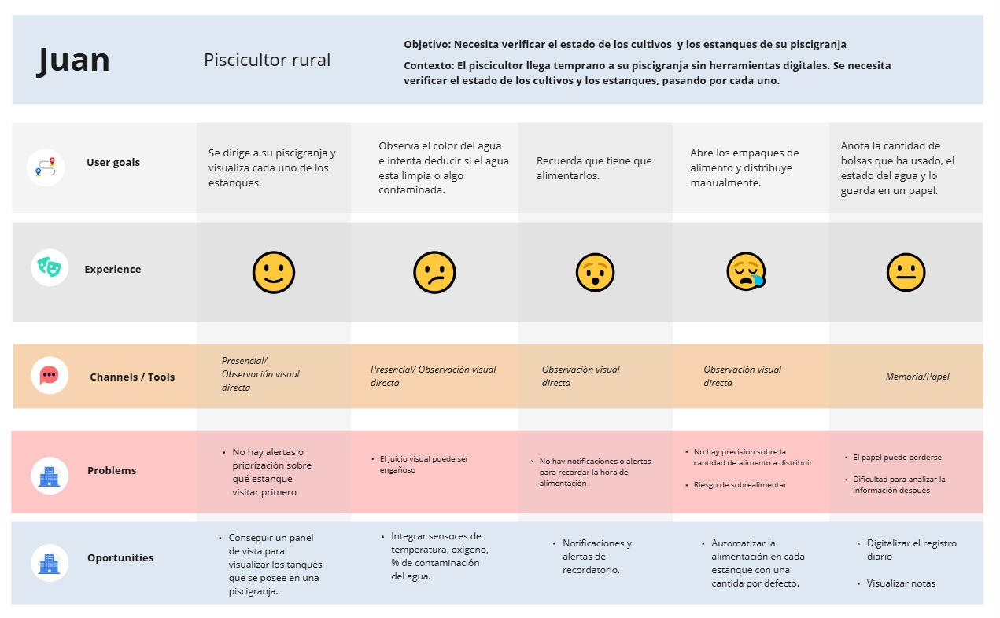
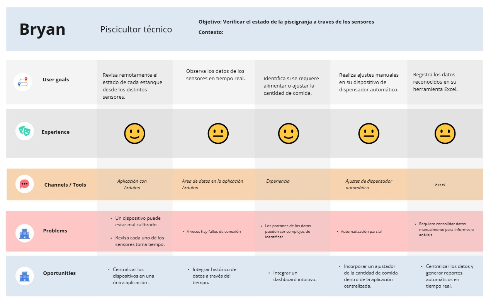
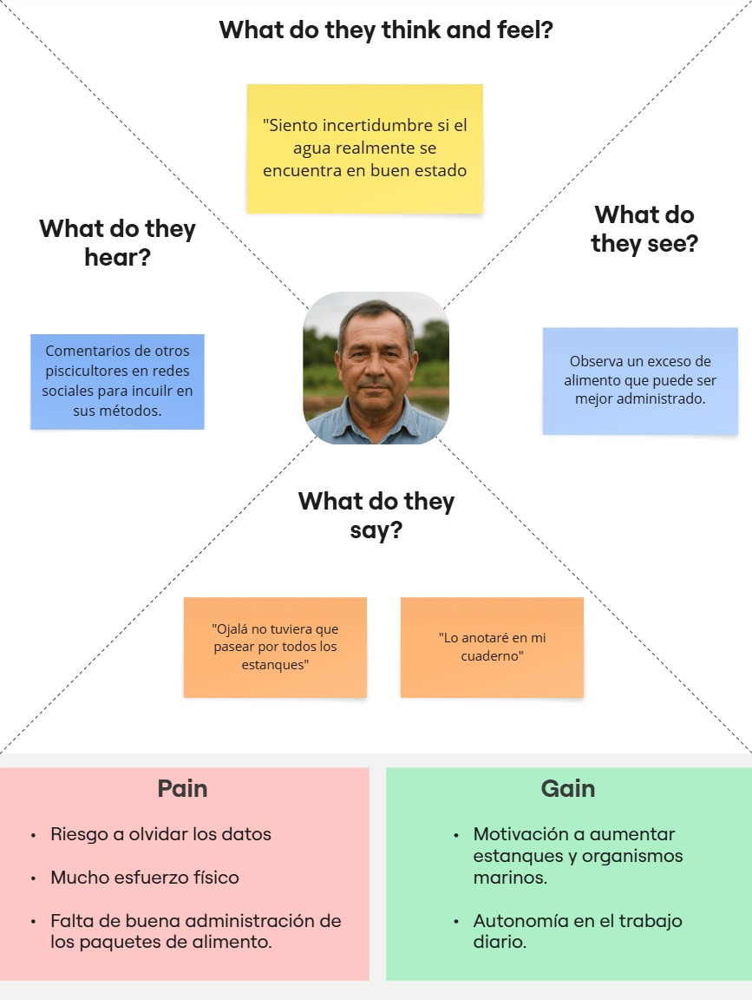
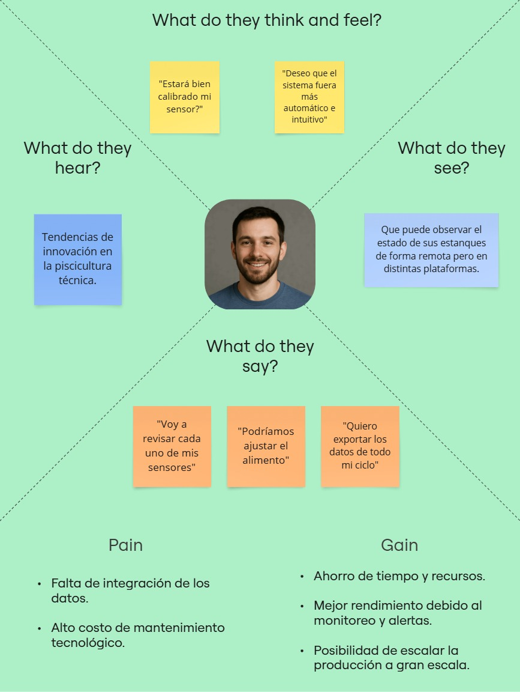
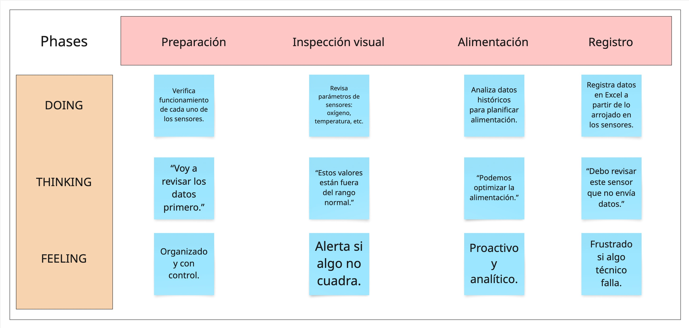

# Reporte de Proyecto

# **UNIVERSIDAD PERUANA DE CIENCIAS APLICADAS**

### **Facultad de Ingeniería - Carrera de Ingeniería de Software**

### **2025-1**

#### **Curso:**

### 1ASI0572 - Desarrollo de Soluciones IoT

#### **NRC:**

#### 2947

#### **Profesor:**

#### Angel Augusto Velasquez Nuñez

### **Informe de Trabajo Final**

#### Startup: **AquaSense Technologies**

#### Producto: **FeedGuard**

### **Integrantes del equipo**

<table align="center">
  <thead>
    <tr>
      <th>Código de Estudiante</th>
      <th>Apellidos y Nombres</th>
    </tr>
  </thead>
  <tbody>
    <tr>
      <td align="center">U202121584</td>
      <td align="center">Martel Zevallos, Gabriel</td>
    </tr>
    <tr>
      <td align="center">U202018627</td>
      <td align="center">Garcia Rodriguez, Gabriel</td>
    </tr>
    <tr>
      <td align="center">201923994</td>
      <td align="center">Avellaneda Ramos, Carlo</td>
    </tr>
    <tr>
      <td align="center">20191E831</td>
      <td align="center">Rivas Sarango, David Alejandro</td>
    </tr>
  </tbody>
</table>

 

### **Abril 2025**

---

## Registro de Versiones del Informe

<table border="1" cellspacing="0" cellpadding="5">
  <tr>
    <th>Versión</th>
    <th>Fecha</th>
    <th>Autor</th>
    <th>Descripción de modificación</th>
  </tr>
  <tr>
    <td>1.0.0</td>
    <td>18:04/2025</td>
    <td>Todos los miembros del grupo</td>
    <td>Se realizaron las entrevistas, user persona y  user stories.</td>
  </tr>
</table>

## Project Report Collaboration Insights

## Contenido

### Tabla de contenidos

- [Reporte de Proyecto](#reporte-de-proyecto)
- [**UNIVERSIDAD PERUANA DE CIENCIAS APLICADAS**](#universidad-peruana-de-ciencias-aplicadas)
    - [**Facultad de Ingeniería - Carrera de Ingeniería de Software**](#facultad-de-ingeniería---carrera-de-ingeniería-de-software)
    - [**2025-1**](#2025-1)
      - [**Curso:**](#curso)
    - [1ASI0572 - Desarrollo de Soluciones IoT](#1asi0572---desarrollo-de-soluciones-iot)
      - [**NRC:**](#nrc)
      - [2947](#2947)
      - [**Profesor:**](#profesor)
      - [Angel Augusto Velasquez Nuñez](#angel-augusto-velasquez-nuñez)
    - [**Informe de Trabajo Final**](#informe-de-trabajo-final)
      - [Startup: **AquaSense Technologies**](#startup-aquasense-technologies)
      - [Producto: **FeedGuard**](#producto-feedguard)
    - [**Integrantes del equipo**](#integrantes-del-equipo)
    - [**Abril 2025**](#abril-2025)
  - [Registro de Versiones del Informe](#registro-de-versiones-del-informe)
  - [Project Report Collaboration Insights](#project-report-collaboration-insights)
  - [Contenido](#contenido)
    - [Tabla de contenidos](#tabla-de-contenidos)
  - [Student Outcome](#student-outcome)
  - [Capítulo I: Introducción](#capítulo-i-introducción)
    - [1.1. Startup Profile](#11-startup-profile)
      - [1.1.1. Descripción de la Startup](#111-descripción-de-la-startup)
      - [1.1.2. Perfiles de integrantes del equipo](#112-perfiles-de-integrantes-del-equipo)
    - [1.2. Solution Profile](#12-solution-profile)
      - [1.2.1. Antecedentes y problemática](#121-antecedentes-y-problemática)
      - [The 5 W’s and 2 H’s](#the-5-ws-and-2-hs)
    - [Descripción de la problemática](#descripción-de-la-problemática)
      - [1.2.2. Lean UX Process](#122-lean-ux-process)
        - [1.2.2.1. Lean UX Problem Statements](#1221-lean-ux-problem-statements)
        - [1.2.2.2. Lean UX Assumptions](#1222-lean-ux-assumptions)
        - [1.2.2.3. Lean UX Hypothesis Statements](#1223-lean-ux-hypothesis-statements)
        - [1.2.2.4. Lean UX Canvas](#1224-lean-ux-canvas)
    - [1.3. Segmentos objetivo](#13-segmentos-objetivo)
  - [Capítulo II: Requirements Elicitation \& Analysis](#capítulo-ii-requirements-elicitation--analysis)
    - [2.1. Competidores](#21-competidores)
      - [2.1.1. Análisis competitivo](#211-análisis-competitivo)
      - [2.1.2. Estrategias y tácticas frente a competidores](#212-estrategias-y-tácticas-frente-a-competidores)
    - [2.2. Entrevistas](#22-entrevistas)
      - [2.2.1. Diseño de entrevistas](#221-diseño-de-entrevistas)
    - [🎯 Objetivo de la entrevista](#-objetivo-de-la-entrevista)
    - [📋 Guía de preguntas](#-guía-de-preguntas)
      - [1. Datos personales y productivos](#1-datos-personales-y-productivos)
      - [2. Proceso de alimentación actual](#2-proceso-de-alimentación-actual)
      - [3. Monitoreo ambiental y toma de decisiones](#3-monitoreo-ambiental-y-toma-de-decisiones)
      - [4. Tecnología, percepción y adopción](#4-tecnología-percepción-y-adopción)
    - [📝 Datos complementarios a recolectar](#-datos-complementarios-a-recolectar)
      - [2.2.2. Registro de entrevistas](#222-registro-de-entrevistas)
      - [2.2.2. Registro de entrevistas](#222-registro-de-entrevistas-1)
      - [2.2.3. Análisis de entrevistas](#223-análisis-de-entrevistas)
    - [2.3. Needfinding](#23-needfinding)
      - [2.3.1. User Personas](#231-user-personas)
      - [2.3.2. User Task Matrix](#232-user-task-matrix)
      - [2.3.3. User Journey Mapping](#233-user-journey-mapping)
      - [2.3.4. Empathy Mapping](#234-empathy-mapping)
      - [2.3.5. As-is Scenario Mapping](#235-as-is-scenario-mapping)
    - [2.4. Ubiquitous Language](#24-ubiquitous-language)
  - [Capítulo III: Requirements Specification](#capítulo-iii-requirements-specification)
    - [3.1. To-Be Scenario Mapping](#31-to-be-scenario-mapping)
    - [To-Be Scenario Mapping – Juan Pérez](#to-be-scenario-mapping--juan-pérez)
    - [To-Be Scenario Mapping – Bryan Díaz](#to-be-scenario-mapping--bryan-díaz)
    - [3.2. User Stories](#32-user-stories)
    - [3.3. Impact Mapping](#33-impact-mapping)
      - [Impact Mapping – Juan Pérez (Piscicultor rural, tradicional)](#impact-mapping--juan-pérez-piscicultor-rural-tradicional)
      - [Impact Mapping – Bryan Díaz (Piscicultor técnico, innovador)](#impact-mapping--bryan-díaz-piscicultor-técnico-innovador)
    - [3.4. Product Backlog](#34-product-backlog)
  - [Capítulo IV: Solution Software Design](#capítulo-iv-solution-software-design)
    - [4.1. Strategic-Level Domain-Driven Design](#41-strategic-level-domain-driven-design)
      - [4.1.1. EventStorming](#411-eventstorming)
        - [4.1.1.1. Candidate Context Discovery](#4111-candidate-context-discovery)
        - [4.1.1.2. Domain Message Flows Modeling](#4112-domain-message-flows-modeling)
        - [4.1.1.3. Bounded Context Canvases](#4113-bounded-context-canvases)
      - [4.1.2. Context Mapping](#412-context-mapping)
      - [4.1.3. Software Architecture](#413-software-architecture)
        - [4.1.3.1. System Landscape Diagram](#4131-system-landscape-diagram)
        - [4.1.3.2. Context Level Diagrams](#4132-context-level-diagrams)
        - [4.1.3.3. Container Level Diagrams](#4133-container-level-diagrams)
        - [4.1.3.4. Deployment Diagrams](#4134-deployment-diagrams)
    - [4.2. Tactical-Level Domain-Driven Design](#42-tactical-level-domain-driven-design)
      - [4.2.X. Bounded Context: \<Bounded Context Name\>](#42x-bounded-context-bounded-context-name)
        - [4.2.X.1. Domain Layer](#42x1-domain-layer)
        - [4.2.X.2. Interface Layer](#42x2-interface-layer)
        - [4.2.X.3. Application Layer](#42x3-application-layer)
        - [4.2.X.4. Infrastructure Layer](#42x4-infrastructure-layer)
        - [4.2.X.5. Component Level Diagrams](#42x5-component-level-diagrams)
        - [4.2.X.6. Code Level Diagrams](#42x6-code-level-diagrams)
          - [4.2.X.6.1. Domain Layer Class Diagrams](#42x61-domain-layer-class-diagrams)
          - [4.2.X.6.2. Database Design Diagram](#42x62-database-design-diagram)

---

## Student Outcome

<table border="1" cellspacing="0" cellpadding="5" style="border-collapse: collapse; width: 100%;">
  <tr>
    <th>Criterio especifico</th>
    <th>Acciones realizadas</th>
    <th>Conclusiones</th>
  </tr>
  <tr>
    <td><strong>Trabaja en equipo para proporcionar liderazgo en forma conjunta</strong></td>
    <td>
    Avellaneda Ramos, Carlos Edward 
    <i>
    TB1:
    Trabajamos como equipo, liderando la dirección y aportando la ejecución técnica para modelar AquaSense.
    </i>  
    Eduardo Espinoza, Vittorio Marcelo 
    <i>TB1: se realizo el Lean UX Problem Statements, Assumptions, Hypothesis Statements, Canvas y Segmentos objetivo</i> 
    Flores Avalos, Diego 
    <i>TB1</i> 
    Garcia Rodriguez, Gabriel Stefano 
    <i>TB1: se realizo el ubiquitous Languaje, To-Be Scenario Mapping, User Stories, Impact Mapping, Product Backlog</i> 
    MartelZevallos, Gabriel Aristoteles 
    <i>TB1</i> 
    Rivas Sarango, David Alejandro 
    <i>TB1:<i>Se realizó el capítulo 2, junto con la elaboración de las entrevistas.</i> </i> 
    </td>
    <td>Concluimos</td>
  </tr>
  <tr>
    <td><strong>Crea un entorno colaborativo e inclusivo, establece metas, planifica tareas y cumple objetivos.</strong></td>
    <td>
    Avellaneda Ramos, Carlos Edward 
    <i>TB1: Creamos un entorno colaborativo y alcanzamos el objetivo de construir el modelo C4 mediante tareas planificadas y comunicación abierta.
    </i>  
    Eduardo Espinoza, Vittorio Marcelo 
    <i>TB1: se realizo el Lean UX Problem Statements, Assumptions, Hypothesis Statements, Canvas y Segmentos objetivo</i> 
    Flores Avalos, Diego 
    <i>TB1</i> 
    Garcia Rodriguez, Gabriel Stefano 
    <i>TB1: se realizo el ubiquitous Languaje, To-Be Scenario Mapping, User Stories, Impact Mapping, Product Backlog</i> 
    MartelZevallos, Gabriel Aristoteles 
    <i>TB1</i> 
    Rivas Sarango, David Alejandro 
    <i>TB1</i> 
    </td>
    <td>Concluimos</td>
  </tr>
</table>

## Capítulo I: Introducción

En el contexto de los sistemas productivos modernos, la incorporación de tecnologías emergentes como el Internet de las Cosas (IoT, por sus siglas en inglés) representa una oportunidad clave para mejorar procesos tradicionales a través de la automatización, el monitoreo en tiempo real y la toma de decisiones basada en datos. Esta transformación digital, conocida como Industria 4.0, ha impactado positivamente múltiples sectores, incluyendo la agricultura, la manufactura, la logística y, más recientemente, la acuicultura.

La acuicultura, entendida como la cría controlada de organismos acuáticos en entornos artificiales o semi-naturales, se ha consolidado como una de las principales fuentes de proteína animal a nivel mundial. Sin embargo, a pesar de su crecimiento, enfrenta desafíos estructurales relacionados con la eficiencia de los recursos, la sostenibilidad ambiental y la precisión en los procesos operativos, especialmente en el manejo de la alimentación y la calidad del agua.

Este reporte documenta el ciclo de vida completo del desarrollo de una solución basada en IoT orientada a resolver una problemática concreta dentro del entorno acuícola. A través de la aplicación de metodologías ágiles, principios de diseño centrado en el usuario, y prácticas modernas de desarrollo de software, se busca diseñar e implementar una solución que no solo resuelva una necesidad real del sector, sino que también aproveche los beneficios de la conectividad y la automatización.

El contenido del informe abordará desde la identificación de la problemática, el análisis de los usuarios, la especificación de requerimientos y diseño de la arquitectura de software, hasta la implementación, validación y despliegue de la solución propuesta. Todo ello con el objetivo de mostrar cómo una propuesta tecnológica puede impactar positivamente la productividad y sostenibilidad de una actividad económica vital como lo es la acuicultura.

### 1.1. Startup Profile

#### 1.1.1. Descripción de la Startup

AquaSense Technologies es una startup tecnológica orientada al desarrollo de soluciones inteligentes para el sector acuícola. Su enfoque principal es mejorar la eficiencia y sostenibilidad de los procesos productivos en pisciculturas mediante el uso de tecnologías IoT, automatización y monitoreo ambiental en tiempo real. La empresa trabaja con un enfoque centrado en el usuario, combinando ingeniería, datos y experiencia en campo para resolver problemáticas clave en sistemas semiindustriales de crianza de peces.

- 🧭 **Visión**

  Convertirnos en referentes en la transformación digital de la acuicultura en Latinoamérica, mediante soluciones tecnológicas accesibles, eficientes y sostenibles que contribuyan al desarrollo de sistemas de producción más rentables y responsables con el medio ambiente.

- 🎯 **Misión**

  Diseñar e implementar soluciones inteligentes que integren IoT, automatización y análisis de datos en tiempo real para optimizar procesos clave en sistemas acuícolas, mejorando la productividad, la sostenibilidad y la calidad del producto final.

- 💡 **Propuesta de valor**

  - Soluciones tecnológicas adaptadas a las necesidades reales de productores acuícolas semiindustriales.
  - Automatización de procesos críticos como la alimentación y el monitoreo ambiental.
  - Mejora de la eficiencia operativa, reducción de desperdicios y optimización del uso de recursos.
  - Diseño centrado en el usuario y validación continua con datos reales del entorno.

- ⚙️ **Enfoque tecnológico**

  AquaSense Technologies desarrolla productos utilizando:

  - **Tecnologías IoT** para la sensorización y automatización.
  - **Sistemas embebidos** conectados con plataformas en la nube.
  - **Arquitecturas distribuidas** con Edge Computing y servicios RESTful.
  - **Software open-source** para garantizar adaptabilidad y sostenibilidad.

- 🤝 **Compromiso**

  Promovemos la integración entre tecnología y sostenibilidad en el sector acuícola. Nuestro compromiso es con la innovación responsable, la mejora continua y la colaboración interdisciplinaria, integrando conocimientos de ingeniería, biología acuática y experiencia del usuario.

- 🚀 **Primer producto**

  **FeedGuard**  
  Sistema inteligente de alimentación y monitoreo para acuicultura semiindustrial. 
  Automatiza la dosificación de alimento y toma decisiones en función de parámetros como el oxígeno disuelto y los compuestos nitrogenados del agua, mejorando la eficiencia productiva y el bienestar de los peces.

#### 1.1.2. Perfiles de integrantes del equipo

<table border="1" cellspacing="0" cellpadding="5" style="border-collapse: collapse; width: 100%;">
  <tr>
    <th>Foto</th>
    <th>Descripcion</th>
  </tr>
  <tr>
    <td></td>
    <td>
     Mi nombre es Carlos Avellaneda Ramos, estudiante de la carrera de ingeniería de software, en la UPC. Actualmente, manejo con soltura Java y TypeScript. Además, me divierto creando mods para juegos en Lua y también tengo experiencia con Python y C++.
    </td>
  </tr>
  <tr>
    <td></td>
    <td>
    Mi nombre es Vittorio Marcelo Eduardo Espinoza y soy alumno de la carrera de ingeniería de software en la UPC. Soy una persona persistente y honesta que trata realizar su trabajo de manera correcta, así como tengo conocimientos en programación como C++ y Java Spring.
    </td>
  </tr>
  
  <tr>
    <td></td>
    <td>
    Flores Avalos, Diego
    </td>
  </tr>
  <tr>
    <td></td>
    <td>
    Mi nombre es Garcia Rodriguez Gabriel Stefano, tengo conocimientos de lenguajes de programación c++, c#, python, html y css, Frontend: Html, CSS, Angular y Vue. Backend: C# .NET y Java Spring Boot.  Habilidades de liderazgo y contribución en equipo.
    </td>
  </tr>
  <tr>
    <td> </td>
    <td>
    MartelZevallos, Gabriel Aristoteles
    </td>
  </tr>
  <tr>
    <td></td>
    <td>
    Mi nombre es David Alejandro Rivas Sarango, actualmente estoy cursando la carrera de Ingeniería de Software en la UPC. Soy una persona honesta y responsable. Me interesa el área de Data Science, por esto estoy siguiendo cursos de capacitacion en SQL y Python.
    </td>
  </tr>
</table>

### 1.2. Solution Profile

#### 1.2.1. Antecedentes y problemática
#### The 5 W’s and 2 H’s

- **Who (¿Quiénes están involucrados?)**  
  Productores acuícolas, específicamente aquellos que operan sistemas semiindustriales de crianza de peces en estanques, piscinas o jaulas flotantes.  
  Técnicos encargados del monitoreo y mantenimiento de las condiciones del agua y de los procesos de alimentación.  
  Proveedores de alimento balanceado y servicios de mantenimiento de equipos.  
  Instituciones regulatorias o de supervisión ambiental.

- **What (¿Qué está ocurriendo?)**  
  Se presentan ineficiencias significativas en los procesos de alimentación y control de calidad del agua. Estas fallas operativas generan impactos negativos en el crecimiento de los peces, el uso de insumos y la rentabilidad general del sistema.

- **Where (¿Dónde ocurre?)**  
  En entornos de acuicultura semiindustrial, comúnmente en zonas rurales o periurbanas donde se instalan estanques o piscinas de crianza de peces como parte de sistemas de producción local o regional.

- **When (¿Cuándo ocurre?)**  
  De forma continua durante las fases activas del ciclo productivo de los peces, con especial incidencia durante los horarios de alimentación y monitoreo diario.

- **Why (¿Por qué ocurre?)**  
  La problemática surge por la ausencia de mecanismos automatizados y precisos que permitan controlar tanto la cantidad de alimento suministrado como el estado ambiental del agua. Las decisiones suelen basarse en la experiencia empírica del personal y no en datos en tiempo real.

- **How (¿Cómo ocurre?)**  
  A través de procesos manuales o semi-manuales que no siempre garantizan la regularidad ni la exactitud necesarias, lo que puede llevar a situaciones de sobrealimentación, subalimentación, o alimentación en condiciones desfavorables del agua.

- **How much (¿Cuánto impacta?)**  
  El impacto puede reflejarse en pérdidas económicas por mal aprovechamiento del alimento (hasta un 30% del alimento puede desperdiciarse), aumento del estrés en los peces, crecimiento lento, aparición de enfermedades, y deterioro de la calidad del agua que obliga a realizar tratamientos costosos o incluso pérdidas totales en algunos ciclos productivos.

---

### Descripción de la problemática

En los sistemas acuícolas semiindustriales, uno de los procesos más críticos y determinantes para el éxito del ciclo de producción es la alimentación. La alimentación adecuada no solo garantiza el crecimiento óptimo de los peces, sino que también influye directamente en la calidad del agua y en la salud general del cultivo. Sin embargo, a pesar de su importancia, la alimentación suele llevarse a cabo de manera manual o con mecanismos rudimentarios, lo que conlleva una serie de desafíos recurrentes.

En primer lugar, la alimentación manual depende de la experiencia del operario, lo que introduce una variabilidad significativa en términos de cantidad, frecuencia y oportunidad. Esto puede resultar en prácticas ineficientes como la sobrealimentación, que genera acumulación de residuos en el agua, o la subalimentación, que afecta el crecimiento de los peces. Ambas situaciones pueden tener consecuencias económicas severas para los productores.

Adicionalmente, la falta de integración entre el proceso de alimentación y las condiciones ambientales del agua representa otro factor de riesgo. Parámetros como el oxígeno disuelto o los niveles de compuestos nitrogenados (amonio, nitritos, nitratos) tienen un impacto directo en la fisiología de los peces. Alimentar en condiciones subóptimas no solo reduce la eficiencia de conversión alimenticia, sino que también incrementa el estrés y la vulnerabilidad a enfermedades.

A esto se suma la necesidad de optimizar el uso del tiempo y los recursos humanos en un contexto donde el acceso a personal capacitado es limitado y los márgenes de ganancia son estrechos. Las actividades repetitivas y rutinarias como la alimentación podrían ser automatizadas para liberar tiempo y reducir errores humanos.

Frente a esta problemática, se evidencia una clara oportunidad de mejora mediante el uso de tecnologías emergentes que permitan tomar decisiones más informadas, automatizar procesos clave y mejorar la sostenibilidad del sistema productivo.

#### 1.2.2. Lean UX Process

##### 1.2.2.1. Lean UX Problem Statements

**Domain:**
Acuicultura semiindustrial (crianza de peces en sistemas controlados, en zonas rurales o periurbanas).

**Customer Segments:**
Productores acuícolas semiindustriales, técnicos de campo, cooperativas pesqueras pequeñas, y eventualmente proveedores de tecnología para acuicultura.

**Pain Points:**

Alimentación ineficiente (sobre o subalimentación).

Falta de monitoreo continuo de calidad del agua.

Procesos manuales propensos a errores humanos.

Pérdida económica por desperdicio de alimento.

Crecimiento lento y enfermedades en los peces por malas prácticas.

**Gap:**
No existen soluciones integradas, accesibles y adaptables a entornos semiindustriales que automaticen la alimentación y el monitoreo ambiental en tiempo real.

**Visión / Strategy:**
Desarrollar un sistema inteligente que automatice la dosificación de alimento en función de parámetros ambientales del agua y del comportamiento de los peces, conectando sensores IoT con una plataforma de análisis de datos.

**Initial Segment:**
Piscicultores semiindustriales con entre 2 y 10 estanques operativos, localizados en zonas rurales con acceso a conectividad básica.

##### 1.2.2.2. Lean UX Assumptions

- Los productores acuícolas tienen acceso mínimo a conexión a internet o redes móviles.

- Están dispuestos a invertir en soluciones tecnológicas si estas aseguran ahorro en alimento y mejoran el crecimiento de los peces.

- La variabilidad en la alimentación está generando pérdidas económicas en más del 20% de los ciclos productivos.

- La introducción de una solución de fácil uso puede ser adoptada sin capacitación extensa si cuenta con interfaz intuitiva.

- Los parámetros más críticos para la alimentación son el oxígeno disuelto y los compuestos nitrogenados.

##### 1.2.2.3. Lean UX Hypothesis Statements

**Hipótesis general:**
Creemos que los productores acuícolas semiindustriales adoptarán un sistema de alimentación inteligente si este les permite ahorrar alimento, mejorar el crecimiento de los peces y reducir el trabajo manual.

**Hipótesis específicas:**

Si automatizamos la dosificación de alimento en función del oxígeno disuelto, entonces reduciremos el desperdicio de alimento en al menos un 20%.

Si mostramos alertas sobre condiciones críticas del agua en tiempo real, entonces los técnicos podrán tomar decisiones más informadas, reduciendo la mortalidad de peces.

Si ofrecemos una interfaz amigable basada en iconos y visualizaciones simples, entonces los usuarios podrán utilizar el sistema sin requerir capacitación formal.

Si el sistema demuestra beneficios medibles en el primer mes, entonces los usuarios recomendarán su uso a otros piscicultores locales.

##### 1.2.2.4. Lean UX Canvas

<table border="1" cellspacing="0" cellpadding="5">
  <tr>
    <th colspan="4">Lean UX Canvas</th>
  </tr>

  <!-- Fila 1 -->
  <tr>
    <td colspan="2"><strong>Business Problem</strong>  
      Los productores acuícolas semiindustriales enfrentan pérdidas económicas por sobrealimentación y deterioro del agua debido a prácticas manuales sin automatización.
    </td>
    <td colspan="2"><strong>Business Outcomes</strong> 
      - Reducción de desperdicio de alimento (20%) 
      - Mejora en crecimiento y salud de los peces 
      - Reducción de tareas manuales 
      - Incremento en la rentabilidad por ciclo productivo
    </td>
  </tr>

  <!-- Fila 2 -->
  <tr>
    <td colspan="2"><strong>Users</strong> 
      Piscicultores semiindustriales con entre 2 y 10 estanques, y técnicos de campo responsables del monitoreo y alimentación.
    </td>
    <td colspan="2"><strong>User Outcomes & Benefits</strong> 
      - Reducción de trabajo manual 
      - Toma de decisiones basadas en datos 
      - Menor mortalidad 
      - Mayor tasa de conversión alimenticia
    </td>
  </tr>

  <!-- Fila 3 -->
  <tr>
    <td colspan="4"><strong>Solutions</strong> 
      - Sistema de sensores IoT 
      - Algoritmo de dosificación automática de alimento 
      - Interfaz móvil/web sencilla 
      - Alertas ambientales automatizadas 
      - Plataforma conectada a la nube con operación offline temporal
    </td>
  </tr>

  <!-- Fila 4 -->
  <tr>
    <td colspan="4"><strong>Hypotheses</strong> 
      Creemos que la reducción del desperdicio de alimento será posible si los piscicultores obtienen alertas personalizadas y automatización del proceso de alimentación mediante sensores IoT integrados a una plataforma inteligente.
    </td>
  </tr>

  <!-- Fila 5 -->
  <tr>
    <td colspan="2"><strong>What's the most important thing we need to learn first?</strong> 
      ¿Los usuarios confiarán en la automatización para dosificar el alimento?  
      Riesgo: Si no confían, no usarán el sistema.
    </td>
    <td colspan="2"><strong>What's the least amount of work we need to do to learn the next most important thing?</strong> 
      Probar un piloto funcional en un estanque real con sensores, dosificador y visualización básica para evaluar ahorro de alimento y aceptación del usuario.
    </td>
  </tr>
</table>

### 1.3. Segmentos objetivo

**Segmento 1: Productores acuícolas semiindustriales rurales**
Descripción:
Pequeños y medianos piscicultores que operan estanques de crianza de tilapia, trucha o gamitana en zonas rurales o periurbanas. Generalmente trabajan de forma independiente o en asociación, con entre 2 y 10 unidades de cultivo operativas.

Características demográficas y técnicas:

- Edad promedio de los productores: entre 35 y 55 años.
- Nivel educativo: secundaria completa o técnica agrícola.
- Acceso limitado a tecnologías digitales, pero creciente interés por innovaciones que mejoren la rentabilidad.
- Ubicación en zonas con conectividad móvil básica y limitado acceso a servicios técnicos continuos.
- Operación centrada en ciclos productivos de entre 5 y 8 meses.

**Segmento 2: Piscicultores técnicos innovadores**
Descripción:
Piscicultores jóvenes o de perfil técnico, con conocimientos básicos o intermedios en tecnologías digitales, automatización y sensores. Utilizan o experimentan con herramientas como Arduino, sensores ambientales y dispositivos móviles para monitoreo de sus estanques. Tienen altas expectativas en cuanto a eficiencia y tecnología.

Características demográficas y técnicas:

- Edad promedio: 25 a 40 años.
- Nivel educativo: técnico superior o universitario (áreas relacionadas a producción agropecuaria, ingeniería técnica o afines).
- Uso de dispositivos móviles y plataformas digitales.
- Interés activo en automatización, monitoreo en tiempo real y reducción de costos operativos.
- Buscan soluciones escalables y con soporte técnico constante.

## Capítulo II: Requirements Elicitation & Analysis

### 2.1. Competidores

#### 2.1.1. Análisis competitivo

<table border="1" cellspacing="0" cellpadding="5">
  <!-- Fila 1: Título que ocupa las 7 columnas -->
  <tr>
    <th colspan="7">Competitive Analysis Landscape</th>
  </tr>

  <!-- Fila 2: Primera celda ocupa 2 columnas y 2 filas; las otras 5 son normales -->
  <tr>
    <td rowspan="2" colspan="2"><strong>¿Por qué llevar a cabo este análisis?</strong></td>
    <td colspan="5"><strong>Escriba en el recuadro la pregunta que busca responder o el objetivo de este análisis.</strong></td>
  </tr>

  <!-- Fila 3: solo 5 columnas, alineadas con las celdas superiores -->
  <tr>
    <td colspan="5"></td>
  </tr>

  <!-- Fila 4: primera celda ocupa 3 columnas, el resto son normales -->
  <tr>
    <td colspan="3"><strong>(En la cabecera colocar por cada competidor nombre y logo)</strong></td>
    <td style="width: 25%;">FeedGuard</td>
    <td style="width: 25%;">Aquarium Xiamoi</td>
    <td style="width: 25%;">FishFarmFeeder</td>
    <td style="width: 25%;">Aplians Fish</td>
  </tr>

  <!-- Perfil-->
  <tr>
    <td rowspan="2" colspan="1" style="writing-mode: vertical-rl; 
           transform: rotate(180deg); 
           text-align: center; 
           vertical-align: middle;"><strong>Perfil</strong></td>
    <td colspan="2"><strong>Overview</strong></td>
    <td><strong>Es una solución enfocada en la automatización del proceso de alimentación en las pesceras mediante sensores integrados.</strong></td>
    <td><strong>Acuario inteligente de Xiaomi dedicado a Smart Home, este dispositivo puede alimentar automáticamente a los peces, ofrece información sobre el estado del acuario</strong></td>
    <td><strong>Aplicación móvil que permite monitorizar en tiempo real los alimentadores instalados. Accesible tanto para IPhone como Android.</strong></td>
    <td><strong>Plataforma española que gestiona de manera continua el desempeño de la piscíola, disponible desde celular y pc.</strong></td>
  </tr>

  <tr>
    <td colspan="2"><strong>Ventaja competitiva ¿Qué valor ofrece a los clientes?</strong></td>
    <td>Automatización de alimentación y notificación de alerta basada en datos y con un diseño intuitivo</td>
    <td>Su principal ventaja radica en la integración tecnológica, siendo respaldado por la marca mundial Xiaomi. Ofrese una experiencia de usuario moderna para los poseedores de estanques hogareños.</td>
    <td>Su ventaja reside en la especialización y enfoque en la eficiencia y optimización de la alimentación en la industria acuícola.</td>
    <td>Centrado en la especialización de control de inventario y monitoreo de crecimiento, esta plataforma sigue todo el ciclo de vida desde la siembra hasta la cosecha y trazabilidad.</td>
  </tr>
  
  <!-- Perfil de Marketing-->
  <tr>
    <td rowspan="2" colspan="1" style="writing-mode: vertical-rl; 
           transform: rotate(180deg); 
           text-align: center; 
           vertical-align: middle;"><strong>Perfil de Marketing</strong></td>
    <td colspan="2"><strong>Mercado objetivo</strong></td>
    <td><strong>Son los piscicultores con limitaciones tecnológicas que posean de 2 a 10 estanques que se ubican entre los 35 y 55 años de edad.</strong></td>
    <td><strong>Consumidores interesados en acuarios domésticos inteligentes.</strong></td>
    <td><strong>Productores agrícoles de pequeña a gran escala.</strong></td>
    <td><strong>Productores agrícoles que buscan digitalizar y optimizar la gestión de sus cultivos.</strong></td>
  </tr>

  <tr>
    <td colspan="2"><strong>Estrategias de marketing</strong></td>
    <td> Marketing educativo, alianzas estratégicas y flexibilidad en los costos.</td>
    <td>Poseen una línea de productos SmartHome que venden globalmente, no solo consolidándose como competidor en el mercado móvil.</td>
    <td>Marketing digital dirigido a la industria agrícola y en eventos del sector, incluyendo demostraciones del producto.</td>
    <td>Marketing online a través de su plataforma y redes sociales.</td>
  </tr>

  <!-- Perfil de Producto-->
  <tr>
    <td rowspan="3" colspan="1" style="writing-mode: vertical-rl; 
           transform: rotate(180deg); 
           text-align: center; 
           vertical-align: middle;"><strong>Perfil de Producto</strong></td>
    <td colspan="2"><strong>Productos & Servicios</strong></td>
    <td><strong>La funcionalidad principal viene de la mano con sensores IoT para monitorear oxígeno, temperatura y compuestos dañinos dentro de la pescera.</strong></td>
    <td><strong>Acuario inteligente con sistema de filtración integrado, iluminación LED, control de temperatura y oxígeno, conectividad WI-FI y aplicación móvil.</strong></td>
    <td><strong>Sistema de alimentación automática de peces en estanques y sistemas de acuicultura.</strong></td>
    <td><strong>Plataforma que maneja el desempeño agrícola incluso de manera local, incluye seguimiento del proceso productivo y reportes en línea.</strong></td>
  </tr>
  <tr>
    <td colspan="2"><strong>Precios & Costos</strong></td>
    <td>40 dólares por suscripción mensual.</td>
    <td>50 dólares por unidad</td>
    <td>55 dólares al mes</td>
    <td>80 dólares al mes por Centro piscícola / 25 dólares al mes por estanque</td>
  </tr>
  <tr>
    <td colspan="2"><strong>Canales de distribución (Web y/o Móvil)</strong></td>
    <td>Distribución tanto web como móvil.</td>
    <td>A través de su plataforma oficial o en tiendas online de terceros.</td>
    <td>Venta directa a través de su propia página web.</td>
    <td>Principalmente a través de su propia tienda online, luego se extiende a tiendasfísicas especializadas en acuarios.</td>
  </tr>

  <!-- Analisis SWOT-->
  <tr>
    <td rowspan="5" colspan="1" style="writing-mode: vertical-rl; 
           transform: rotate(180deg); 
           text-align: center; 
           vertical-align: middle;"><strong>Analisis SWOT</strong></td>
    <td colspan="6"><strong>Realice esto para su startup y sus competidores. Sus fortalezas deberían apoyar sus oportunidades y contribuir a lo que ustedes definen como su posible ventaja competitiva.</strong></td>
  </tr>
  <tr>
    <td colspan="2"><strong>Fortalezas</strong></td>
    <td><strong>No se posee necesidad de uso de red, implementación en granjas de estanques clave y colaboración estratégica con piscicultores de nicho.</strong></td>
    <td><strong>Integración de tecnología inteligente que se puede controlar por aplicación móvil, conectividad móvil, alimentación automática y monitoreo de ambiente.</strong></td>
    <td><strong>Solución especializada para la alimentación en acuicultura.</strong></td>
    <td><strong>Enfoque en la variedad y calidad de peces, conocimiento especilizado en el cuidado de peces.</strong></td>
  </tr>
  <tr>
    <td colspan="2"><strong>Debilidades</strong></td>
    <td>Dificultad inicial a adoptar una técnología con una curva de aprendizaje media para los piscicultores.</td>
    <td>Precio elevado</td>
    <td>Necesidad de capacitación, mercado objetivo limitado a la industria acuícola empresarial.</td>
    <td>Requiere una curva de aprendizaje elevada para el correcto manejo del producto.</td>
  </tr>
  <tr>
    <td colspan="2"><strong>Oportunidades</strong></td>
    <td>Crecimiento del sector acuícola en LATAM, enfoque en los que no poseen acceso a internet 24/7.</td>
    <td>Creciente interés en hogares inteligentes.</td>
    <td>Creciente demanda por productos del mar gestionables, posibilidad de incluir sensores.</td>
    <td>Creciente demanda por productos gestionables.</td>
  </tr>
  <tr>
    <td colspan="2"><strong>Amenazas</strong></td>
    <td>Competencia de soluciones genéricas IoT con monitoreo, variedad de características por parte de la competencia.</td>
    <td>Competencia con marcas de acuarios tradicionales y nuevos competidores de acuarios inteligentes.</td>
    <td>Costo elevado mensual respecto al mercado acuícola.</td>
    <td>Competencia de otras plataformas con mayor visibilidad.</td>
  </tr>
</table>

#### 2.1.2. Estrategias y tácticas frente a competidores

A partir del análisis competitivo realizado, se logró identificar las fortalezas, debilidades, oportunidades y amenzas destacadas en los competidores. A continuación, se brindará tanto estrategias como tácticas para alcanzar esta meta:

**Fortalezas de nuestros competidores:** 

- Integración de tecnología inteligente con una marga global por detrás.
- Solución especializada y eficiente para la alimentación.
- Acompaña en el ciclo de vida, incluyendo el control de inventario y monitoreo de crecimiento.

**Estrategias y tácticas a nuestras fortalezas:**

**Estrategias:**
- Consolidación de características: Se puede desarrollar tecnología que abarque en conjunto lo que ofrecen los competidores.
- Construcción de una comunidad: Se fomentaría una unión mediante una comunidad, los usuarios podrían acceder a contenido educativo que otros publican.
- Ampliar segmento objetivo: No limitarnos a negocios de piscicultura, sino a usuarios que inician en este ámbito.

**Tácticas:** 
- Crear foros de comunidad.
- Colaboración con tiendas online de cuidado de peces.
- Sistema de recompensas.

**Debilidades de nuestros competidores:** 

- Algunos pueden ser percibidos como caros debido a su costo excesivo mensual, llegando hasta los 80 dólares.
- Curva de aprendizaje pronunciada debido a su logística compleja.
  
**Estrategias y tácticas a nuestras debilidades:**
**Estrategias:** 

- Simplicidad: Ofrecer simplicidad y facilidad de uso para que la aplicación no posea una curva de aprendizaje pronunciada.
- Soporte: Ofrecer servicio al cliente
- Calidad-precio: Disminuir precio para acceder a la aplicación, distribuirlo entre las características que brinda.
- 
**Tácticas:**

- Crear tutoriales de uso y conceptos sobre la piscicultura
- Desarrollar alianzas con tiendas de mascotas locales
- Implementar sistema de suscripciones por características.

**Oportunidades de nuestros competidores:**

- Creciente interés en hogares inteligentes.
- Monitoreo avanzado y modificable que se le proporciona a los usuarios.
  
**Estrategias y tácticas a nuestras oportunidades:**
**Estrategias:** 

- Compra/venta de productos: Se pueden ofrecer productos como pesceras a nivel de usuarios especializados.
- Anticipación de tendencias y conceptos: Se puede identificar las nuevas tendencias y promoverlas en la plataforma.
  
**Tácticas:**

- Integrar asistentes de voz e IA.
- Establecer el producto físico como el más completo.
- Implementar nuevos sensores de monitoreo para el ambiente, no solo la pescera.

**Amenazas de nuestros competidores:**

- Competencia entre marcas de acuarios innovando en la tecnología, crecimiento de la IA, variedad de costos en el mercado.
- Competencia tanto online como en el mercado retail.
  
**Estrategias y tácticas a nuestras amenazas:**
**Estrategias:** 

- Adaptabilidad: Debemos ser capaces de ajustar la oferta, limitar lo esencial a la plataforma.
- Seguridad: Se debe incluir un sistema de seguridad eficiente.
- Disponibilidad: Debe utilizarse con normalidad sin resaltar defectos por parte del sistema.
  
**Tácticas:**
- Implementar un sistema de recompensa.
- Establecernos como la plataforma que monitorea todos los aspectos.

### 2.2. Entrevistas

#### 2.2.1. Diseño de entrevistas

Con el objetivo de comprender las necesidades, frustraciones, comportamientos y expectativas de los usuarios objetivo del sistema FeedGuard, se diseñó una guía de entrevistas semiestructurada dirigida a **productores acuícolas semiindustriales**. Estas entrevistas permitirán construir perfiles de usuario (User Personas) representativos y definir con mayor claridad las funcionalidades de la solución IoT.

Las entrevistas se dividen en 4 bloques temáticos: **Datos personales y productivos**, **Proceso de alimentación actual**, **Monitoreo ambiental**, y **Tecnología y disposición al cambio**.

### 🎯 Objetivo de la entrevista

Recolectar información cualitativa sobre la operación acuícola, métodos actuales de alimentación, monitoreo ambiental, percepción de la tecnología y disposición a adoptar una solución automatizada como FeedGuard.

### 📋 Guía de preguntas

#### 1. Datos personales y productivos

- ¿Cuál es su nombre y edad?
- ¿Dónde está ubicada su piscigranja?
- ¿Qué especie cultiva (tilapia, trucha, gamitana, etc.)?
- ¿Cuántos estanques opera actualmente?
- ¿Desde hace cuánto tiempo se dedica a la acuicultura?
- ¿Cuántas personas trabajan en la operación?
- ¿Qué tipo de formación o experiencia tiene en este rubro?

#### 2. Proceso de alimentación actual

- ¿Cómo se realiza actualmente la alimentación de los peces?
- ¿Cuántas veces al día alimenta y en qué horarios?
- ¿Cómo decide la cantidad de alimento que les da?
- ¿Qué sucede si un día no puede alimentar en el horario previsto?
- ¿Ha tenido problemas de sobrealimentación o desperdicio?
- ¿Qué indicadores usa para saber si los peces están comiendo bien?

#### 3. Monitoreo ambiental y toma de decisiones

- ¿Monitorea parámetros del agua como oxígeno o amonio? ¿Con qué frecuencia?
- ¿Tiene sensores o lo hace de forma manual?
- ¿Alguna vez ha tenido pérdidas por mala calidad del agua?
- ¿Qué tan fácil o difícil es mantener el agua en condiciones óptimas?

#### 4. Tecnología, percepción y adopción

- ¿Ha usado alguna tecnología automatizada para alimentar?
- ¿Qué herramientas digitales utiliza en su trabajo? (Apps, redes, sensores, etc.)
- ¿Le interesaría automatizar el proceso de alimentación si esto le ahorra alimento y trabajo?
- ¿Qué necesitaría una herramienta tecnológica para que usted la use sin complicaciones?
- ¿Qué desconfianza tendría respecto a un sistema automatizado?
- ¿Cuánto estaría dispuesto a invertir en una solución que mejore su eficiencia?

---

### 📝 Datos complementarios a recolectar

Además de las respuestas a las preguntas, durante cada entrevista se deben registrar los siguientes datos del participante:

- **Género**: Masculino, femenino u otro.
- **Edad**: Número de años cumplidos.
- **Nivel educativo**: Primaria, secundaria, formación técnica o educación superior.
- **Tecnología que utiliza habitualmente**: Por ejemplo, celular, laptop, o ninguna herramienta digital.
- **Canales digitales que usa con frecuencia**: Como WhatsApp, Facebook u otras plataformas de comunicación.
- **Tiempo promedio dedicado diariamente al monitoreo de los estanques**: Expresado en horas por día.

#### 2.2.2. Registro de entrevistas

#### 2.2.2. Registro de entrevistas

**Entrevista a piscicultores**
|**Nombre del entrevistado**|**Sebastian Pacheco**|
|:-|:-|
|Edad|23 años|
|Profesión|Psicicultor|
|Departamento|Lima, Peru|
|Duración 00:0-8:43|Como primer entrevistado tenemos a Sebastian Pacheco, él es un piscicultor rural cuya granja se encuentra en Qulmana, Cañete. Cultiva tolapia roja y paco en menor escala. Nos menciona que posee un alimentador automático casero que armo con Arduino. Este alimenta a los peces 3 veces por día. Para el cálculo y registro de la alimentacion de los peces usa la herramienta Excel. Como indicadores paa saber si los peces estan comiendo bien califica la velocidad de consumoo, residuos en el fondo, reaccion cuando se aproxima a la granja de peces y la temperatura. Incluyendo el monitoreo de oxígeno y amonio constantemente. Actualmente posee una aplicación móvil que le avisa cuando baja el nivel de agua. Utiliza Whatsapp para ventas, Youtube para aprender y Drive para su registro. Él desearía que el sistema no falle o no avise sobre un evento. Estaría dispuesto a invertir entre 1500 y 2000 soles por una solución más completa.|

**Entrevista a piscicultores**
|**Nombre del entrevistado**|**Andre Bernaola**|
|:-|:-|
|Edad|24 años|
|Profesión|Psicicultor|
|Departamento|Lima, Peru|
|Duración 8:43-13:45|Andre Bernaola es un pisciultor rural que cría anguílas en agua salada. Menciona que no posee un control de la cantidad especifica de alimento que le brinda a su cultivo. Se les alimenta 2 veces durante un día. El desea saber cómo se puede verificar el nivel tanto de oxígeno y calidad del agua para poder proceder a un cambio y así las anguílas puedan prosperar en un buen ambiente. Utiliza Whatsapp para el contacto con proveedores y ventas. Esta muy interesado en usar una aplicación que lo ayuden con el monitoreo. El desearía que la aplicación posea monitoreo de oxígeno, cantidad de anguílas y datos que lo ayuden a mejorar su piscigranja. Estaría dispuesto a invertir 40 soles mensuales en una solución completa.|

**Entrevista a piscicultores**
|**Nombre del entrevistado**|**Alberto Martinez**|
|:-|:-|
|Edad|24 años|
|Profesión|Psicicultor|
|Departamento|Lima, Peru|
|Duración 13:45-17:55| Alberto es un pisciultor experimentado que ya posee dispositivos de monitoreo para sus piscigranjas. Cría salmon en agua salada, carpas y tilapias. Con uno de sus dispositivos de Arduino, él ya puede saber la cantidad exacta de alimento que les va a proveer, con los demás registra el nivel de oxígeno, amonio y de residuos que perjudiquen a su cultivo; esto lo ayuda a decidir cuando hay un cambio de agua en sus piscigranjas. Utiliza Whatsapp e Instagram para el contacto con proveedores y para realizar sus ventas. Se encuentra interesado en usar una aplicación que reúna todas las características que sus dispositivos indican. El desearía que la aplicación posea una sección donde pueda colocar sus anotaciones. Estaría dispuesto a invertir 50 soles mensuales para una solución que reúna todas las características de sus ya existentes dispositivos Arduino. |

#### 2.2.3. Análisis de entrevistas

**Piscicultor técnico**

El 100% de los piscicultores rurales indicaron que le gista la acuicultura y como es su principal fuente de ingresos. El 100% reconoció que la tecnología será clave para la automatización de procesos. Se presentó interés en conseguir una aplicación, con tal de que abarque todas las funcionalidades dentro del sistema  de monitoreo.

**Piscicultor rural**

Entre los piscicultres entrevistado, el 80% indica que los acuicultores rurales entrevistados mencionaron que le gusta relizar monitoreo. Solo 20% de los entrevistados ha utillizado sensores electrónicos para controlar parámetros físicos. A pesar de la carga, el 100% de los piscicultors expresó interés en la solución total. Que la herramienta incluya una función del registro y anotaciones para poder  tener control de los parámetros. Finalmente el 100% estaria dispuesto a invertir como mínimo 40 soles mensuales.

### 2.3. Needfinding

A continuación, se detallan los principales artefactos elaborados en esta fase del proyecto.

#### 2.3.1. User Personas

Con base en el análisis de entrevistas realizadas a representantes de los segmentos objetivo, se han definido dos **User Personas** representativos del ecosistema productivo de la acuicultura semiindustrial.

- **Persona 1**, Juan
  

- **Persona 2**, Bryan
  

Estos arquetipos nos permiten modelar comportamientos, motivaciones y necesidades clave que serán consideradas a lo largo del diseño de la solución.

#### 2.3.2. User Task Matrix

| Task Matrix                                                         | Piscicultores rural Frecuencia | Piscicultores rural Importancia | Piscicultores técnico Frecuencia | Piscicultores técnico Importancia |
|----------------------------------------------------------------|:------------------------:|:-----------------------:|:------------------------:|:-----------------------:|
| 1. Aumentar la eficiencia de su operación                      |           Alta           | Alta                    | Alta                     | Alta                    |
| 2. Monitorear niveles de la piscigranja                        |           Alta           | Alta                   | Alta                     | Media                   |
| 3. Reducir el desperdicio de recursos                          |           Alta           | Alta                   | Alta                     | Alta                    |
| 4. Anotar actividades y datos sobre su trabajo                 |           Media           | Alta                    | Alta                     | Alta                    |
| 5. Contar la cantidad de cultivos que posee                    |           Media           | Alta                    | Media                    | Media                   |
| 6. Monitorear el ciclo de vida del cultivo completo en la piscigranja|           Alta           | Alta                   | Alta                     | Alta                    |
| 7. Tomar decisiones en base a datos brindados                  |           Media           | Alta                    | Alta                    | Alta                   |
| 8. Estar alerta en caso de escasez o excedente de recursos     |           Alta           | Alta                    | Media                    | Alta                   |
| 9. Intentar automatizar el proceso                             |           Baja           | Media                    | Alta                    | Alta                   |

- **Juan** prioriza tareas manuales como la dosificación y supervisión visual, con poco uso de registros o análisis digital.
- **Bryan**, en cambio, tiene una visión más analítica: mide constantemente, registra sus datos y busca optimizar con base en evidencia técnica.

También se observa que **Bryan valora mucho la automatización y el uso de sensores**, mientras que **Juan necesita confianza y simplicidad** para adoptar nuevas herramientas.

**Piscicultores rurales**
Los piscicultores rurales priorizan la eficiencia operativa, el monitoreo constante de las  condiciones de la granja y la reducción de desperdicio de recursos. También se observa un alto valor otorgado a registrar actividades y datos. Aunque la automatización no esta entre su foco principal, muestra interés en la toma de decisiones a partir de datos.

**Piscicultores técnicos**

Los piscicultores técnicos, por otro lado, muestran un enfoque más avanzado y estratégico en la gestión de sus operaciones. Junto con la eficiencia, valoran altamente la automatización de procesos y el uso de datos para la toma de decisiones. Aunque el monitoreo constante sigue siendo frecuente, su importancia rapida más en los aspectos técnicos y analíticos. La anotación de datos son prácticas clave en este segmento.

#### 2.3.3. User Journey Mapping
Se construyeron los **User Journey Maps** (estado actual - *As-Is*) para cada User Persona. A continuación, se resumen las fases clave del proceso diario:

**Piscicultores rurales**

Link: https://miro.com/app/board/uXjVI-Kzxf8=/?share_link_id=977489618547

**Piscicultores técnicos**

Link: https://miro.com/app/board/uXjVI-Kzxf8=/?share_link_id=977489618547

#### 2.3.4. Empathy Mapping

**Piscicultores rurales**

Link: https://miro.com/app/board/uXjVI-Kzxf8=/?share_link_id=977489618547

**Piscicultores técnicos**

Link: https://miro.com/app/board/uXjVI-Kzxf8=/?share_link_id=977489618547

#### 2.3.5. As-is Scenario Mapping

En esta sección se presentan los _As-Is Scenario Mapping_ correspondientes a los dos User Personas definidos: **Juan Pérez** y **Bryan Díaz**. Estos mapas describen el escenario actual de los usuarios, sin la intervención de la solución FeedGuard, y permiten visualizar cómo experimentan su jornada operativa en relación a la alimentación y monitoreo en sistemas acuícolas semiindustriales.

**Piscicultores rurales**

Link: https://miro.com/app/board/uXjVI-Kzxf8=/?share_link_id=977489618547

**Piscicultores técnicos**

Link: https://miro.com/app/board/uXjVI-Kzxf8=/?share_link_id=977489618547

### 2.4. Ubiquitous Language

|Término (inglés)|Término (español)|Definición|
|-|-|-|
|Fish Farmer|Piscicultor|Persona responsable por la gestión de la piscigranja.|
|Fish Farm|Piscigranja|Instalación acuícola (natural o artificial) destinada a la crianza de organismos marinos.|
|Pond|Estanque|Donde se cultivan los organismos marinos.|
|Fish Stock|Cultivo de peces|Total de organismos marinos que estan siendo criados en un estanque.|
|Feeding time|Tiempo de alimentación|Momento determinado del día en el que se alimenta a los organismos marinos.|
|Feed distribution|Distribución de alimento|Acción de repartir el alimento para organismos marinos sobre el estanque.|
|Water Quality|Calidad del agua|Medición de las condiciones del agua, considerando oxígeno, pH, temperatura y químicos que afectan la salud de los peces.|
|Contamined water|Agua contaminada|Agua que no es adecuada para los peces debido a los desechos o químicos.|
|Oxygen level|Nivel de oxígeno|Cantidad de oxígeno disuelto en el agua.|
|Ammonia level|Nivel de amoniaco|Sistancia producida por los desechos de los peces que puede resultar tóxica en altas concentraciones.|
|Daily routine|Rutina diaria|Actividades realizadas o por realizar en un día en la piscigranja.|

## Capítulo III: Requirements Specification

> **💬 Enunciado:** Esta sección permite que el equipo realice en base al análisis de la información
> obtenida en las investigaciones, la especificación de los requisitos de los productos
> digitales. La sección inicia con una introducción e incluye secciones internas para el
> To-Be Scenario Mapping, los User Stories, Impact Map y Product Backlog.

### 3.1. To-Be Scenario Mapping

En esta sección se presentan los **To-Be Scenario Mapping** elaborados para cada uno de los segmentos objetivo identificados: **Juan Pérez** (piscicultor rural, tradicional) y **Bryan Díaz** (piscicultor técnico, innovador).  
Cada mapa refleja cómo la solución FeedGuard transforma la experiencia diaria de los usuarios, detallando las fases principales de su jornada y describiendo, para cada una, lo que hacen (Doing), piensan (Thinking) y sienten (Feeling) con la incorporación de la tecnología.

El proceso de construcción de estos mapas incluyó sesiones de lluvia de ideas, revisión de los recorridos actuales (As-Is), identificación de fases clave y validación de los cambios esperados.  
A continuación, se presenta el To-Be Scenario Mapping para cada segmento objetivo, permitiendo comparar claramente la evolución respecto al escenario actual y evidenciar los beneficios de la solución propuesta.

### To-Be Scenario Mapping – Juan Pérez

### To-Be Scenario Mapping – Bryan Díaz

### 3.2. User Stories

Los User Stories sirven para describir de manera más detallada las diferentes funciones de la aplicación, adaptándolas a las necesidades y prioridades de los usuarios. Estas historias también capturan el propósito de uso de las personas, brindando una comprensión más completa de cómo se relacionan con la aplicación y qué esperan lograr con ella.

**Epic Stories**
<table>
  <thead>
    <tr>
      <th>Epic / Story ID</th>
      <th>Título</th>
      <th>Descripción</th>
    </tr>
  </thead>
  <tbody>
    <tr>
      <td>EP01</td>
      <td>Landing Page</td>
      <td>
  <strong>Descripción:</strong> Como piscicultor, deseo que la landing page comunique claramente los beneficios de FeedGuard y cómo puede ayudarme a optimizar la alimentación y el monitoreo en mi piscigranja.  
  Como usuario interesado, deseo entender rápidamente cómo FeedGuard automatiza procesos críticos, reduce desperdicios y mejora la eficiencia en la acuicultura.  
  Como cliente potencial, deseo poder acceder fácilmente a información sobre las funcionalidades principales, casos de éxito y cómo comenzar a usar el sistema.  
  <strong>Technical Stories:</strong> 
  - Como desarrollador, deseo implementar una landing page responsiva y optimizada para SEO, para atraer y convertir visitantes. 
  - Como desarrollador, deseo mostrar testimonios y casos de éxito en la landing page, para aumentar la confianza de los usuarios. 
  - Como desarrollador, deseo asegurar que la landing page cargue rápidamente y sea accesible desde cualquier dispositivo.
</td>
    </tr>
    <tr>
      <td>EP02</td>
      <td>Onboarding de Usuario y Configuración de Granja</td>
      <td>
        <strong>Descripción:</strong> Como nuevo usuario, deseo poder registrarme fácilmente en la plataforma FeedGuard y configurar la información básica de mi piscigranja (nombre, ubicación, número de estanques, especies de peces) para comenzar a utilizar el sistema.  
        Como técnico de campo, deseo poder agregar y configurar los dispositivos IoT (sensores, alimentadores) asociados a cada estanque para que la plataforma pueda recopilar datos y enviar comandos.  
        Como administrador, deseo tener herramientas para gestionar las cuentas de usuario y la información general de las piscigranjas.  
        <strong>Technical Stories:</strong> 
        - Como desarrollador, deseo implementar un flujo de registro y login seguro para nuevos usuarios. 
        - Como desarrollador, deseo crear interfaces para la configuración de la información de la granja y los estanques. 
        - Como desarrollador, deseo implementar la lógica para asociar dispositivos IoT específicos a estanques. 
        - Como desarrollador, deseo asegurar la validación de la información ingresada por el usuario.
      </td>
    </tr>
    
    <tr>
      <td>EP03</td>
      <td>Monitoreo Ambiental en Tiempo Real</td>
      <td>
        <strong>Descripción:</strong> Como piscicultor, deseo poder visualizar en tiempo real los datos de los sensores ambientales de mis estanques (oxígeno disuelto, temperatura, pH, etc.) para estar informado de las condiciones del agua.  
        Como técnico de campo, deseo poder acceder a gráficos históricos de los parámetros ambientales para identificar tendencias y posibles problemas.  
        Como usuario, deseo recibir alertas automáticas cuando los parámetros ambientales se salgan de los rangos óptimos definidos para mis especies.  
        <strong>Technical Stories:</strong> 
        - Como desarrollador, deseo implementar la recepción y almacenamiento de datos de los sensores IoT en tiempo real. 
        - Como desarrollador, deseo crear interfaces visuales (tableros, gráficos) para mostrar los datos ambientales en tiempo real e históricos. 
        - Como desarrollador, deseo implementar la lógica para la definición de reglas de alerta basadas en rangos de parámetros. 
        - Como desarrollador, deseo implementar el sistema de notificaciones (push, email) para enviar alertas a los usuarios.
      </td>
    </tr>
  </tbody>
</table>

<table border="1" cellspacing="0" cellpadding="5" style="border-collapse: collapse; width: 100%;">
  <tr>
    <th>Epic / Story ID</th>
    <th>Título</th>
    <th>Descripción</th>
    <th>Criterios de Aceptación</th>
    <th>Relacionado con (Epic ID)</th>
  </tr>
  <tr>
      <td>HU1</td>
      <td>Visualización de Servicios Destacados</td>
      <td>Como cliente, quiero ver los servicios legales más destacados en la landing page para entender rápidamente cómo la plataforma puede ayudarme a resolver mis problemas legales.</td>
      <td>
        <strong>Scenario 1:</strong> Visualización de Servicios Destacados 
        GIVEN un cliente potencial visitando la landing page 
        WHEN accede al sitio web 
        THEN se muestran los servicios legales más relevantes y populares en un formato atractivo, organizado por categorías para facilitar la navegación 
        AND puede hacer clic directamente en los servicios para obtener más información.  
        <strong>Scenario 2:</strong> No hay servicios destacados disponibles 
        GIVEN un cliente potencial accediendo a la landing page 
        WHEN no hay servicios destacados disponibles 
        THEN se muestra un mensaje indicando que los servicios se actualizarán pronto 
        AND se ofrece la opción de registrarse para recibir notificaciones sobre los nuevos servicios.
      </td>
      <td>EP01</td>
    </tr>
    <tr>
  <td>HU2</td>
  <td>Testimonios de Usuarios Satisfechos</td>
  <td>Como piscicultor, quiero leer testimonios de otros usuarios satisfechos en la landing page para sentirme más confiado al considerar la solución, lo que me ayudará a tomar una decisión informada.</td>
  <td>
    <strong>Scenario 1:</strong> Visualización de Testimonios 
    GIVEN un piscicultor potencial interesado en FeedGuard 
    WHEN navega por la landing page 
    THEN se muestra una sección con testimonios auténticos de usuarios satisfechos, ordenados por relevancia 
    AND puede filtrar los testimonios por tipo de piscigranja o beneficio obtenido.  
    <strong>Scenario 2:</strong> No hay testimonios disponibles 
    GIVEN un piscicultor potencial buscando opiniones en la landing page 
    WHEN no hay testimonios disponibles 
    THEN se muestra un mensaje indicando que pronto se publicarán nuevos testimonios 
    AND se invita al usuario a contactar con el equipo para más información.
  </td>
  <td>EP01</td>
</tr>
<tr>
  <td>HU3</td>
  <td>Acceso Rápido a Funcionalidades Clave</td>
  <td>Como piscicultor, quiero tener accesos rápidos a las funcionalidades principales desde la landing page para encontrar fácilmente lo que necesito, sin tener que hacer clics innecesarios.</td>
  <td>
    <strong>Scenario 1:</strong> Acceso Rápido desde la Landing Page 
    GIVEN un piscicultor potencial explorando el sitio web 
    WHEN llega a la landing page 
    THEN se muestran accesos directos claros a funcionalidades clave como registro, contacto y casos de éxito, con un diseño intuitivo y responsivo 
    AND puede realizar una acción en 3 clics o menos.  
    <strong>Scenario 2:</strong> No hay accesos rápidos disponibles 
    GIVEN un piscicultor potencial buscando funcionalidades clave 
    WHEN no se muestran accesos rápidos en la landing page 
    THEN el usuario puede navegar a través del menú principal para acceder a las funcionalidades deseadas 
    AND se le informa de los accesos disponibles en otras secciones.
  </td>
  <td>EP01</td>
</tr>
<tr>
  <td>HU4</td>
  <td>Información Clara y Concisa sobre FeedGuard</td>
  <td>Como piscicultor, quiero encontrar una descripción clara y concisa de FeedGuard en la landing page para entender de qué se trata la solución sin complicaciones.</td>
  <td>
    <strong>Scenario 1:</strong> Información sobre el Servicio 
    GIVEN un piscicultor potencial sin experiencia previa con FeedGuard 
    WHEN accede a la landing page 
    THEN se presenta una descripción clara y simple de los servicios y beneficios de FeedGuard 
    AND puede acceder a más información sin tener que navegar por varias páginas.  
    <strong>Scenario 2:</strong> No se muestra la información clara 
    GIVEN un piscicultor potencial buscando más información 
    WHEN la descripción no es clara o está incompleta 
    THEN el usuario puede contactar al equipo para obtener más detalles 
    AND se le ofrece una guía o página de preguntas frecuentes.
  </td>
  <td>EP01</td>
</tr>
<tr>
  <td>HU5</td>
  <td>Diseño Atractivo y Responsivo</td>
  <td>Como piscicultor, quiero que la landing page tenga un diseño atractivo y sea responsivo para una experiencia de usuario agradable desde cualquier dispositivo.</td>
  <td>
    <strong>Scenario 1:</strong> Diseño de la Landing Page 
    GIVEN un piscicultor potencial utilizando diferentes dispositivos 
    WHEN visita la landing page 
    THEN la página se adapta perfectamente al dispositivo, con un diseño atractivo que facilita la navegación 
    AND las principales funcionalidades son accesibles sin problemas desde móviles y tablets.  
    <strong>Scenario 2:</strong> Problemas de responsividad 
    GIVEN un piscicultor utilizando un dispositivo móvil 
    WHEN la página no se adapta correctamente a su pantalla 
    THEN el usuario puede informar del problema a través de un formulario de retroalimentación 
    AND se le ofrece una versión simplificada de la página para continuar su navegación.
  </td>
  <td>EP01</td>
</tr>
<tr>
  <td>HU06</td>
  <td>Registro Seguro de Usuario</td>
  <td>Como nuevo usuario, quiero registrarme en la plataforma con mi correo electrónico y contraseña de forma segura para poder acceder a las funcionalidades de FeedGuard.</td>
  <td>
    <strong>Scenario 1:</strong> Registro exitoso 
    GIVEN un nuevo usuario con un correo válido y una contraseña segura 
    WHEN completa el formulario de registro y lo envía 
    THEN su cuenta se crea correctamente y puede acceder a la plataforma.  
    <strong>Scenario 2:</strong> Registro fallido 
    GIVEN un usuario que ingresa datos inválidos (correo no válido o contraseña débil) 
    WHEN intenta registrarse 
    THEN el sistema muestra mensajes de error claros indicando cómo corregir los datos.
  </td>
  <td>EP02</td>
</tr>

<tr>
  <td>HU07</td>
  <td>Configuración Inicial de la Granja</td>
  <td>Como técnico de campo, quiero configurar los detalles de mi granja, incluyendo el nombre, ubicación y número de estanques para poder organizar mis dispositivos y datos.</td>
  <td>
    <strong>Scenario 1:</strong> Configuración completa 
    GIVEN un técnico que accede por primera vez a la plataforma 
    WHEN completa los datos de su granja y guarda la configuración 
    THEN los estanques quedan registrados y visibles en su tablero.  
    <strong>Scenario 2:</strong> Datos incompletos 
    GIVEN un técnico que omite campos obligatorios 
    WHEN intenta guardar 
    THEN el sistema le indica qué campos debe completar.
  </td>
  <td>EP02</td>
</tr>

<tr>
  <td>HU08</td>
  <td>Vinculación de Dispositivos IoT</td>
  <td>Como técnico, quiero vincular cada sensor y alimentador IoT específico a un estanque dentro de la plataforma para que los datos y las acciones se asocien correctamente.</td>
  <td>
    <strong>Scenario 1:</strong> Vinculación exitosa 
    GIVEN un técnico con dispositivos IoT previamente configurados 
    WHEN selecciona un estanque y asigna un dispositivo 
    THEN el dispositivo queda vinculado y comienza a transmitir datos.  
    <strong>Scenario 2:</strong> Error en vinculación 
    GIVEN un dispositivo que ya está vinculado a otro estanque 
    WHEN se intenta vincular de nuevo 
    THEN el sistema notifica que el dispositivo ya está en uso y no permite duplicación.
  </td>
  <td>EP02</td>
</tr>
<tr>
  <td>HU09</td>
  <td>Visualización de Parámetros en Tiempo Real</td>
  <td>Como piscicultor, quiero ver los valores actuales de oxígeno disuelto, temperatura y pH para cada uno de mis estanques en un panel principal para tener una visión general rápida de las condiciones.</td>
  <td>
    <strong>Scenario 1:</strong> Panel actualizado 
    GIVEN un piscicultor en su tablero principal 
    WHEN consulta el estado de sus estanques 
    THEN ve en tiempo real los valores actuales de los parámetros para cada estanque.  
    <strong>Scenario 2:</strong> Falta de datos 
    GIVEN una pérdida de conexión temporal con un sensor 
    WHEN intenta ver los valores 
    THEN el sistema indica que los datos están temporalmente no disponibles.
  </td>
  <td>EP03</td>
</tr>

<tr>
  <td>HU10</td>
  <td>Gráficos Históricos de Parámetros Ambientales</td>
  <td>Como técnico, quiero visualizar gráficos históricos de los parámetros ambientales durante las últimas 24 horas para identificar fluctuaciones o tendencias inusuales.</td>
  <td>
    <strong>Scenario 1:</strong> Análisis de datos 
    GIVEN un técnico en el módulo de monitoreo 
    WHEN selecciona un estanque 
    THEN puede ver gráficos con la evolución de temperatura, oxígeno y pH de las últimas 24 horas.  
    <strong>Scenario 2:</strong> Rangos anormales 
    GIVEN que existen variaciones inusuales en los datos 
    WHEN se visualizan los gráficos 
    THEN el sistema destaca automáticamente los valores fuera del rango normal.
  </td>
  <td>EP03</td>
</tr>

<tr>
  <td>HU11</td>
  <td>Alertas por Parámetros Fuera de Rango</td>
  <td>Como usuario, quiero definir rangos óptimos para cada parámetro ambiental por especie de pez y recibir una notificación si alguno de los valores se sale de ese rango para poder tomar medidas correctivas.</td>
  <td>
    <strong>Scenario 1:</strong> Configuración de alertas 
    GIVEN un usuario que ha ingresado los rangos óptimos por especie 
    WHEN un parámetro se desvía 
    THEN el sistema le envía una notificación instantánea.  
    <strong>Scenario 2:</strong> Personalización de rangos 
    GIVEN un usuario con múltiples especies 
    WHEN configura los rangos para cada estanque 
    THEN puede personalizar los umbrales según la especie presente.
  </td>
  <td>EP03</td>
</tr>

</table>

### 3.3. Impact Mapping

En esta sección se presentan los **Impact Mapping** desarrollados para cada uno de los segmentos objetivo identificados: **Juan Pérez** (piscicultor rural, tradicional) y **Bryan Díaz** (piscicultor técnico, innovador).  
El Impact Mapping fue clave para alinear las funcionalidades de FeedGuard con los objetivos estratégicos del proyecto, permitiendo visualizar de manera clara cómo las acciones y cambios de comportamiento de cada usuario contribuyen al logro de los resultados esperados.

El proceso de construcción de estos mapas incluyó sesiones colaborativas de análisis, identificación de objetivos, actores, impactos y entregables clave, asegurando que cada funcionalidad propuesta responda a necesidades reales detectadas en la investigación.  

A continuación, se presentan los Impact Mapping para cada segmento objetivo, facilitando la comparación de los caminos de valor y el impacto esperado de la solución en cada perfil de usuario.

#### Impact Mapping – Juan Pérez (Piscicultor rural, tradicional)

#### Impact Mapping – Bryan Díaz (Piscicultor técnico, innovador)

### 3.4. Product Backlog

> **💬 Enunciado:** Los User Stories deben incluir su estimación y priorización en el Product Backlog.
> Debe utilizar la herramienta indicada para el Product Backlog. Adicionalmente debe
> elaborar en este documento una tabla con la siguiente estructura. Adicionalmente debe incluir una captura y una referencia de URL del enlace público
> para el product backlog en la herramienta indicada. Recuerde que en el Product
> Backlog, el orden lo determina el valor para el negocio. Elaborar un product backlog
> colocando al inicio User Stories ligados a la seguridad o autenticación, por ejemplo,
> se considera incorrecto. Considere que los User Stories relacionados con el sitio web
> estático (Landing Page) requieren co nsiderarse desde el primer sprint.

<table border="1" cellspacing="0" cellpadding="5" style="border-collapse: collapse; width: 100%;">
  <tr>
    <th># Orden</th>
    <th>User Story Id</th>
    <th>Titulo</th>
    <th>Descripcion</th>
    <th>Story Points (1/2/3/5/8)</th>
  </tr>
  <tr>
    <td></td>
    <td></td>
    <td></td>
    <td></td>
    <td></td>
  </tr>
</table>

## Capítulo IV: Solution Software Design

### 4.1. Strategic-Level Domain-Driven Design

> **💬 Enunciado:** En esta sección el equipo introduce y explica el proceso realizado para las decisiones de nivel estratégico aplicando Domain-Driven Design.  Bounded Contexts  `--En esta sección el equipo explica y evidencia el proceso para descomponer el sistema en subconjuntos con límites naturales o Bounded Contexts. Para ello debe aplicar las herramientas de EvenStorming y Bounded Context Canvas

#### 4.1.1. EventStorming

> **💬 Enunciado:** En esta sección el equipo explica y evidencia el proceso de EventStorming, con el fin de plantear una primera aproximación al modelado de nivel general para el dominio del problema, buscando a partir de ahí identificar el mayor nivel de detalle posible.
> Es recomendable que el equipo organice la sesión de EventStorming con una duración entre 1 – 2 horas, a fin de concentrar esfuerzos y no extender el proceso de forma innecesaria. La sección inicia con una introducción y explicación de las actividades realizadas en la sesión de EventStorming, e incluye capturas de lo elaborado en la herramienta indicada.

##### 4.1.1.1. Candidate Context Discovery

> **💬 Enunciado:** En esta sección el equipo, a partir del dominio modelado como EventStorm, explica y evidencia el proceso realizado para la sesión de Candidate Context Discovery, en la que se busca identificar los bounded contexts. Puede aplicar las técnicas de startwith-value (Identificar las partes core del dominio que tienen el mayor valor para el negocio), start-with-simple (Crear modelos simples, pero con propósito, descomponiendo el timeline en steps secuenciales), ó look-for-pivotal-events (Buscar eventos clave del negocio que indiquen cambios de estado entre diferentes partes del proceso de negocio). La sesión de Candidate Context Discovery no debería durar más de 2 horas. Utilice para el proceso la herramienta indicada. Complemente la explicación con capturas en imagen de los cambios progresivos del EventStorm.

##### 4.1.1.2. Domain Message Flows Modeling

> **💬 Enunciado:** En esta sección, el equipo explica y evidencia el proceso seguido para visualizar cómo deben colaborar los bounded contexts para resolver los casos que se presentan en el negocio para los usuarios del sistema. Para ello debe aplicar la técnica de visualización Domain Storytelling. Complemente la explicación con capturas en imágenes de los diagramas de Domain Storytelling elaborados.

##### 4.1.1.3. Bounded Context Canvases

> **💬 Enunciado:** En esta sección el equipo diseña sus candidate bounded contexts, detallando los criterios de diseño. El equipo debe ir seleccionando cada bounded context, por orden de importancia, para elaborar su Bounded Context Canvas. La elaboración del Bounded Context Canvas debe seguir un proceso iterativo con los pasos de Context Overview Definition, Business Rules Distillation & Ubiquitous Language Capture, Capability Analysis, Capability Layering (si aplica), Dependencies Capture, y Design Critique.

#### 4.1.2. Context Mapping

> **💬 Enunciado:** En esta sección el equipo explica y evidencia el proceso de elaboración de un conjunto de contexts maps (visualizaciones de las relaciones estructurales entre bounded contexts). Para ello el equipo revisa información recolectada y la utiliza para producir los diseños candidatos. Se recomienda en el proceso incluir preguntas como: “¿qué pasaría si movemos este capability a otro bounded context?”, “¿qué pasaría si descomponemos este capability y movemos uno de los sub-capabilities a otro bounded context?”, “¿qué pasaría si partimos el bounded context en múltiples
> bounded contexts?”, “¿qué pasaría si tomamos este capability de estos 3 contexts y lo usamos para formar un nuevo context?”, “¿qué pasaría si duplicamos una 16/41 V1.0 funcionalidad para romper la dependencia?”, “¿qué pasaría si creamos un shared service para reducir la duplicación entre múltiples bounded contexts?”, “¿qué pasaría si aislamos los core capabilities y movemos los otros a un context aparte?”. Debe finalizar este proceso discutiendo cada alternativa de context mapping a fin de llegar a la mejor aproximación. Es importante que el equipo considere los patrones de relaciones entre Bounded Contexts establecidos en Domain-Driven Design, como Anti-corruption Layer, Conformist, Customer/Supplier ó Shared Kernel.

#### 4.1.3. Software Architecture

> **💬 Enunciado:** En esta sección el equipo presenta y explica la representación, aplicando C4 Model y utilizando la herramienta indicada, de la Arquitectura de Software para la solución. Aquí se realiza una introducción y se incluye como secciones internas Software Architecture Context Level Diagram y Software Architecture Container Level Diagrams.

##### 4.1.3.1. System Landscape Diagram

##### 4.1.3.2. Context Level Diagrams

El sistema AquaSense actúa como núcleo central que ofrece servicios digitales enfocados en el monitoreo y gestión de cultivos acuícolas, permitiendo a los usuarios obtener datos de sensores, programar actividades, y comunicarse de manera eficiente.

1. **Aquaculture Farmer (Productor Acuícola)**
  - Utiliza el sistema para monitorear las condiciones de los estanques, programar la alimentación y recibir notificaciones en tiempo real.
  - Interactúa principalmente a través de la aplicación móvil y web.

2. **Field Technician (Técnico de Campo)**
  - Realiza la configuración de sensores y monitorea su funcionamiento en el lugar de cultivo.
  - Utiliza principalmente la aplicación móvil para tareas de mantenimiento y revisión de datos.

##### 4.1.3.3. Container Level Diagrams

1. **Mobile App**
  - Aplicación móvil desarrollada en Kotlin.
  - Permite a los usuarios (agricultores y técnicos) monitorear condiciones, gestionar la alimentación y recibir notificaciones desde cualquier lugar.

2. **Web App**
  - Aplicación web desarrollada en Angular 17.
  - Dirigida a usuarios que prefieren trabajar desde escritorio, principalmente para la gestión de datos y generación de reportes.

3. **API Gateway**
  - Componente central que expone endpoints RESTful y gestiona todas las solicitudes provenientes de la app móvil y web.
  - Implementado en Java con Spring Boot.
  - Sirve de punto de entrada único al backend, facilitando el control, seguridad y mantenimiento.

4. **Relational Database**
  - Base de datos relacional implementada en PostgreSQL.
  - Almacena información crítica del sistema como usuarios, sensores, horarios, alimentación, etc.
  - Todos los contextos acceden a ella a través de sus respectivos repositorios, manteniendo la coherencia y separación de responsabilidades.

##### 4.1.3.4. Deployment Diagrams

El backend está dividido en varios contextos delimitados (Bounded Contexts) siguiendo principios de **Domain-Driven Design**:

## Identify and access Bounded Context
- Módulo de autenticación y autorización de usuarios.

## Communication Bounded Context
- Gestión de alertas y reportes entre los devices y los usuarios.

## Device Management Bounded Context
- Administración de sensores y dispositivos de campo.

##  Feeding Bounded Context
- Gestión de la programación de alimentación.

## Schedule Management Bounded Context
- Manejo de información sobre estanques, granjas y horarios de alimentación.

### link de structurizr

https://structurizr.com/share/101696/0bfbd598-12c4-4206-aeea-2a33a2379713

### 4.2. Tactical-Level Domain-Driven Design

#### 4.2.1. Bounded Context: \<Access and Identify\>

##### 4.2.1.1. Domain Layer

- **Entity: User**
  - Propósito: Representa a un usuario del sistema, que puede ser un Farmer o un Technician, y que tiene acceso a las funcionalidades del sistema según su rol.
    - Atributos:
      - id: UUID – Identificador único del usuario.
      - username: String – Nombre de usuario único.
      - password: String – Contraseña cifrada.
      - role: Enum – Rol del usuario: puede ser FARMER o TECHNICIAN.
    - Métodos:
      - createUser(): void – Crea un nuevo usuario.
      - updateUser(): void – Actualiza la información del usuario.
      - deleteUser(): void – Elimina un usuario.
      - authenticate(): boolean – Verifica las credenciales del usuario.
      - getUserDetails(): User – Devuelve los detalles del usuario.
- **Repository Interface**
    - farmerRepository
      - Interface para acceder a los datos del usuario con rol de Farmer.
    - TechnicianRepository
      - Interface para acceder a los datos del usuario con rol de Technician.

##### 4.2.1.2. Interface Layer

- **Controller: Identify and Access Controller**
  - Controlador que expone los endpoints para el inicio de sesión (/login) y el registro (/register).
  - Maneja las solicitudes desde el cliente web o móvil, y responde con tokens de autenticación o mensajes de error.

##### 4.2.1.3. Application Layer

- **Service: Login Service**
  - Lógica de negocio para autenticar usuarios.
  - Valida credenciales, genera y retorna tokens JWT o equivalentes.

- **Service: Register Service**
  - Lógica de negocio para registrar nuevos usuarios (Farmer o Technician).
  - Verifica que el username no esté en uso, almacena la contraseña de forma segura (hashing), y persiste el nuevo usuario.

- **Command Handlers (implícitos en los servicios)**
  - LoginCommandHandler
  - RegisterCommandHandler.
##### 4.2.1.4. Infrastructure Layer

- **Repositories:**

  - FarmerRepositoryImpl

    - Implementa el acceso a la tabla de farmers en la base de datos PostgreSQL.

  - TechnicianRepositoryImpl

    - Implementa el acceso a la tabla de technicians en la base de datos PostgreSQL.

- **Tecnología:**

  - Framework: Angular 17

  - Backend: Java / Spring Boot

  - Base de datos: PostgreSQL

  - Seguridad: JWT para autenticación

##### 4.2.1.5. Component Level Diagrams

Incluye:

  - Identify and Access Controller

  - Login Service

  - Register Service

  - FarmerRepository

  - TechnicianRepository

Responsabilidades:

  - Controller maneja los endpoints

  - Services ejecutan lógica de negocio

  - Repositories acceden a datos

##### 4.2.1.6. Code Level Diagrams

  - Bounded Context Domain Layer Class Diagram:

    - Clase User como entidad principal

    - Interfaces FarmerRepository y TechnicianRepository

  - Bounded Context Database Diagram:

    - Tabla users (o tablas separadas: farmers, technicians)

      - Columnas: id, username, password, role, created_at

#### 4.2.2. Bounded Context: \<Communication\>

##### 4.2.2.1. Domain Layer

- **Entity: Report**
  - Propósito: Representa un reporte generado por el sistema, que puede incluir alertas o estados sobre condiciones ambientales.
    - Atributos:
      - id: UUID – Identificador único del usuario.
      - type: String - Tipo de reporte (alerta, estado, etc.).
      - title: String – Título del reporte.
      - information: String – Información detallada del reporte.
      - pond_id: UUID – Identificador del estanque asociado al reporte.
    - Métodos:
      - createReport(): void – Crea un nuevo reporte.
      - updateReport(): void – Actualiza la información del reporte.
      - deleteReport(): void – Elimina un reporte.

- **Entity: User_Report**
  - Propósito: Representa la relación entre un usuario y un reporte, indicando qué reportes han sido generados o asignados a un usuario específico.
    - Atributos:
      - report_id: UUID – Identificador único del reporte.
      - user_id: UUID – Identificador único del usuario.
      - created_at: Date – Fecha de creación del reporte.
    - Métodos:
      - getUserReports(): List< Report > – Devuelve la lista de reportes asociados a un usuario.

- **Entity: Notifcation**
  - Propósito: Representa una notificación enviada a un usuario, que puede incluir alertas o información relevante sobre el estado de los estanques.
    - Atributos:
      - id: UUID – Identificador único de la notificación.
      - title: String – Título de la notificación.
      - description: String – Descripción detallada de la notificación.
      - pond_id: UUID – Identificador del estanque asociado a la notificación.
    - Métodos:
      - createNotification(): void – Crea una nueva notificación.
      - deleteNotification(): void – Elimina una notificación.

- **Entity: User_Notification**
  - Propósito: Representa la relación entre un usuario y una notificación, indicando qué notificaciones han sido enviadas o asignadas a un usuario específico.
    - Atributos:
      - notification_id: UUID – Identificador único de la notificación.
      - user_id: UUID – Identificador único del usuario.
      - created_at: Date – Fecha de creación del reporte.
      - is_read: boolean – Indica si la notificación ha sido leída por el usuario.
    - Métodos:
      - getUserNotifications(): List< Notification > – Devuelve la lista de notificaciones asociadas a un usuario.

- **Repository Interface**
  - NotificationRepository
    - Interface para acceder a los datos de las notificaciones.
  - ReportRepository
    - Interface para acceder a los datos de los reportes.

##### 4.2.2.2. Interface Layer

- **Controller: Communication Controller**
  - Controlador que expone los endpoints para la gestión de reportes y notificaciones.
  - Maneja las solicitudes desde el cliente web o móvil, y responde con los datos solicitados o mensajes de error.

##### 4.2.2.3. Application Layer

- **Service: Communication Service**
  - Lógica de negocio para gestionar reportes y notificaciones.
  - Permite crear, actualizar y eliminar reportes y notificaciones, así como asociarlos a usuarios.

- **Command Handlers (implícitos en los servicios)**
  - NotificationCommandHandler
  - ReportCommandHandler

##### 4.2.2.4. Infrastructure Layer

- **Repositories:**

  - NotificationRepositoryImpl

    - Implementa el acceso a la tabla de notifications en la base de datos PostgreSQL.

  - ReportRepositoryImpl

    - Implementa el acceso a la tabla de reports en la base de datos PostgreSQL.

- **Tecnología:**

  - Framework: Angular 17

  - Backend: Java / Spring Boot

  - Base de datos: PostgreSQL

  - Seguridad: JWT para autenticación

##### 4.2.2.5. Component Level Diagrams

Incluye:

- Communication Controller

- Communication Service

- NotificationRepository

- ReportRepository

Responsabilidades:

- Controller maneja los endpoints

- Services ejecutan lógica de negocio

- Repositories acceden a datos

##### 4.2.2.6. Code Level Diagrams

- Bounded Context Domain Layer Class Diagram:

  - Clase Report y Notification como entidad principal

  - Interfaces NotificationRepository y ReportRepository

  - Clase User_Report y User_Notification como entidades de relación

- Bounded Context Database Diagram:

  - Tabla reports

    - Columnas: id, type, title, information, pond_id

  - Tabla notifications

    - Columnas: id, title, description, pond_id

  - Tabla user_reports
  
    - Columnas: report_id, user_id, created_at
  
  - Tabla user_notifications
  
    - Columnas: notification_id, user_id, created_at, is_read

#### 4.2.2. Bounded Context: \<Device\>

##### 4.2.2.1. Domain Layer

- **Entity: Device**
  - Propósito: Representa un dispositivo IoT (sensor o alimentador) asociado a un estanque.
    - Atributos:
      - id: UUID – Identificador único del usuario.
      - name: String - Nombre del dispositivo.
      - description: String – Descripción del dispositivo.
      - is_registered: boolean – Indica si el dispositivo está registrado en el sistema.
      - status: String – Estado actual del dispositivo (activo, inactivo, error).
    - Métodos:
      - updateInformation(): void – Actualiza la información del dispositivo.
      - deleteDevice(): void – Elimina un dispositivo.
      - getDeviceStatus(): String – Devuelve el estado actual del dispositivo.
      - getDeviceData(): List< Data > – Devuelve los datos históricos del dispositivo.
      - isRegistered(): boolean – Verifica si el dispositivo está registrado.

- **Entity: Sensor**
  - Propósito: Representa un sensor IoT que mide parámetros ambientales en un estanque.
    - Atributos:
      - id: UUID – Identificador único del usuario.
      - device_id: UUID – Identificador del dispositivo asociado.
      - oxygen_level: Float – Nivel de oxígeno disuelto.
      - temperature: Float – Temperatura del agua.
      - ph: Float – Nivel de pH.
      
    - Métodos:
      - createSensor(): void – Crea un nuevo sensor.
      - updateSensor(): void – Actualiza la información del sensor.
      - getSensorData(): List< Data > – Devuelve los datos históricos del sensor.

- **Entity: Dispenser**
  - Propósito: Representa un alimentador IoT que controla la alimentación de los peces en un estanque.
    - Atributos:
      - id: UUID – Identificador único del usuario.
      - device_id: UUID – Identificador del dispositivo asociado.
      - food_capacity: Float – Capacidad de alimento del dispensador.
      - is_empty: boolean – Indica si el dispensador está vacío.
      - is_programmed: boolean – Indica si el dispensador está programado.
      - is_working: boolean – Indica si el dispensador está funcionando correctamente.
    - Métodos:
      - createDispenser(): void – Crea un nuevo dispensador.
      - updateDispenser(): void – Actualiza la información del dispensador.
      - programDispenser(): void – Programa el dispensador para una alimentación específica.
      - startDispenser(): void – Inicia el dispensador.
      - stopDispenser(): void – Detiene el dispensador.
      - getDispenserStatus(): String – Devuelve el estado actual del dispensador.
      - isWorking(): boolean – Verifica si el dispensador está funcionando correctamente.
      - isEmpty(): boolean – Verifica si el dispensador está vacío.
      - isProgrammed(): boolean – Verifica si el dispensador está programado.

- **Entity: Registered_Dispenser**
  - Propósito: Representa la relación entre un dispensador y un estanque, indicando qué dispensadores están registrados en el sistema.
    - Atributos:
      - dispenser_id: UUID – Identificador del dispensador asociado.
      - pond_id: UUID – Identificador del estanque asociado.
      - created_at: Date – Fecha de creación del registro.
    - Métodos:
      - getRegisteredDispensers(): List< Dispenser > – Devuelve la lista de dispensadores registrados en el sistema.

- **Entity: Registered_Sensors**
  - Propósito: Representa la relación entre un sensor y un estanque, indicando qué sensores están registrados en el sistema.
    - Atributos:
      - sensor_id: UUID – Identificador del sensor asociado.
      - pond_id: UUID – Identificador del estanque asociado.
      - created_at: Date – Fecha de creación del registro.
    - Métodos:
      - getRegisteredSensors(): List< Sensor > – Devuelve la lista de sensores registrados en el sistema.

- **Repository Interface**
  - DeviceRepository
    - Interface para acceder a los datos de los dispositivos.
  - SensorRepository
    - Interface para acceder a los datos de los sensores.

##### 4.2.2.2. Interface Layer

- **Controller: Device Controller**
  - Controlador que expone los endpoints para la gestión de dispositivos, sensores y alimentadores.
  - Maneja las solicitudes desde el cliente web o móvil, y responde con los datos solicitados o mensajes de error.

##### 4.2.2.3. Application Layer

- **Service: Sensor Service**
  - Lógica de negocio para gestionar sensores.
  - Permite crear, actualizar y eliminar sensores, así como asociarlos a estanques.

- **Service: Configuration Service**
  - Lógica de negocio para gestionar dispositivos y alimentadores.
  - Permite crear, actualizar y eliminar dispositivos, así como asociarlos a estanques.

- **Service: Dispenser Service**
  - Lógica de negocio para gestionar dispensadores.
  - Permite crear, actualizar y eliminar dispensadores, así como asociarlos a estanques.

- **Command Handlers (implícitos en los servicios)**
  - SensorCommandHandler
  - ConfigurationCommandHandler
  - DispenserCommandHandler

##### 4.2.2.4. Infrastructure Layer

- **Repositories:**

  - DeviceRepositoryImpl

    - Implementa el acceso a la tabla de devices en la base de datos PostgreSQL.

  - SensorRepositoryImpl

    - Implementa el acceso a la tabla de sensors en la base de datos PostgreSQL.

- **Tecnología:**

  - Framework: Angular 17

  - Backend: Java / Spring Boot

  - Base de datos: PostgreSQL

  - Seguridad: JWT para autenticación

##### 4.2.2.5. Component Level Diagrams

Incluye:

- Device Controller

- Sensor Service
- Configuration Service
- Dispenser Service

- SensorRepository

- DispenserRepository

Responsabilidades:

- Controller maneja los endpoints

- Services ejecutan lógica de negocio

- Repositories acceden a datos

##### 4.2.2.6. Code Level Diagrams

- Bounded Context Domain Layer Class Diagram:

  - Clase Device, Sensor y Dispenser como entidades principales

  - Interfaces DeviceRepository y SensorRepository

  - Clase Registered_Dispenser y Registered_Sensors como entidades de relación

- Bounded Context Database Diagram:

  - Tabla devices
    - Columnas: id, name, description, is_registered, status

  - Tabla sensors
    - Columnas: id, device_id, oxygen_level, temperature, ph

  - Tabla dispensers
    - Columnas: id, device_id, food_capacity, is_empty, is_programmed, is_working
  
  - Tabla registered_sensors
    - Columnas: sensor_id, pond_id, created_at

  - Tabla registered_dispensers
    - Columnas: dispenser_id, pond_id, created_at

###### 4.3.1 Domain Layer Class Diagrams

###### 4.3.2 Database Design Diagram

